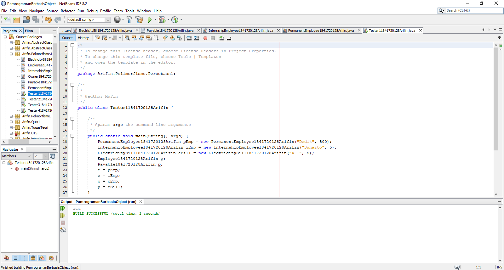
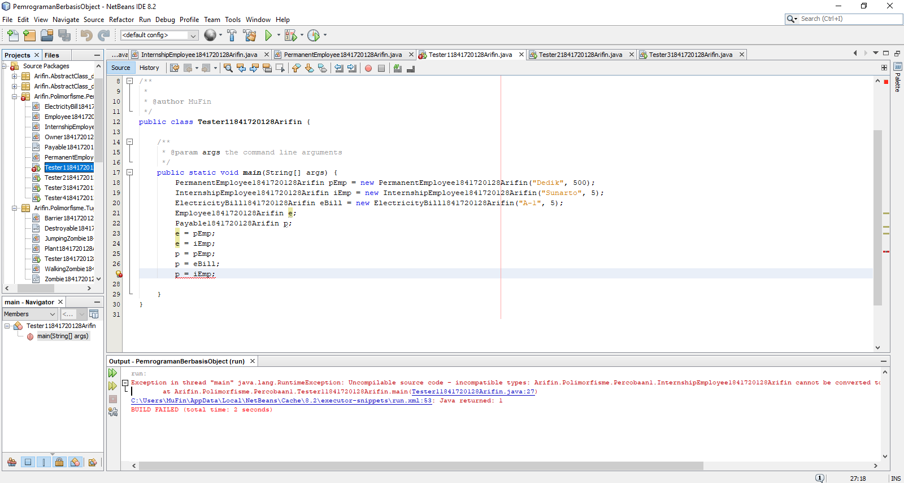
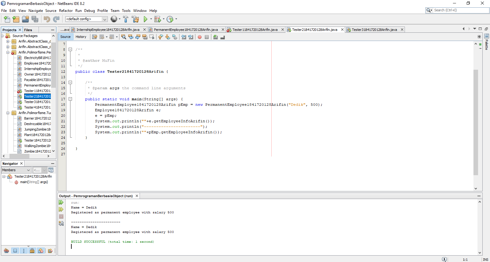
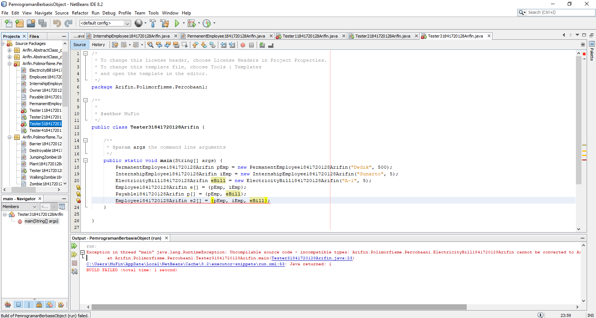
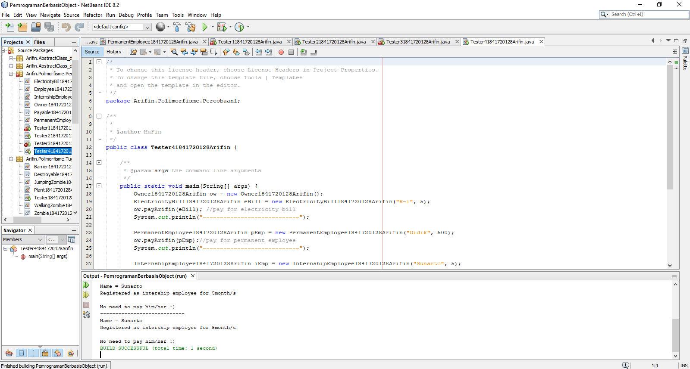
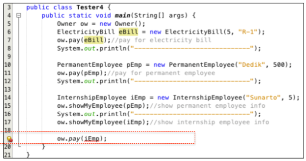
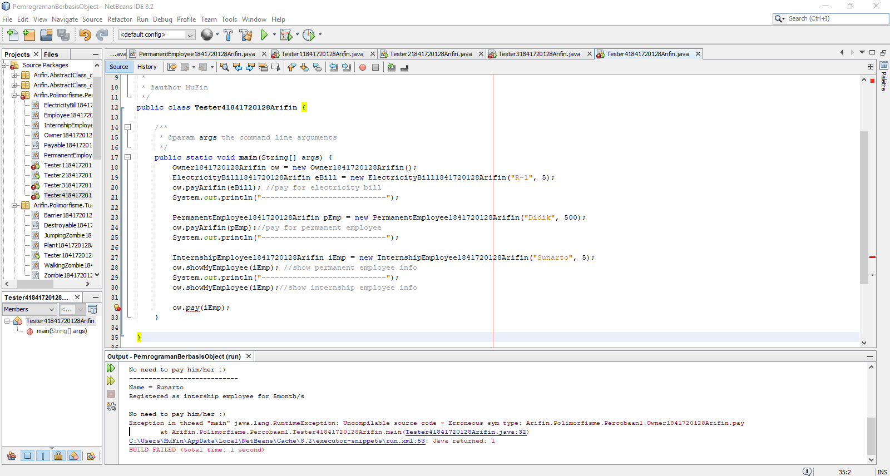
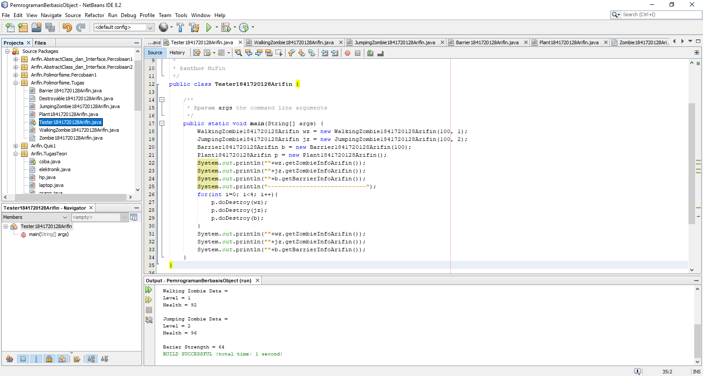

# Laporan Praktikum #10 - POLIMORFISME

## Kompetensi

Setelah melakukan percobaan pada jobsheet ini, diharapkan mahasiswa mampu: 
1. Memahami konsep dan bentuk dasar polimorfisme
2. Memahami konsep virtual method invication
3. Menerapkan polimorfisme pada pembuatan heterogeneous collection
4. Menerapkan polimorfisme pada parameter/argument method
5. Menerapkan object casting untuk meng-ubah bentuk objek

## Ringkasan Materi

Pada praktikum ini saya mengalami kesulitan konsep class abstract, untuk solusi dari permasalahan yang saya alami dapat diselesaikan dengan lebih belajar lagi.

## Percobaan

### Percobaan 1

Pada percobaan pertama saya membuat empat buah class, yang pertama bernama Employee1841720128Arifin yang memiliki atribut nama dengan tipe data String selain itu terdapat method getEmployeeInfoArifin(). Kedua adalah class dengan nama InternshipEmployee1841720128Arifin yang merupakan turunan dari Employee1841720128Arifin dan memiliki atribut length dengan tipe data integer dan bermodifier private selain itu terdapat konstruktor berparameter dan juga terdapat method getter setterdan getEmployeeInfoArifin(). Yang ketiga adalah class dengan nama PermanentEmployee1841720128Arifin yang merupakan turunan dari Employee1841720128Arifin dan memiliki atribut bernama salary dengan tipe data integer bermodifier private selain itu terdapat konstruktor berparameter, method getter setter dan getEmployeeInfoArifin(). Yang terakhir adalah saya membuat class bernama ElectricityBill184172128Arifin yang memiliki atribut kwh dengan tipe data int dan category yang memiliki tipe data String, selain atribut terdapat konstruktor berparameter dan juga terdapat method getBasePriceArifin(). Selain dari keempat class tersebut saya juga membuat satu buah interface bernama Payable1841720128Arifin yang didalamnya terdapat method getPaymentAmountArifin() dan juga tak lupa saya membuat satu buah main class dengan nama Tester11841720128Arifin.

Contoh kode program pada class Employee1841720128Arifin.java : [ini link ke kode program](../../src/10_Polimorfisme/Percobaan_1/Employee1841720128Arifin.java)

Contoh kode program pada interface Payable1841720128Arifin.java : [ini link ke kode program](../../src/10_Polimorfisme/Percobaan_1/Payable1841720128Arifin.java)

Contoh kode program pada class InternshipEmployee1841720128Arifin.java : [ini link ke kode program](../../src/10_Polimorfisme/Percobaan_1/InternshipEmployee1841720128Arifin.java)

Contoh kode program pada class PermanentEmployee1841720128Arifin.java : [ini link ke kode program](../../src/10_Polimorfisme/Percobaan_1/PermanentEmployee1841720128Arifin.java)

Contoh kode program pada class ElectricityBill1841720128Arifin.java : [ini link ke kode program](../../src/10_Polimorfisme/Percobaan_1/ElectricityBill1841720128Arifin.java)

Contoh kode program pada main class Tester11841720128Arifin.java : [ini link ke kode program](../../src/10_Polimorfisme/Percobaan_1/Tester11841720128Arifin.java)

### Pertanyaan

1.  Class apa sajakah yang merupakan turunan dari class Employee1841720128Arifin?

    Jawab:

    Class yang merupakan turunan dari class Employee1841720128Arifin adalah InternshipEmployee1841720128Arifin dan PermanentEmployee1841720128Arifin

2. Class apa sajakah yang implements ke interface Payable1841720128Arifin?

    Jawab:

    Class yang implements ke interface Payable1841720128Arifin adalah PermanentEmployee1841720128Arifin dan ElectricityBill1841720128Arifin

3. Perhatikan class Tester1, baris ke-10 dan 11. Mengapa e, bisa diisi dengan objek pEmp (merupakan objek dari class PermanentEmployee) dan objek iEmp (merupakan objek dari class InternshipEmploye) ?

    Jawab:

    Karena pada kedua baris tersebut memiliki parent class yang sama sehingga "e" yang sebenarnya merupakan class Employee1841720128Arifin yang memiliki kedudukan sebagai parent class dari class InternshipEmployee1841720128Arifin dan PermanentEmployee1841720128Arifin.

4. Perhatikan class Tester1, baris ke-12 dan 13. Mengapa p, bisa diisi dengan objek pEmp (merupakan objek dari class PermanentEmployee) dan objek eBill (merupakan objek dari class ElectricityBill) ?

    Jawab:

    Karena pada dasarnya object pada baris-12 dan 13 tersebut merupakan implements dari interface Payable1841720128Arifin.

5. Coba tambahkan sintaks: 
    
    p = iEmp;      
    
    e = eBill; 

    pada baris 14 dan 15 (baris terakhir dalam method main) ! Apa yang menyebabkan error?

    Jawab:
    
    

    Penyebab error tersebut adalah karena object "p" bukan turunan dari class Employee, dan juga object "e" bukanlah implements dari interface Payable1841720128Arifin.

6. Ambil kesimpulan tentang konsep/bentuk dasar polimorfisme!

    Jawab:

    Kesimpulan yang bisa saya ambil adalah Polimorfisme adalah suatu kemampuan untuk memungkinkan memiliki banyak bentuk dimana pengimplementasiannya sendiri bisa diterapkan pada penggunaan inheritance atau turunan atau implements, atau bisa diterapkan pada keduanya.

### Percobaan 2

Pada percobaan kedua ini masih berhubungan dengan percobaan pertama namun terdapat perbedaan dimana saya akan menambahkan main class baru yaitu Tester21841720128Arifin.

Contoh kode program pada class Employee1841720128Arifin.java : [ini link ke kode program](../../src/10_Polimorfisme/Percobaan_2/Employee1841720128Arifin.java)

Contoh kode program pada interface Payable1841720128Arifin.java : [ini link ke kode program](../../src/10_Polimorfisme/Percobaan_2/Payable1841720128Arifin.java)

Contoh kode program pada class PermanentEmployee1841720128Arifin.java : [ini link ke kode program](../../src/10_Polimorfisme/Percobaan_2/PermanentEmployee1841720128Arifin.java)

Contoh kode program pada main class Tester21841720128Arifin.java : [ini link ke kode program](../../src/10_Polimorfisme/Percobaan_2/Tester21841720128Arifin.java)

### Pertanyaan

1. Perhatikan class Tester2 di atas, mengapa pemanggilan e.getEmployeeInfo() pada baris 8 dan pEmp.getEmployeeInfo() pada baris 10 menghasilkan hasil sama?

    Jawab:

    Karena pada dasarnya object tersebut terjadi pergantian tipe data, penjelasannya adalah terdapat pada baris

        Employee1841720128Arifin e;
        e = pEmp;

    disini bisa dilihat bahwa e adalah object yang memiliki tipe data Employee1841720128Arifin dan e sama dengan pEmp itu lah penyebab kenapa saat melakukan run pada program akan menghasilkan hasil yang sama.

2. Mengapa pemanggilan method e.getEmployeeInfo() disebut sebagai pemanggilan method virtual (virtual method invication), sedangkan pEmp.getEmployeeInfo() tidak?

    Jawab:

    Karena pada object "e" tersebut terdapat inisialisasi baru dimana e sama dengan pEmp yang menjadi object tersebut disebut sebagai pemanggilan method virtual.

3. Jadi apakah yang dimaksud dari virtual method invocation? Mengapa disebut virtual?

    Jawab:

    Virtual method invocation atau VMI adalah dimana pada suatu object yang telah dibuat tersebut memanggil overriden method pada parent class, kompiler java akan melakukan invocation (pemanggilan) terhadap overriding method pada subclass. Alasan disebut virtual adalah karena pada pengenalan method pada pemanggilan dengan apa yang dikenali oleh compiler tidak sama.

### Percobaan 3

Pada percobaan ketiga juga berhubungan dengan percobaan pertama dan kedua dimana disini saya hanya menambahkan main class bernama Tester31841720128Arifin.

Contoh kode program pada class Employee1841720128Arifin.java : [ini link ke kode program](../../src/10_Polimorfisme/Percobaan_3/Employee1841720128Arifin.java)

Contoh kode program pada interface Payable1841720128Arifin.java : [ini link ke kode program](../../src/10_Polimorfisme/Percobaan_3/Payable1841720128Arifin.java)

Contoh kode program pada class InternshipEmployee1841720128Arifin.java : [ini link ke kode program](../../src/10_Polimorfisme/Percobaan_3/InternshipEmployee1841720128Arifin.java)

Contoh kode program pada class PermanentEmployee1841720128Arifin.java : [ini link ke kode program](../../src/10_Polimorfisme/Percobaan_3/PermanentEmployee1841720128Arifin.java)

Contoh kode program pada class ElectricityBill1841720128Arifin.java : [ini link ke kode program](../../src/10_Polimorfisme/Percobaan_1/ElectricityBill1841720128Arifin.java)

Contoh kode program pada main class Tester31841720128Arifin.java : [ini link ke kode program](../../src/10_Polimorfisme/Percobaan_3/Tester31841720128Arifin.java)

### Pertanyaan

1. Perhatikan array e pada baris ke-8, mengapa ia bisa diisi dengan objek-objek dengan tipe yang berbeda, yaitu objek pEmp (objek dari PermanentEmployee) dan objek iEmp (objek dari InternshipEmployee) ?

    Jawab:

    Karena pada object "e" bisa ditambahan dengan object yang memiliki tipe data class yang berbeda karena kedua object tersebut merupakan subclass yang memiliki parent class yang sama.

2. Perhatikan juga baris ke-9, mengapa array p juga biisi dengan objekobjek dengan tipe yang berbeda, yaitu objek pEmp (objek dari PermanentEmployee) dan objek eBill (objek dari ElectricityBilling) ?

    Jawab:

    sama dengan kedua object tersebut yang merupakan implements dari interface Payable1841720128Arifin.

3. Perhatikan baris ke-10, mengapa terjadi error?

    Jawab:

    Karena terdapat object yang tipe data classnya merupakan subclass dan memiliki parent class yang berbeda sehingga terjadi error.

### Percobaan 4

Pada percobaan keempat ini masih berhubungan dengan percobaan yang sebelum-sebelumnya, dimana saya akan membuat class baru bernama Owner1841720128Arifin dan main class Tester1841720128Arifin

Contoh kode program pada class Employee1841720128Arifin.java : [ini link ke kode program](../../src/10_Polimorfisme/Percobaan_4/Employee1841720128Arifin.java)

Contoh kode program pada interface Payable1841720128Arifin.java : [ini link ke kode program](../../src/10_Polimorfisme/Percobaan_4/Payable1841720128Arifin.java)

Contoh kode program pada class InternshipEmployee1841720128Arifin.java : [ini link ke kode program](../../src/10_Polimorfisme/Percobaan_4/InternshipEmployee1841720128Arifin.java)

Contoh kode program pada class PermanentEmployee1841720128Arifin.java : [ini link ke kode program](../../src/10_Polimorfisme/Percobaan_4/PermanentEmployee1841720128Arifin.java)

Contoh kode program pada class ElectricityBill1841720128Arifin.java : [ini link ke kode program](../../src/10_Polimorfisme/Percobaan_1/ElectricityBill1841720128Arifin.java)

Contoh kode program pada class Owner1841720128Arifin.java : [ini link ke kode program](../../src/10_Polimorfisme/Percobaan_4/Owner1841720128Arifin.java)

Contoh kode program pada main class Tester41841720128Arifin.java : [ini link ke kode program](../../src/10_Polimorfisme/Percobaan_4/Tester41841720128Arifin.java)

### Pertanyaan

1. Perhatikan class Tester4 baris ke-7 dan baris ke-11, mengapa pemanggilan ow.pay(eBill) dan ow.pay(pEmp) bisa dilakukan, padahal jika diperhatikan method pay() yang ada di dalam class Owner memiliki argument/parameter bertipe Payable? Jika diperhatikan lebih detil eBill merupakan objek dari 
ElectricityBill dan pEmp merupakan objek dari PermanentEmployee?

    Jawab:

    Keduanya bisa melakukan pemanggilan adalah karena keduanya merupakan implements dari interface Payable1841720128Arifin.

2. Jadi apakah tujuan membuat argument bertipe Payable pada method pay() yang ada di dalam class Owner?

    Jawab:

    Agar class yang merupakan implements dari interface Payable1841720128Arifin bisa dipanggil.

3. Coba pada baris terakhir method main() yang ada di dalam class Tester4 ditambahkan perintah ow.pay(iEmp);

    

    Jawab:

    

4. Perhatikan class Owner, diperlukan untuk apakah sintaks p instanceof ElectricityBill pada baris ke-6 ?

    Jawab:

    Melakukan suatu pengecekan berupa kondisi dengan pernyataan apakah ada hubungan antara object "p" yang adalah hasil dari instansiasi dari interface Payable1841720128Arifin pada class ElectrictyBill1841720128Arifin.

5. Perhatikan kembali class Owner baris ke-7, untuk apakah casting objek disana (ElectricityBill eb = (ElectricityBill) p) diperlukan ? Mengapa objek p yang bertipe Payable harus di-casting ke dalam objek eb yang bertipe ElectricityBill ?

    Jawab:

    Casting object tersebut diperlukan karena agar object tersebut bisa melakukan pemanggilan method yang terdapat pada method class ElectrcityBill1841720128Arifin. Karena sebelumnya object eb pada class Owner1841720128Arifin belum di instansiasi yang menyebabkan harus dilakukannya sebuah casting pada object "p".

## Tugas

Dalam suatu permainan, Zombie dan Barrier bisa dihancurkan oleh Plant dan bisa menyembuhkan diri. Terdapat dua jenis Zombie, yaitu Walking Zombie dan Jumping Zombie. Kedua Zombie tersebut memiliki cara penyembuhan yang berbeda, demikian juga cara penghancurannya, yaitu ditentukan oleh aturan berikut ini:
1. Pada WalkingZombie 
    
    Penyembuhan : Penyembuhan ditentukan berdasar level zombie yang bersangkutan
        
    a. Jika zombie level 1, maka setiap kali penyembuhan, health akan bertambah 20%
    b. Jika zombie level 2, maka setiap kali penyembuhan, health akan bertambah 30%
    c. Jika zombie level 3, maka setiap kali penyembuhan, health akan bertambah 40% o Penghancuran : setiap kali penghancuran, health akan berkurang 2%

2. Pada Jumping Zombie o Penyembuhan : 
    
    Penyembuhan ditentukan berdasar level zombie yang bersangkutan
        
    a. Jika zombie level 1, maka setiap kali penyembuhan, health akan bertambah 30%
    b. Jika zombie level 2, maka setiap kali penyembuhan, health akan bertambah 40%
    c. Jika zombie level 3, maka setiap kali penyembuhan, health akan bertambah 50% o Penghancuran : setiap kali penghancuran, health akan berkurang 1% Buat program dari class diagram di bawah ini! 

Jawab:

Contoh kode program pada abstract class Zombie1841720128Arifin.java : [ini link ke kode program](../../src/10_Polimorfisme/Tugas/Zombie1841720128Arifin.java)

Contoh kode program pada interface Destroyable1841720128Arifin.java : [ini link ke kode program](../../src/10_Polimorfisme/Tugas/Destroyable1841720128Arifin.java)

Contoh kode program pada class WalkingZombie1841720128Arifin.java : [ini link ke kode program](../../src/10_Polimorfisme/Tugas/WalkingZombie1841720128Arifin.java)

Contoh kode program pada class JumpingZombie1841720128Arifin.java : [ini link ke kode program](../../src/10_Polimorfisme/Tugas/JumpingZombie1841720128Arifin.java)

Contoh kode program pada class Barrier1841720128Arifin.java : [ini link ke kode program](../../src/10_Polimorfisme/Tugas/Barrier1841720128Arifin.java)

Contoh kode program pada class Plant1841720128Arifin.java : [ini link ke kode program](../../src/10_Polimorfisme/Tugas/Plant1841720128Arifin.java)

Contoh kode program pada main class Tester11841720128Arifin.java : [ini link ke kode program](../../src/10_Polimorfisme/Tugas/Tester1841720128Arifin.java)

## Kesimpulan

Hal yang dapat saya simpulkan dari praktikum yang telah dilakukan adalah Polimorfisme adalah suatu metode untuk mengubah suatu object kedalam banyak bentuk dan dalam penerapannya bisa dilakukan pada metode lain seperti inheritance dan juga implements.

## Pernyataan Diri

Saya menyatakan isi tugas, kode program, dan laporan praktikum ini dibuat oleh saya sendiri. Saya tidak melakukan plagiasi, kecurangan, menyalin/menggandakan milik orang lain.

Jika saya melakukan plagiasi, kecurangan, atau melanggar hak kekayaan intelektual, saya siap untuk mendapat sanksi atau hukuman sesuai peraturan perundang-undangan yang berlaku.

Ttd,

***Mukhammad Arifin***
