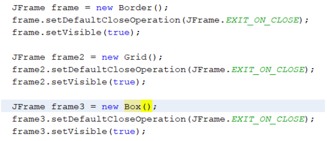
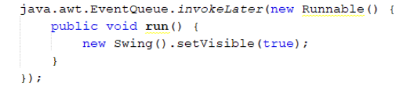
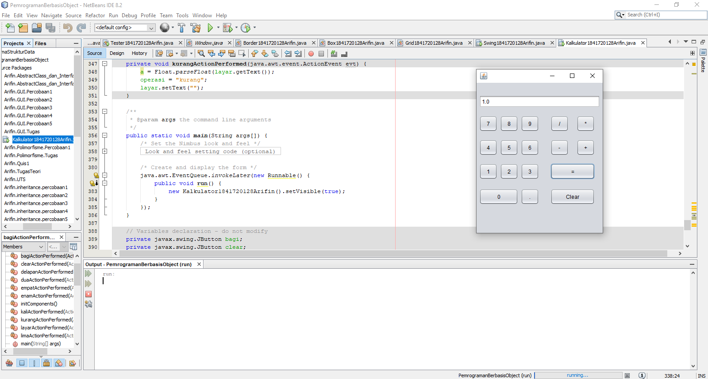

# Laporan Praktikum #11 - GUI (Graphical User Interface)

## Kompetensi

Setelah menyelesaikan lembar kerja ini mahasiswa diharapkan mampu:
1. Membuat aplikasi Graphical User Interface sederhana dengan bahasa pemrograman java.
2. Mengenal komponen GUI seperti frame, label, textfield, combobox, radiobutton, checkbox,
textarea, menu, serta table.
3. Menambahkan event handling pada aplikasi GUI.

## Ringkasan Materi

Pada praktikum ini sudah mencapai hampir semua targetan yang ada untuk kendala mungkin hanya pada awal saat pertama mencoba menggunakan JFrame, untuk kendala tersebut sudah teratasi.

## Percobaan

### Percobaan 1

Pada percobaan pertama saya membuat satu buah main class dengan nama HelloGui1841720128Arifin dan sebuah object frame yang memiliki tipe data JFrame.

Contoh kode program pada main class HelloGui1841720128Arifin.java : [ini link ke kode program](../../src/11_GUI/Percobaan_1/HelloGui1841720128Arifin.java)

### Percobaan 2

Pada percobaan kedua ini saya membuat satu buah class dengan nama MyInputForm1841720128Arifin yang merupakan subclass dari JFrame dimana memiliki variable dengan nama aLabel, bLabel, cLabel yang ketiganya memiliki tipe data yang sama yaitu JLabel. Selain itu terdapat aField dan bField dengan tipe data JTextField, button bertipe data JButton dan panel dengan tipe data JPanel. Saya juga membuat satu buah main class dengan nama Tester1841720128Arifin.

Contoh kode program pada class MyInputForm1841720128Arifin.java : [ini link ke kode program](../../src/11_GUI/Percobaan_2/MyInputForm1841720128Arifin.java)

Contoh kode program pada main class Tester1841720128Arifin.java : [ini link ke kode program](../../src/11_GUI/Percobaan_2/Tester1841720128Arifin.java)

### Pertanyaan

1. Modifikasi kode program dengan menambahkan JButton baru untuk melakukan fungsi
perhitungan penambahan, sehingga ketika button di klik (event click) maka akan
menampilkan hasil penambahan dari nilai A dan B

    Jawab:

    
    
    
    Contoh kode program pada class MyInputForm1841720128Arifin.java : [ini link ke kode program](../../src/11_GUI/Pertanyaan2/MyInputForm1841720128Arifin.java)

    Contoh kode program pada main class Tester1841720128Arifin.java : [ini link ke kode program](../../src/11_GUI/Pertanyaan2/Tester1841720128Arifin.java)

### Percobaan 3

Pada percobaan ketiga saya membuat tiga buah class, yang pertama adalah Border1841720128Arifin, yang kedua adalah Box1841720128Arifin, dan ketiga adalah Grid1841720128Arifin. Selain class tersebut saya juga membuat main class dengan nama LayoutGUI1841720128Arifin yang digunakan untuk menampilkan layout pada setiap class yang telah dibuat.

Contoh kode program pada class Border1841720128Arifin.java : [ini link ke kode program](../../src/11_GUI/Percobaan_3/Border1841720128Arifin.java)

Contoh kode program pada interface Box1841720128Arifin.java : [ini link ke kode program](../../src/11_GUI/Percobaan_3/Box1841720128Arifin.java)

Contoh kode program pada class Grid1841720128Arifin.java : [ini link ke kode program](../../src/11_GUI/Percobaan_3/Grid1841720128Arifin.java)

Contoh kode program pada main class LayoutGUI1841720128Arifin.java : [ini link ke kode program](../../src/11_GUI/Percobaan_3/LayoutGUI1841720128Arifin.java)

### Pertanyaan

1. Apa perbedaan dari Grid Layout, Box Layout dan Border Layout?

    Jawab:

    Perbedaan dari Grid, Box dan Border Layout adalah terletak pada tampilan dimana Border ditampilkan dimulai dari urutan teratas dibaris kedua terdapat 3 kolom dan baris ketiga hanya berisi 1 kolom, untuk Grid memiliki tampilan berupa 4 baris dan 2 kolom yang berurutan dari kiri ke kanan, dan terakhir adalah Box dimana akan diurutkan dari teratas kebawah dengan setiap baris memiliki satu kolom.

2. Apakah fungsi dari masing-masing kode berikut?

    

    Jawab:
    Berikut masing-masing fungsinya:

    a. JFrame frameObject = new (Layout()) adalah melakukan casting sesuai layout yang dibuat, fungsinya sendiri adalah untuk membuat layout muncul pada sebuah frame.

    b. setDefaultCloseOperation(JFrame.EXIT_ON_CLOSE) berfungsi sebagai pengatur program secara otomatis berhenti ketika frame tersebut di close.

    c. setVisible(true) berfungsi untuk menampilkan Frame.

### Percobaan 4

Pada percobaan keempat ini saya membuat satu buah JFrame Form dengan nama Swing1841720128Arifin yang akan digunakan untuk membuat tampilan form Data Mahasiswa dan juga untuk menampilkan hasil yang diperoleh dari menginputkan form tersebut.

Contoh kode program pada JFrame Form Swing1841720128Arifin.form : [ini link ke kode program](../../src/11_GUI/Percobaan_4/Swing1841720128Arifin.form)

Contoh kode program pada class Swing1841720128Arifin.java : [ini link ke kode program](../../src/11_GUI/Percobaan_4/Swing1841720128Arifin.java)

### Pertanyaan

1. Apakah fungsi dari kode berikut?

    

    Jawab:

    Fungsinya adalah akan mengeset swing visible pada saat swing di klik dan akan menonaktifkan navigasi pada bagian Menu Utama.

2. Mengapa pada bagian logika checkbox dan radio button digunakan multiple if ?

    Jawab:

    Karena pada checkbox memiliki beberapa pilihan, sehingga banyaknya if tergantung pada banyak pilihan yang diinputkan oleh user.

3. Lakukan modifikasi pada program untuk melakukan menambahkan inputan berupa alamat
dan berikan fungsi pemeriksaan pada nilai Alamat tersebut jika belum diisi dengan
menampilkan pesan peringatan

    Jawab:

    

    Contoh kode program pada JFrame Form Swing1841720128Arifin.form : [ini link ke kode program](../../src/11_GUI/Pertanyaan4/Swing1841720128Arifin.form)

    Contoh kode program pada class Swing1841720128Arifin.java : [ini link ke kode program](../../src/11_GUI/Pertanyaan4/Swing1841720128Arifin.java)

### Percobaan 5

Pada percobaan keempat ini saya membuat satu buah JFrame Form dengan nama Swing21841720128Arifin yang akan digunakan untuk membuat tampilan 3 tab yang memiliki fungsi tersendiri.

Contoh kode program pada JFrame Form Swing1841720128Arifin.form : [ini link ke kode program](../../src/11_GUI/Percobaan_5/Swing21841720128Arifin.form)

Contoh kode program pada class Swing1841720128Arifin.java : [ini link ke kode program](../../src/11_GUI/Percobaan_5/Swing21841720128Arifin.java)

### Pertanyaan

1. Apa kegunaan komponen swing JTabPane, JTtree, pada percobaan 5?

    Jawab:

    Kegunaan dari kedua komponen tersebut adalah:

    a. JTabPane merupakan panel yang memiliki tab dan dapat beralih dari tab yang awal ke tab yang lainnya

    b. JTree merupakan sebuah direktori folder yang memiliki susunan seperti pohon dimana saat sebuah folder memiliki folder didalam folder.

2. Modifikasi program untuk menambahkan komponen JTable pada tab Halaman 1 dan tab
Halaman 2

    Jawab:

    

    Contoh kode program pada JFrame Form Swing1841720128Arifin.form : [ini link ke kode program](../../src/11_GUI/Pertanyaan5/Swing21841720128Arifin.form)

    Contoh kode program pada class Swing1841720128Arifin.java : [ini link ke kode program](../../src/11_GUI/Pertanyaan5/Swing21841720128Arifin.java)

## Tugas

Buatlah Sebuah Program yang mempunyai fungsi seperti kalkulator (mampu menjumlahkan,
mengurangkan, mengalikan dan membagikan. Dengan tampilan seperti berikut. 

Jawab:

Contoh kode program pada JFrame Form Kalkulator1841720128Arifin.form : [ini link ke kode program](../../src/11_GUI/Tugas/Kalkulator1841720128Arifin.form)

Contoh kode program pada class Kalkulator1841720128Arifin.java : [ini link ke kode program](../../src/11_GUI/Tugas/Kalkulator1841720128Arifin.java)

## Kesimpulan

User Interface berfungsi sebagai wajah atau tampilan pada java memudahkan pengguna atau user dalam berinteraksi dengan program sehingga user akan lebih paham dengan maksud dari fungsi program tersebut daripada berinteraksi dengan program tanpa interface apapun.

## Pernyataan Diri

Saya menyatakan isi tugas, kode program, dan laporan praktikum ini dibuat oleh saya sendiri. Saya tidak melakukan plagiasi, kecurangan, menyalin/menggandakan milik orang lain.

Jika saya melakukan plagiasi, kecurangan, atau melanggar hak kekayaan intelektual, saya siap untuk mendapat sanksi atau hukuman sesuai peraturan perundang-undangan yang berlaku.

Ttd,

***Mukhammad Arifin***