# Laporan Praktikum #12 - Collection (List, Set, Map) dan Database

## Kompetensi

Tujuan Pembelajaran
1. Memahami cara penyimpanan objek menggunakan Collection dan Map. 
2. Mengetahui pengelompokan dari Collection.
3. Mengetahui perbedaan dari interface Set, List dan Map.
4. Mengetahui penggunaan class-class dari interface Set, List, dan Map. Memahami koneksi database menggunakan JDBC dan JDBC API

## Ringkasan Materi

Pada praktikum ini sudah mencapai hampir semua targetan yang ada untuk kendala mungkin hanya pada awal saat pertama mencoba memahami konsep collection, untuk kendala tersebut hampir sudah teratasi.

## Percobaan

### Percobaan 1

Pada percobaan pertama saya membuat satu buah main class dengan nama CobaHashSet1841720128Arifin.

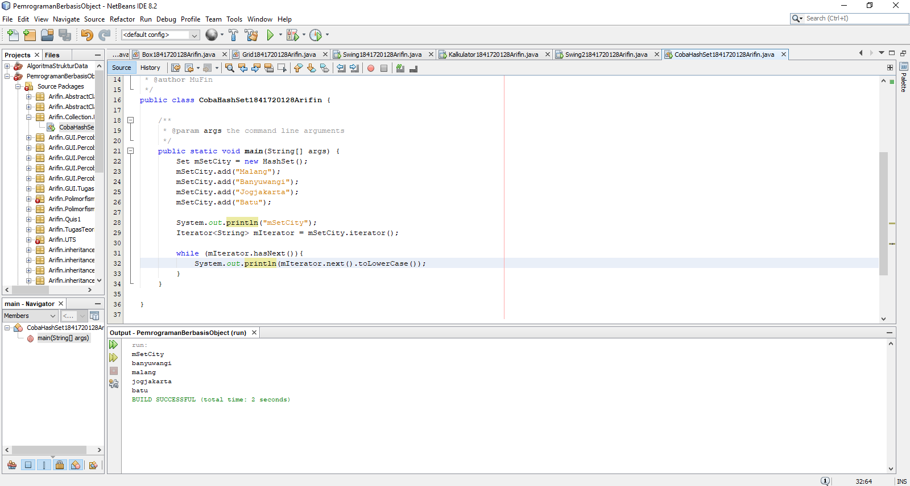

Contoh kode program pada main class CobaHashSet1841720128Arifin.java : [ini link ke kode program](../../src/12_Java_API/Percobaan_1/CobaHashSet1841720128Arifin.java)

### Pertanyaan Percobaan 1

1. Apakah fungsi import java.util.*; pada program diatas!

    Jawab:

    Fungsi dari import.java.util.*; adalah untuk mengimpor semua class yang terdapat pada Java.

2. Pada baris program keberapakah yang berfungsi untuk menciptakan object HashSet?

    Jawab:

    Pada baris yang terdapat kode program seperti dibawah ini:
    
        Set mSetCity = new CobaHashSet1841720128(); 

    kode program tersebut terdapat pada main class CobaHashSet1841720128Arifin.java

3. Apakah fungsi potongan program dibawah ini pada percobaan 1! 

    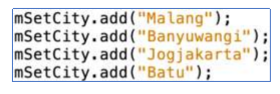

    Jawab:

    Fungsi potongan program tesebut adalah untuk menambahkan value pada set hash.

4. Tambahkan set.add(“Malang”); kemudian jalankan program! Amati hasilnya dan jelaskan mengapa terjadi error!

    Jawab:

    Karena sebelumnya sudah pernah mengisi data dengan nama “ Malang ” , maka data yang sama yang ditambahkan tidak akan terdaftar.

5. Jelaskan fungsi potongan program dibawah ini pada percobaan 1!

    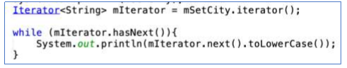

    Jawab:

    Iterator digunakan untuk melakukan akses dan juga menampilkan nilai beserta tambahan method lain yang telah didefinisikan di interface Iterator.

### Percobaan 2

Pada percobaan kedua saya membuat satu buah main class dengan nama CobaArrayList1841720128Arifin.

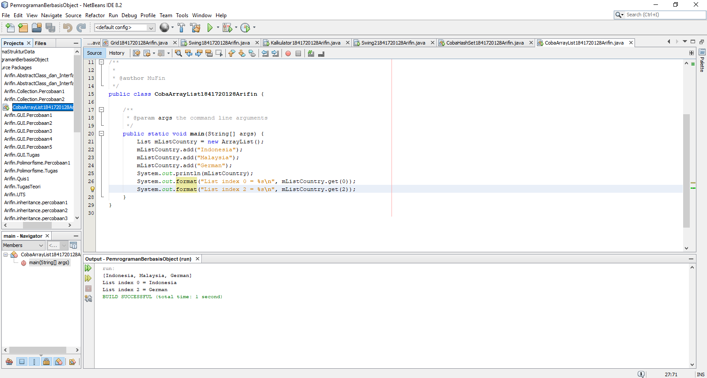

Contoh kode program pada main class CobaArrayList1841720128Arifin.java : [ini link ke kode program](../../src/12_Java_API/Percobaan_2/CobaArrayList1841720128Arifin.java)

### Pertanyaan Percobaan 2

1. Apakah fungsi potongan program dibawah ini! 

    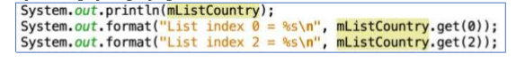

    Jawab:

    Berikut beberapa fungsi yang terdapat pada program tersebut antara lain:

    - System.out.println(mListCountry);
      
      Digunakanan untuk menampilkan keseluruhan data yang ada pada object mListCountry.
    
    - System.out.format("List index 0 = %s\n", mListCountry.get(0));
      
      System.out.format("List index 2 = %s\n", mListCountry.get(2));
      
      Digunakan untuk menampilkan data index ke-0 dan ke-2 pada objek mListCountry.

2. Ganti potongan program pada soal no 1 menjadi sebagai berikut 

    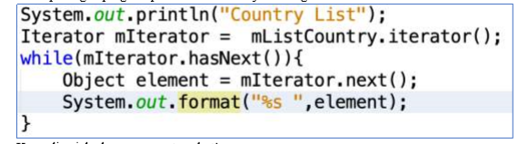

    Kemudian jalankan program tersebut! 

    Jawab:

    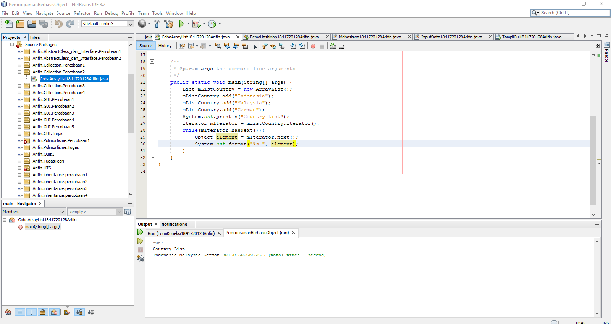

    Contoh kode program pada main class CobaArrayList1841720128Arifin.java : [ini link ke kode program](../../src/12_Java_API/Pertanyaan_Bagian_2/CobaArrayList1841720128Arifin.java)

3. Jelaskan perbedaan menampilkan data pada ArrayList menggunakan potongan program pada soal no 1 dan no 2!

    Jawab:

    Perbedaan menampilkan data pada ArrayList menggunakan potongan program pada soal nomor 1 dan 2 adalah terdapat pada output dimana hasil output dari nomor 1 yang menampilkan data dengan interface list dan untuk nomor 2 yang menampilkan dengan interface iterator.

### Percobaan 3

Pada percobaan ketiga saya membuat satu buah main class dengan nama DemoHashMap1841720128Arifin yang memiliki fungsi untuk menampilkan dan menghapus item dari tampilan saat melakukan output.

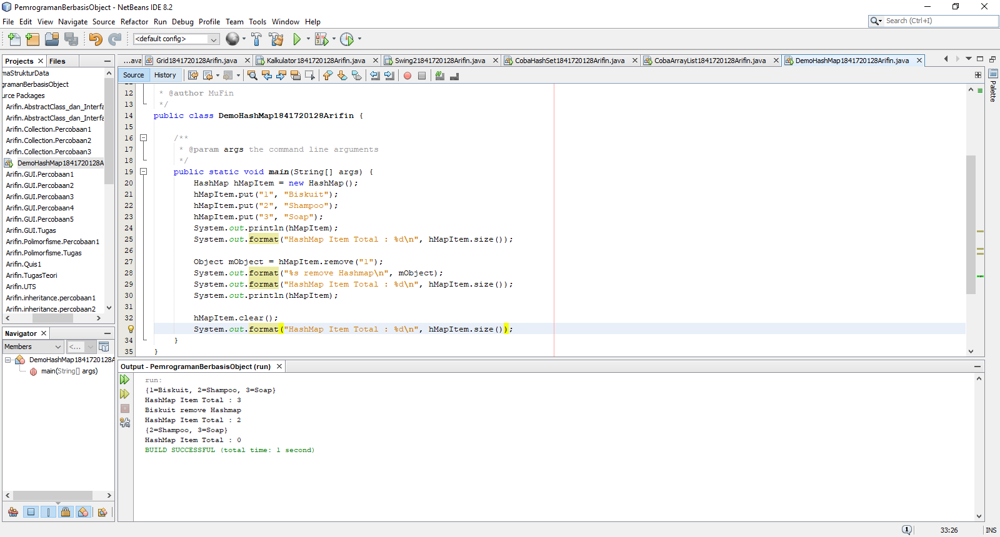

Contoh kode program pada main class DemoHashMap1841720128Arifin.java : [ini link ke kode program](../../src/12_Java_API/Percobaan_3/DemoHashMap1841720128Arifin.java)

### Pertanyaan Percobaan 3

1. Jelaskan fungsi hMapItem.put("1","Biskuit") pada program! 

    Jawab:

    Memasukkan item berupa data dengan value Biskuit dan menaruhnya pada key no 1.

2. Jelaskan fungsi hMapItem.size() pada program!

    Jawab:
    
    Untuk melakukan pengecekan jumlah data yang ada.

3. Jelaskan fungsi hMapItem.remove("1") pada program!

    Jawab:

    Menghapus value data pada item yang ada pada key no 2.

4. Jelaskan fungsi hMapItem.clear() pada program!

    Jawab:

    Menghapus semua value data pada item yang berada di HashMap.

5. Tambahkan kode program yang di blok pada program yang sudah anda buat!
    
    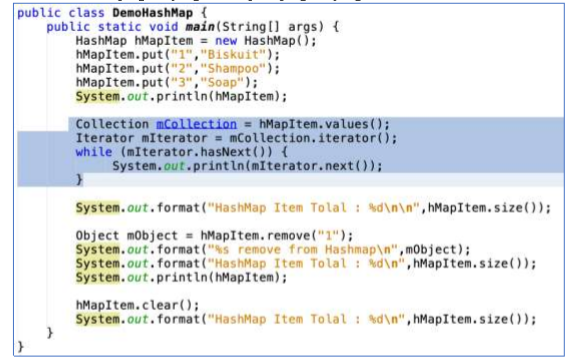

    Jawab:

    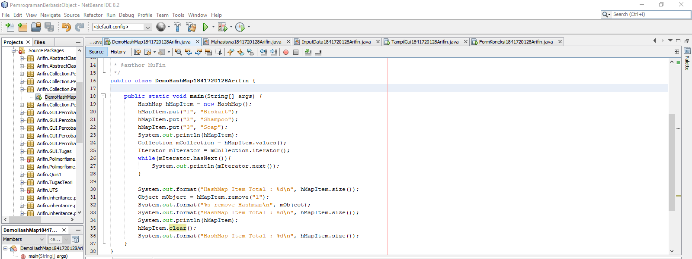

6. Jalankan program dan amati apa yang terjadi!

    Jawab:

    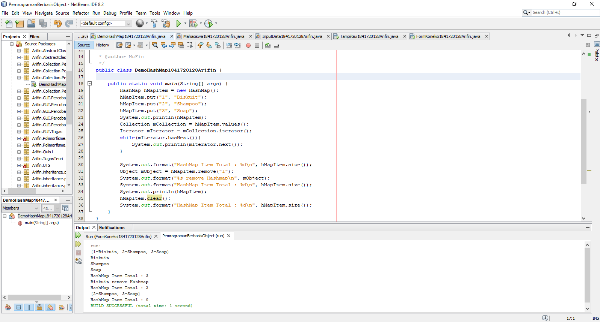

7. Apakah perbedaan program sebelumnya dan setelah ditambahkan kode program pada soal no 5 diatas? Jelaskan!

    Jawab:

    Perbedaannya setelah menambahkan kode program tersebut adalah adanya penampilan data menggunakan iterator.

### Percobaan 4

Pada percobaan keempat ini saya membuat satu buah JFrame Form dengan nama TampilGui1841720128Arifin yang akan digunakan untuk membuat tampilan form Data Mahasiswa dan juga untuk menampilkan hasil yang diperoleh dari menginputkan form tersebut, selain itu saya membuat dua buah class dengan nama InputData1841720128Arifin dan Mahasiswa1841720128Arifin.

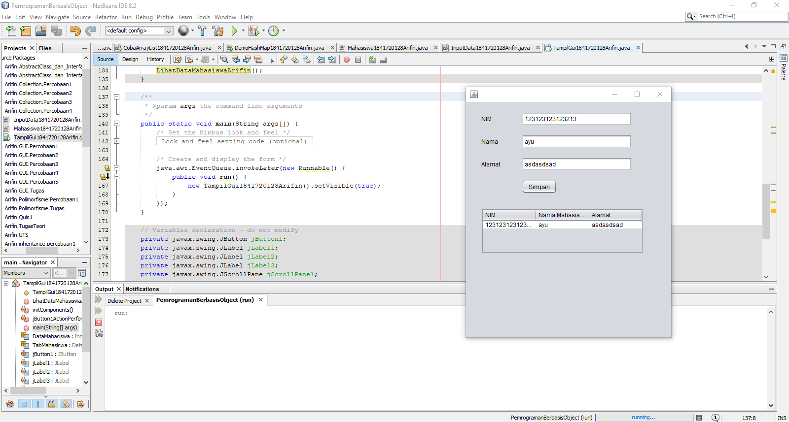

Contoh kode program pada JFrame Form TampilGui1841720128Arifin.form : [ini link ke kode program](../../src/12_Java_API/Percobaan_4/TampilGui1841720128Arifin.form)

Contoh kode program pada class TampilGui1841720128Arifin.java : [ini link ke kode program](../../src/12_Java_API/Percobaan_4/TampilGui1841720128Arifin.java)

Contoh kode program pada class InputData1841720128Arifin.java : [ini link ke kode program](../../src/12_Java_API/Percobaan_4/InputData1841720128Arifin.java)

Contoh kode program pada class Mahasiswa1841720128Arifin.java : [ini link ke kode program](../../src/12_Java_API/Percobaan_4/Mahasiswa1841720128Arifin.java)

### Percobaan 5

Pada percobaan kelima ini saya membuat satu buah JFrame Form dengan nama FormKoneksi1841720128Arifin yang akan digunakan sebagai input data ke dalam database yaitu MySQL.

Contoh kode program pada JFrame Form FormKoneksi1841720128Arifin.form : [ini link ke kode program](../../src/12_Java_API/Percobaan_5/FormKoneksi1841720128Arifin.form)

Contoh kode program pada class FormKoneksi1841720128Arifin.java : [ini link ke kode program](../../src/12_Java_API/Percobaan_5/FormKoneksi1841720128Arifin.java)

### Pertanyaan Percobaan 5

1. Setelah menambah code pada action button klik, coba jalankan program dan tambahkan data. Apakah program berhasil menambahkan data? Jika tidak apakah penyebabnya.

    Jawab:

    Program berhasil menambahkan data namun belum bisa menampilkan data yang telah ditambahkan.

2. Jelaskan maksud source code untuk melakukan insert data diatas? 

    Jawab:

    Menambahkan data berupa nama, alamat dan telp yang akan ditambakan pada table anggota dan setelahnya akan melakukan try catch berupa pengecekan sambungan pada database dan juga apabila sambungan tidak berhasil atau terputus maka akan muncul pesan dialog yang menyatakan bahwa terjadi kesalahan dengan menyertakan penyebab terjadinya error.

3. Jelaskan alur dari method ambil_data_tabel? 

    Jawab:

    Hal pertama yang dilakukan adalah memasukkan method buka_koneksi agar bisa terhubung dengan database lalu memanggil semua data dengan syntax Select * from anggota kemudian semua data tersebut dimasukkan ke dalam ResultSet kemudian melakukan pengecekan dengan syntax next untuk mengambil data yang terdapat di database jika ada maka akan di taruh ke addRow .

4. Buat fungsi untuk merefresh sehingga data yang baru dapat ditampilkan pada tabel. 
    
    Jawab:

    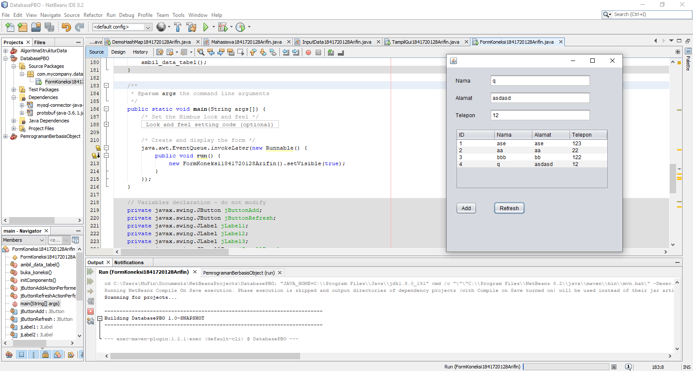
    
    Contoh kode program pada JFrame Form FormKoneksi1841720128Arifin.form : [ini link ke kode program](../../src/12_Java_API/Pertanyaan_Bagian_5/FormKoneksi1841720128Arifin.form)

    Contoh kode program pada class FormKoneksi1841720128Arifin.java : [ini link ke kode program](../../src/12_Java_API/Pertanyaan_Bagian_5/FormKoneksi1841720128Arifin.java)

## Kesimpulan

Collection merupakan object yang dapat melakukan penyimpanan berupa sekumpulan object.

## Pernyataan Diri

Saya menyatakan isi tugas, kode program, dan laporan praktikum ini dibuat oleh saya sendiri. Saya tidak melakukan plagiasi, kecurangan, menyalin/menggandakan milik orang lain.

Jika saya melakukan plagiasi, kecurangan, atau melanggar hak kekayaan intelektual, saya siap untuk mendapat sanksi atau hukuman sesuai peraturan perundang-undangan yang berlaku.

Ttd,

***Mukhammad Arifin***
