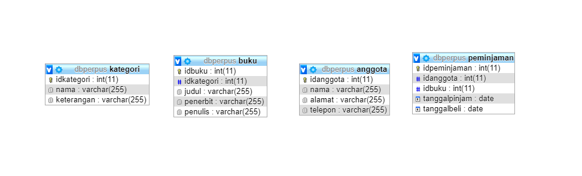
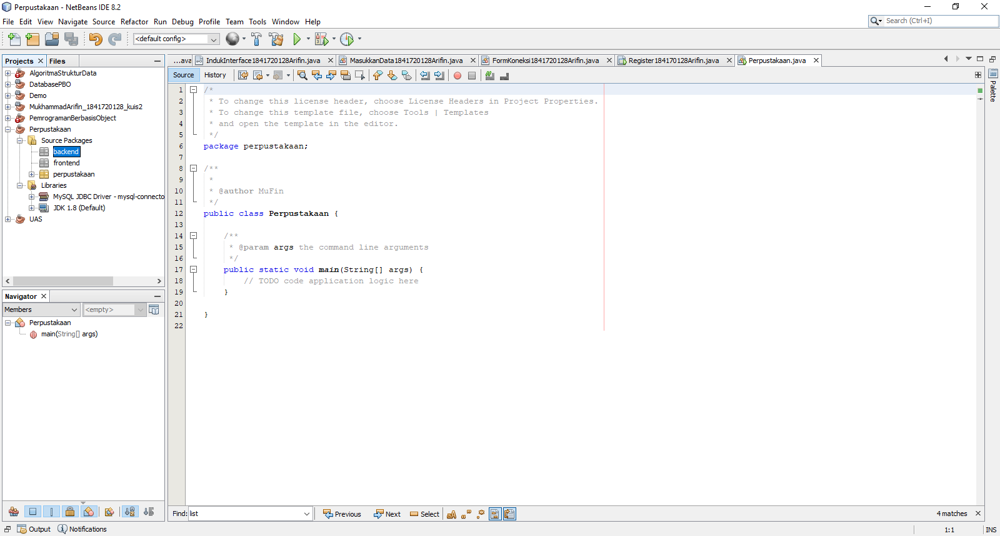
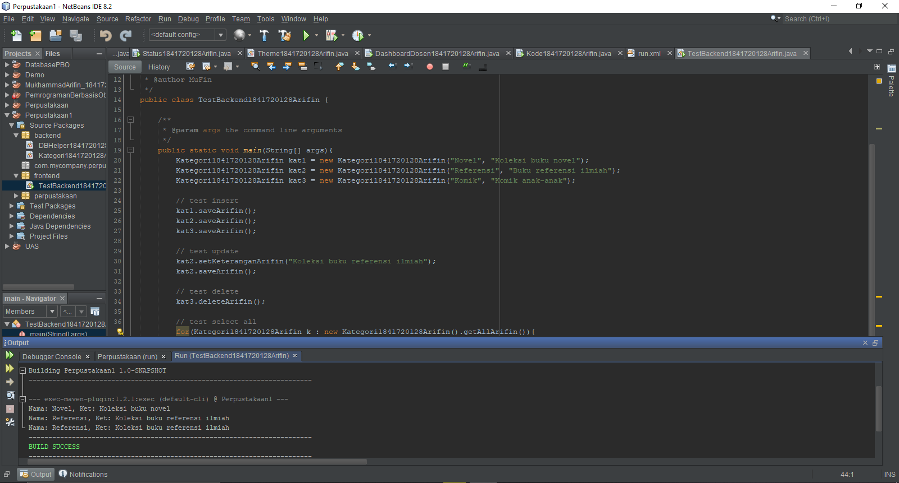
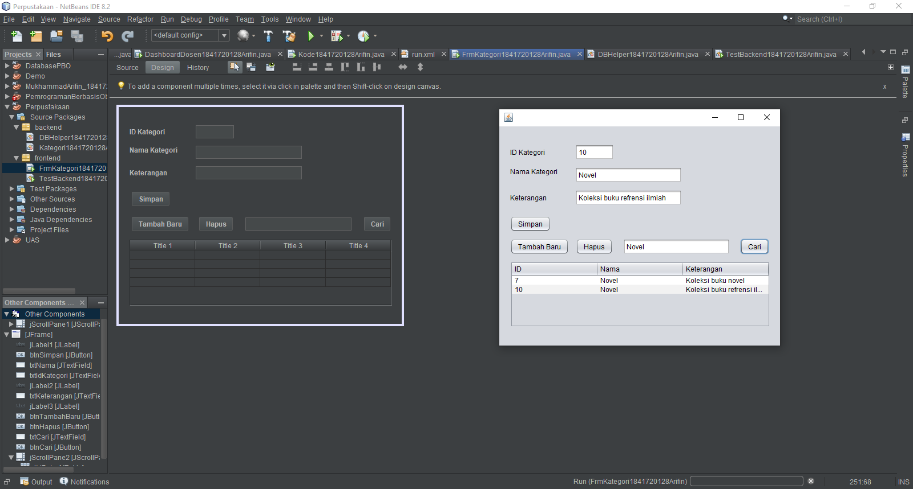
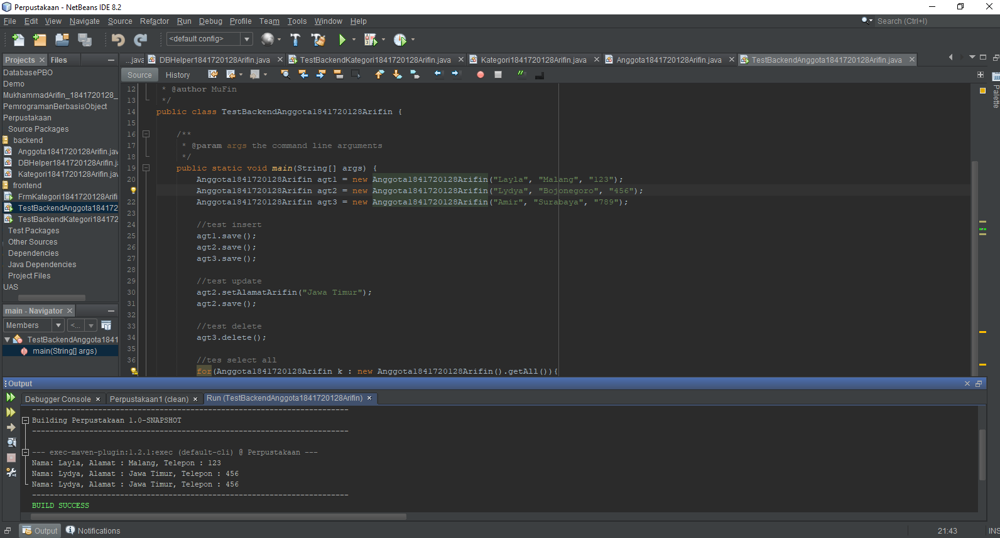
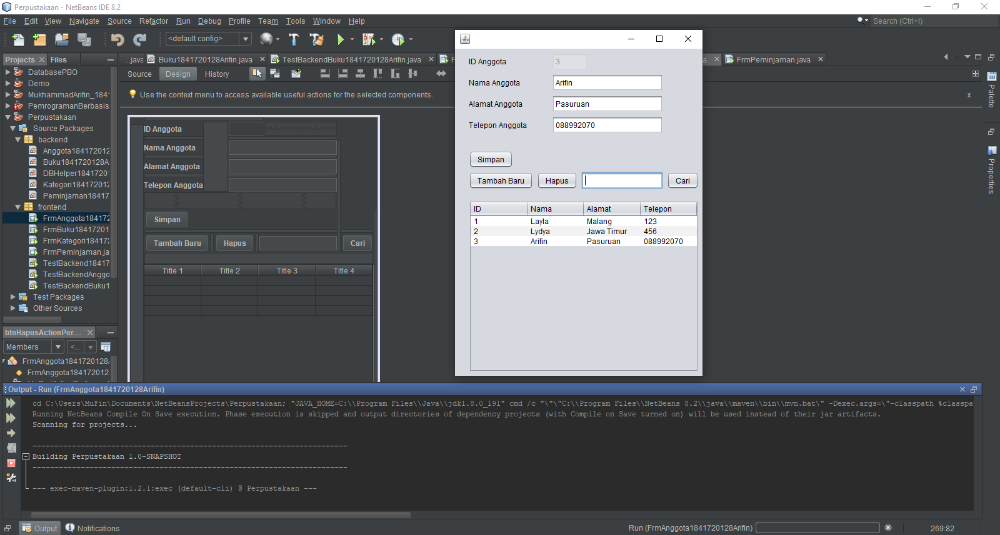
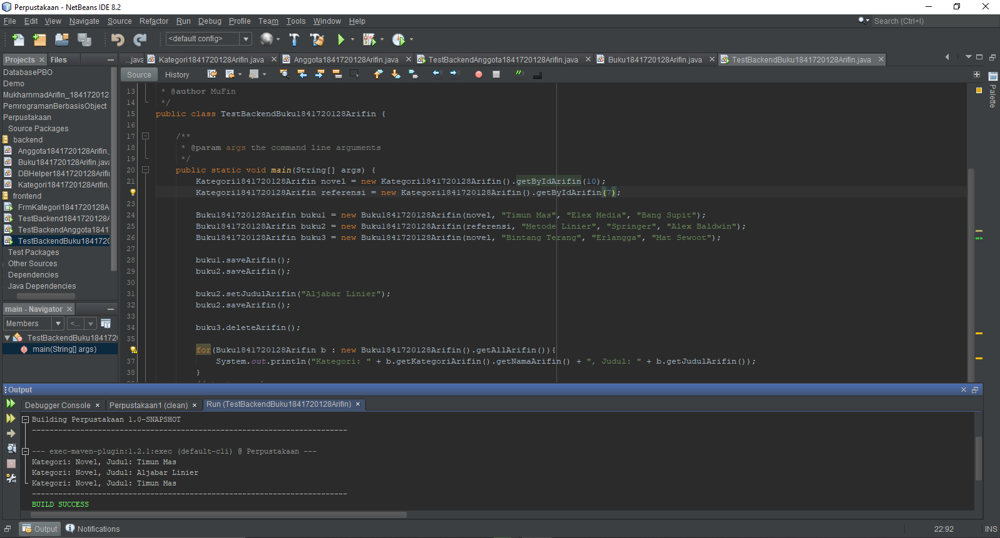
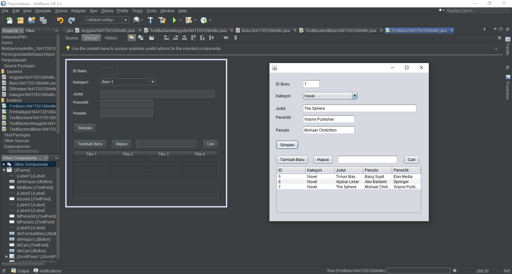
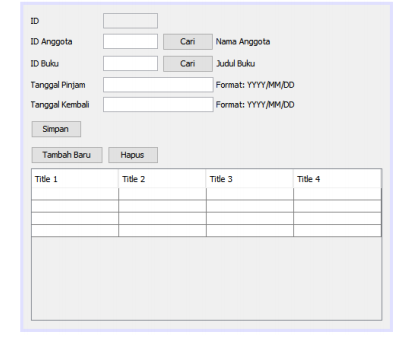
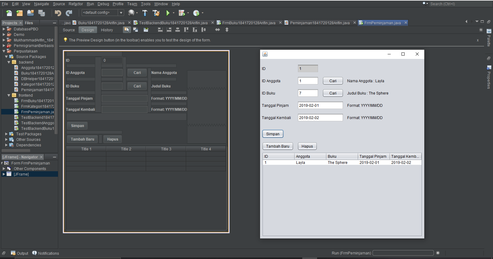

# Laporan Praktikum #13 - Collection (List, Set, Map) dan Database

## Kompetensi

Setelah menempuh materi percobaan ini, mahasiswa mampu mengenal:
1. Menggunakan paradigma berorientasi objek untuk interaksi dengan database
2. Membuat backend dan frontend
3. Membuat form sebagai frontend

## Ringkasan Materi

Pada praktikum ini sudah mencapai hampir semua targetan yang ada untuk kendala mungkin hanya pada awal saat pertama mencoba memahami penggunaan execute query pada bagian DBHelper, dan untuk memahami hal tersebut saya mencoba membaca setiap kode program pada setiap baris dan mengartikan setiap makna dan juga fungsinya.

## Percobaan

### Percobaan 1

Pada percobaan pertama saya membuat satu buah database dengan nama dbperpus yang memiliki empat tabel yaitu kategori, buku, anggota, dan juga peminjaman. Database ini nantinya akan digunakan untuk menyimpan input dari java.

### Percobaan 2

Pada percobaan kedua saya membuat satu project baru dengan nama perpustakaan dimana project baru ini memiliki dua package yaitu fontend dan backend, frontend akan berisi class JFrame yang menangani pada bagian GUI dan untuk backend akan berisi class yang berfungsi untuk menangani method getter setter dan juga method seperti koneksi pada database dan yang lainnya.

### Percobaan 3

Pada percobaan ketiga saya membuat satu buah class dengan nama DBHelper1841720128Arifin pada class ini berfungsi sebagai class controller di bagian yang berhubungan dengan database seperti koneksi, insert query, execute query hingga menampilkan hasil dari execute query tersebut.

Contoh kode program pada class DBHelper1841720128Arifin.java : [ini link ke kode program](../../src/14_GUI_dan_Database/Percobaan_3/DBHelper1841720128Arifin.java)

### Percobaan 4

Pada percobaan keempat ini saya membuat satu buah class dengan nama Kategori1841720128Arifin yang terletak di package backend, class ini menangani fungsi method seperti getter setter yang nantinya fungsi tersebut hanya tinggal diambil atau diimplementasikan ke tampilan GUI.

Contoh kode program pada class Kategori1841720128Arifin.java : [ini link ke kode program](../../src/14_GUI_dan_Database/Percobaan_4/Kategori1841720128Arifin.java)

### Percobaan 5

Pada percobaan kelima ini saya membuat satu buah main class dengan nama TestBackend1841720128Arifin, main class ini digunakan untuk melakukan uji coba pada class Kategori1841720128Arifin yang terdapat pada package backend .

Contoh kode program pada class Kategori1841720128Arifin.java : [ini link ke kode program](../../src/14_GUI_dan_Database/Percobaan_5/Kategori1841720128Arifin.java)

Contoh kode program pada main class TestBackend1841720128Arifin.java : [ini link ke kode program](../../src/14_GUI_dan_Database/Percobaan_5/TestBackend1841720128Arifin.java)

### Percobaan 6

Pada percobaan keenam ini saya membuat satu buah JFrame dengan nama FrmKategori1841720128Arifin pada JFrame ini akan digunakan sebagai tampilan dalam menyimpan, menghapus ataupun mencari data yang terdapat pada database dbperpus di bagian tabel kategori.

Contoh kode program pada class Kategori1841720128Arifin.java : [ini link ke kode program](../../src/14_GUI_dan_Database/Percobaan_6/Kategori1841720128Arifin.java)

Contoh kode program pada JFrame FrmKategori1841720128Arifin.java : [ini link ke kode program](../../src/14_GUI_dan_Database/Percobaan_5/FrmKategori1841720128Arifin.form)

Contoh kode program pada class FrmKategori1841720128Arifin.java : [ini link ke kode program](../../src/14_GUI_dan_Database/Percobaan_5/FrmKategori1841720128Arifin.java)

### Percobaan 7

Pada percobaan ketujuh ini saya membuat satu buah class bernama Anggota1841720128Arifin yang terletak pada package backend dan main class dengan nama TestBackendAnggota1841720128Arifin yang terletak pada package frontend. fungsi dari class Anggota1841720128Arifin sama dengan class Kategori1841720128Arifin dan main class TestBackendAnggota1841720128Arifin digunakan untuk melakukan uji coba pada class Anggota1841720128Arifin. Selain yang telah disebutkan saya juga membuat Form dengan nama FrmAnggota1841720128Arifin yang akan digunakan sebagai tampilan GUI dan juga berfungsi sebagai media inputan data dari GUI ke dalam database.

Contoh kode program pada class Anggota1841720128Arifin.java : [ini link ke kode program](../../src/14_GUI_dan_Database/Percobaan_7/Anggota1841720128Arifin.java)

Contoh kode program pada main class TestBackendAnggota1841720128Arifin.java : [ini link ke kode program](../../src/14_GUI_dan_Database/Percobaan_7/TestBackendAnggota1841720128Arifin.java)

### Percobaan 8

Pada percobaan kedelapan ini saya membuat satu buah class bernama Anggota1841720128Arifin yang terletak pada package backend dan JFrame dengan nama FrmAnggota1841720128Arifin yang terletak pada package frontend. fungsi dari FrmAnggota1841720128Arifin digunakan untuk menginputkan atau menampilkan data pada table anggota.

Contoh kode program pada class Anggota1841720128Arifin.java : [ini link ke kode program](../../src/14_GUI_dan_Database/Percobaan_8/Anggota1841720128Arifin.java)

Contoh kode program pada JFrame FrmAnggota1841720128Arifin.form : [ini link ke kode program](../../src/14_GUI_dan_Database/Percobaan_8/FrmAnggota1841720128Arifin.form)

Contoh kode program pada class FrmAnggota1841720128Arifin.java : [ini link ke kode program](../../src/14_GUI_dan_Database/Percobaan_8/FrmAnggota1841720128Arifin.java)

### Percobaan 9

Pada percobaan kesembilan ini saya membuat satu buah class bernama Buku1841720128Arifin yang terletak pada package backend, main class bernama TestBackendBuku1841720128Arifin yang terletak pada package frontend. fungsi dari TestBackendBuku1841720128Arifin digunakan sebagai uji coba terhadap class Buku1841720128Arifin.

Contoh kode program pada class Buku1841720128Arifin.java : [ini link ke kode program](../../src/14_GUI_dan_Database/Percobaan_9/Buku1841720128Arifin.java)

Contoh kode program pada main class TestBackendBuku1841720128Arifin.form : [ini link ke kode program](../../src/14_GUI_dan_Database/Percobaan_9/TestBackendBuku1841720128Arifin.form)

### Percobaan 10

Pada percobaan kesepuluh ini saya membuat satu buah JFrame atau Form dengan nama FrmBuku1841720128Arifin yang terletak pada package frontend. fungsi dari Form ini digunakan untuk menginputkan atau menampilkan data pada table buku.

Contoh kode program pada class Buku1841720128Arifin.java : [ini link ke kode program](../../src/14_GUI_dan_Database/Percobaan_10/Buku1841720128Arifin.java)

Contoh kode program pada JFrame FrmBuku1841720128Arifin.form : [ini link ke kode program](../../src/14_GUI_dan_Database/Percobaan_10/FrmBuku1841720128Arifin.form)

Contoh kode program pada class FrmBuku1841720128Arifin.java : [ini link ke kode program](../../src/14_GUI_dan_Database/Percobaan_10/FrmBuku1841720128Arifin.java)

## Tugas

1. Buatlah class Peminjaman.
2. Buatlah form FrmPeminjaman dan susun sebagai berikut:

    

3. Atur kode program agar dapat menangani transaksi peminjaman dan pengembalian.
Note:
Pada textbox ID Anggota, pengguna tinggal memasukkan ID anggota, kemudian menekan
tombol Cari. Jika ketemu, maka label “Nama Anggota” yang ada di samping tombol Cari tersebut
akan menampilkan nama anggota dari ID yang dimasukkan tadi. Begitu juga dengan ID Buku.

Jawaban:

Contoh kode program pada class Buku1841720128Arifin.java : [ini link ke kode program](../../src/14_GUI_dan_Database/Tugas/Peminjaman1841720128Arifin.java)

Contoh kode program pada JFrame FrmPeminjaman1841720128Arifin.form : [ini link ke kode program](../../src/14_GUI_dan_Database/Tugas/FrmPeminjaman1841720128Arifin.form)

Contoh kode program pada class FrmPeminjaman1841720128Arifin.java : [ini link ke kode program](../../src/14_GUI_dan_Database/Tugas/FrmPeminjaman1841720128Arifin.java)

## Kesimpulan

GUI adalah antarmuka pada sistem operasi atau komputer yang menggunakan menu grafis agar mempermudah para pengguna-nya untuk berinteraksi dengan komputer atau sistem operasi dan dalam antarmuka tersebut akan terecord suatu data sehingga diperlukanlah yang namanya database sebagai penyedia penyimpanan dan menampilkan data yang ada.

## Pernyataan Diri

Saya menyatakan isi tugas, kode program, dan laporan praktikum ini dibuat oleh saya sendiri. Saya tidak melakukan plagiasi, kecurangan, menyalin/menggandakan milik orang lain.

Jika saya melakukan plagiasi, kecurangan, atau melanggar hak kekayaan intelektual, saya siap untuk mendapat sanksi atau hukuman sesuai peraturan perundang-undangan yang berlaku.

Ttd,

***Mukhammad Arifin***
