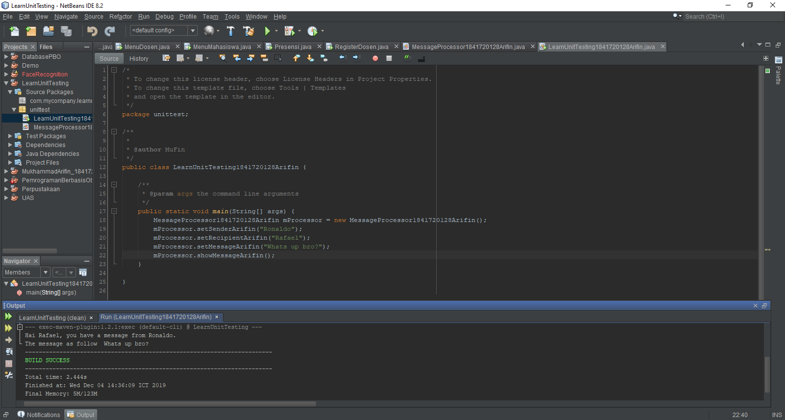
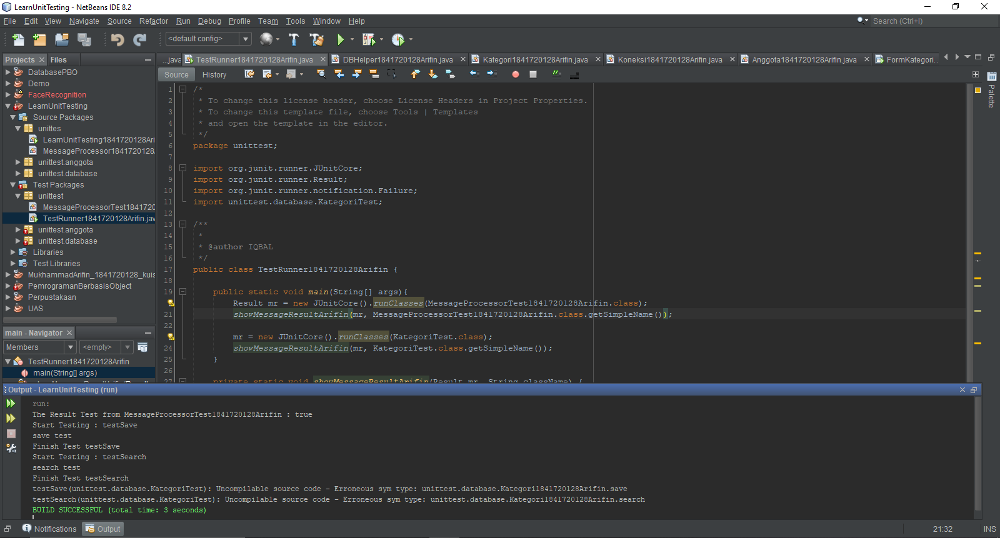
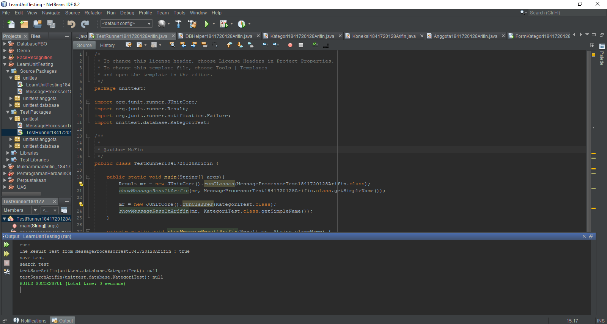

# Laporan Praktikum #15 – Unit Testing

## Kompetensi

Setelah menyelesaikan lembar kerja ini mahasiswa diharapkan mampu:
1. Memahami konsep dan fungsi unit testing
2. Menerapkan unit testing dengan JUnit pada program sederhana.
3. Menerapkan unit testing dengan JUnit pada progam yang terkoneksi database

## Ringkasan Materi

Pada praktikum ini saya tidak memahami karena jobsheet yang berantakan dan langkah-langkahnya tidak berurutan.

## Percobaan

### Percobaan 1

Pada percobaan pertama saya membuat dua buah class java yang akan digunakan untuk melakukan testing setelah melakukan run pada java tersebut akan menghasilkan java pada package test package, namun tidak berhenti disitu akan diteruskan dengan melakukan test pada java yang ada di package test.

Contoh kode program pada class MessageProcessor1841720128Arifin.java : [ini link ke kode program](../../src/15_Unit_Testing/Percobaan_1/MessageProcessor1841720128Arifin.java)

Contoh kode program pada class LearnUnitTesting1841720128Arifin.java : [ini link ke kode program](../../src/15_Unit_Testing/Percobaan_1/LearnUnitTesting1841720128Arifin.java)

Contoh kode program pada class MessageProcessorTest1841720128Arifin.java : [ini link ke kode program](../../src/15_Unit_Testing/Percobaan_1/MessageProcessorTest1841720128Arifin.java)

Contoh kode program pada class TestRunner1841720128Arifin.java : [ini link ke kode program](../../src/15_Unit_Testing/Percobaan_1/TestRunner1841720128Arifin.java)

### Percobaan 2

Pada percobaan kedua saya melakukan testing pada jobsheet 14 atau lebih tepatnya pada laporan praktikum ke 14 yang menyangkut tentang GUI dan Database dimana sekarang saya akan melakukan testing pada program tersebut.

Contoh kode program pada class DBHelper1841720128Arifin.java : [ini link ke kode program](../../src/15_Unit_Testing/Percobaan_2/DBHelper1841720128Arifin.java)

Contoh kode program pada class FormKategori1841720128Arifin.form : [ini link ke kode program](../../src/15_Unit_Testing/Percobaan_2/FormKategori1841720128Arifin.form)

Contoh kode program pada class FormKategori1841720128Arifin.java : [ini link ke kode program](../../src/15_Unit_Testing/Percobaan_2/FormKategori1841720128Arifin.java)

Contoh kode program pada class Kategori1841720128Arifin.java : [ini link ke kode program](../../src/15_Unit_Testing/Percobaan_2/Kategori1841720128Arifin.java)

Contoh kode program pada class KategoriTest1841720128Arifin.java : [ini link ke kode program](../../src/15_Unit_Testing/Percobaan_2/KategoriTest1841720128Arifin.java)

Contoh kode program pada class TestRunner1841720128Arifin.java : [ini link ke kode program](../../src/15_Unit_Testing/Percobaan_2/TestRunner1841720128Arifin.java)

## Tugas

Buat test case untuk percobaan kedua pada jobsheet ke 14.

Jawaban:

Contoh kode program pada class DBHelper1841720128Arifin.java : [ini link ke kode program](../../src/15_Unit_Testing/Tugas/DBHelper1841720128Arifin.java)

Contoh kode program pada JFrame Anggota1841720128Arifin.form : [ini link ke kode program](../../src/15_Unit_Testing/Tugas/Anggota1841720128Arifin.form)

Contoh kode program pada class FrmAnggota1841720128Arifin.form : [ini link ke kode program](../../src/15_Unit_Testing/Tugas/FrmAnggota1841720128Arifin.form)

Contoh kode program pada class FrmAnggota1841720128Arifin.java : [ini link ke kode program](../../src/15_Unit_Testing/Tugas/FrmAnggota1841720128Arifin.java)

Contoh kode program pada class TestBackend1841720128Arifin.java : [ini link ke kode program](../../src/15_Unit_Testing/Tugas/TestBackend1841720128Arifin.java)

Contoh kode program pada class AnggotaTest1841720128Arifin.java : [ini link ke kode program](../../src/15_Unit_Testing/Tugas/AnggotaTest1841720128Arifin.java)

## Kesimpulan

Unit Testing berguna sebagai pendeteksi untuk mencari error atau bug, selain itu bagi developer berguna sebagai debug pada aplikasi untuk menguji apakah program berjalan sesuai keinginan kita.

## Pernyataan Diri

Saya menyatakan isi tugas, kode program, dan laporan praktikum ini dibuat oleh saya sendiri. Saya tidak melakukan plagiasi, kecurangan, menyalin/menggandakan milik orang lain.

Jika saya melakukan plagiasi, kecurangan, atau melanggar hak kekayaan intelektual, saya siap untuk mendapat sanksi atau hukuman sesuai peraturan perundang-undangan yang berlaku.

Ttd,

***Mukhammad Arifin***