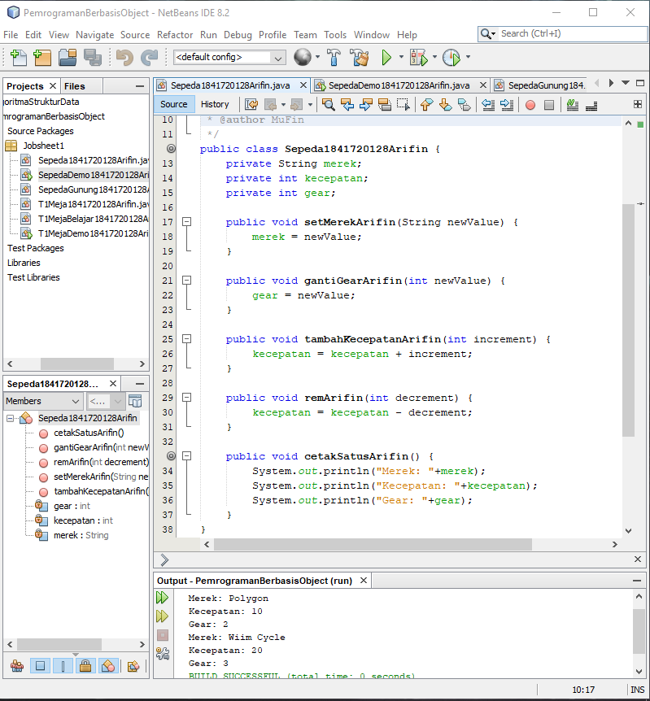
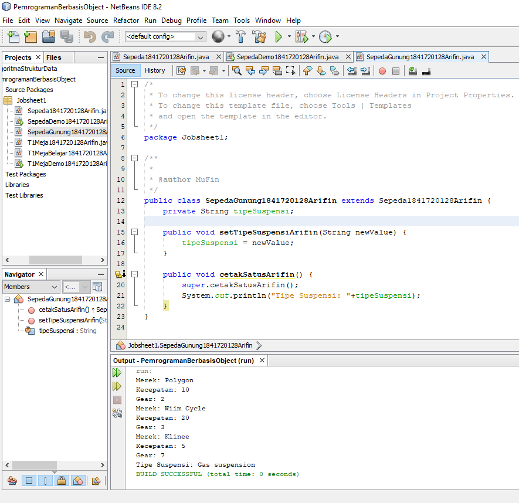
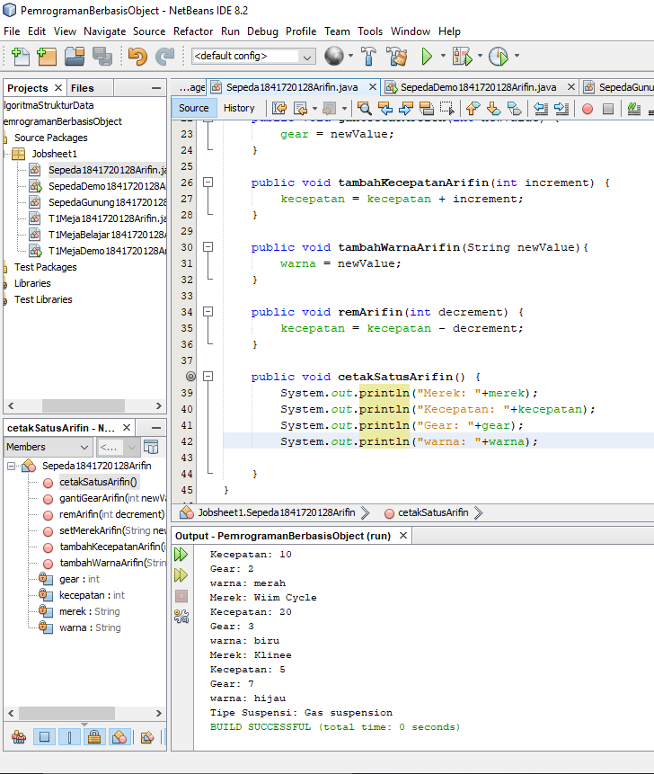
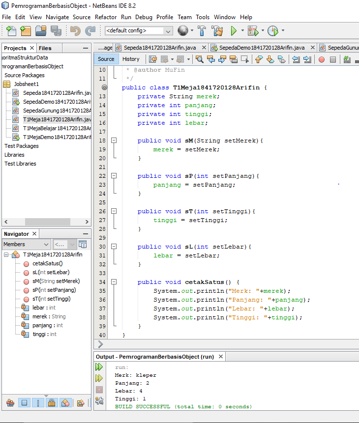
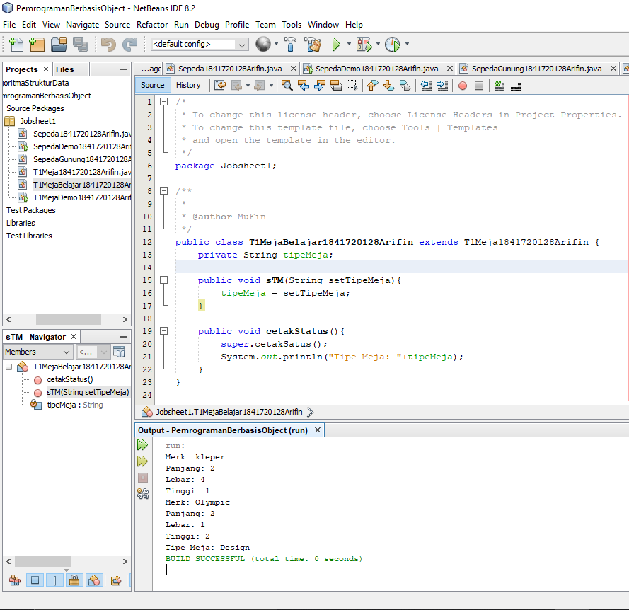

# Laporan Praktikum #1 - Pengantar Konsep PBO

## Kompetensi

Setelah menempuh materi percobaan ini, mahasiswa mampu mengenal: 
1. Perbedaan paradigma berorientasi objek dengan paradigma struktural
2. Konsep dasar PBO

## Ringkasan Materi

Pada praktikum ini saya menemukan kesalahan berupa kesalahan dalam pembuatan method ataupun penulisan program selama melakukan praktikum.

## Percobaan

### Percobaan 1

Pada percobaan pertama disini saya membuat sebuah class sepeda dan juga class main demo sepeda, pada class sepeda di isi oleh atribut yang menjadi variable dan pada class main demo berisi program untuk memasukkan data dan juga menampilkan inputan yang telah dibuat dengan menghubungkan method yang ada pada class sepeda.

Contoh link kode program class sepeda : [ini contoh link ke kode program](../../src/1_Pengantar_Konsep_PBO/Percobaan1/Sepeda1841720128Arifin.java)

Contoh link kode program class SepedaDemo : [ini contoh link ke kode program](../../src/1_Pengantar_Konsep_PBO/Percobaan1/SepedaDemo1841720128Arifin.java)

### Percobaan 2

Pada percobaan kedua masih meneruskan pada percobaan kedua namun ada penambahan class yaitu class SepedaGunung pada class ini merupakan class turunan dari class Sepeda dan pada class SepedaGunung tidak perlu menambahkan method yang sama seperti Sepeda karena method Sepeda sudah diturunkan ke SepedaGunung dengan extend maka SepedaGunung hanya perlu menambahkan method yang belum ada pada Sepeda.

Contoh link kode program class SepedaGunung : [ini contoh link ke kode program](../../src/1_Pengantar_Konsep_PBO/Percobaan2/SepedaGunung1841720128Arifin.java)

Contoh link kode program class SepedaDemo : [ini contoh link ke kode program](../../src/1_Pengantar_Konsep_PBO/Percobaan2/SepedaDemo1841720128Arifin.java)

## Pertanyaan

1.	Sebutkan dan jelaskan aspek-aspek yang ada pada pemrograman berorientasi objek!
    
    Jawaban : Object, Class, Enkapsulasi, Inheritance dan Polimorfisme.

2.	Apa yang dimaksud dengan object dan apa bedanya dengan class?
    
    Jawaban : Object adalah suatu rangkaian dalam program yang terdiri dari state(ciri-ciri atau atribut dari objek tersebut.) dan behavior(perilaku yang dapat dilakukan objek tersebut.) sedangkan perbedaannya adalah Class adalah sebuah blueprint, prototype, atau rancangan pada suatu object. Bisa disimpulkan bahwa  object adalah bendanya sedangkan class adalah rancangan pada benda tersebut.

3.	Sebutkan salah satu kelebihan utama dari pemrograman berorientasi objek dibandingkan dengan pemrograman struktural!

    Jawaban : Perbedaan mendasar antara pemrograman terstruktur dengan pemrograman berorientasi objek (PBO) atau Object Oriented Programming (OOP) adalah: Pada pemrograman terstruktur, program dipecah kedalam sub-program atau fungsi. Sedangkan pada PBO, program dipecah kedalam objek, dimana objek tersebut membungkus state dan method.

4.	Pada class Sepeda, terdapat state/atribut apa saja?

    Jawaban : Merek, kecepatan dan gear

5.	Tambahkan atribut warna pada class Sepeda.

    Jawaban : Class sepeda yang sudah ditambahkan dengan atribut warna

    

    Contoh link kode program class Sepeda : [ini contoh link ke kode program](../../src/1_Pengantar_Konsep_PBO/Pertanyaan/Sepeda1841720128Arifin.java)
    
    Contoh link kode program class SepedaDemo : [ini contoh link ke kode program](../../src/1_Pengantar_Konsep_PBO/Pertanyaan/SepedaDemo1841720128Arifin.java)

6.	Mengapa pada saat kita membuat class SepedaGunung, kita tidak perlu membuat class nya dari nol

    Jawaban : Karena class sepedagunung sudah extend atau sudah diwarisi oleh class sepeda.

## Tugas

Contoh link kode program class T1Meja : [ini contoh link ke kode program](../../src/1_Pengantar_Konsep_PBO/Tugas/T1Meja1841720128Arifin.java)

Contoh link kode program class T1MejaBelajar : [ini contoh link ke kode program](../../src/1_Pengantar_Konsep_PBO/Tugas/T1MejaBelajar1841720128Arifin.java)

Contoh link kode program class T1MejaDemo : [ini contoh link ke kode program](../../src/1_Pengantar_Konsep_PBO/Tugas/T1MejaDemo1841720128Arifin.java)

## Kesimpulan

Hal dapat disimpulkan dari praktikum dan juga tugas yang telah dilakukan, saya dapat menyimpulkan bahwa suatu class pada java dapat diturunkan ke class turunannya, dan dari hal tersebut tidak akan mengganggu class yang lain.

## Pernyataan Diri

Saya menyatakan isi tugas, kode program, dan laporan praktikum ini dibuat oleh saya sendiri. Saya tidak melakukan plagiasi, kecurangan, menyalin/menggandakan milik orang lain.

Jika saya melakukan plagiasi, kecurangan, atau melanggar hak kekayaan intelektual, saya siap untuk mendapat sanksi atau hukuman sesuai peraturan perundang-undangan yang berlaku.

Ttd,

***Mukhammad Arifin***
