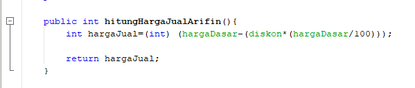
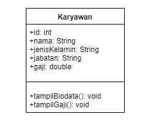
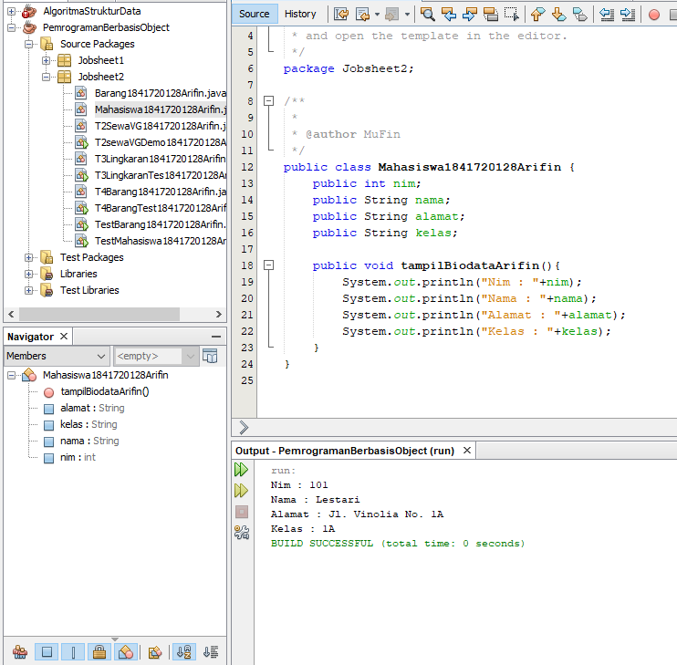
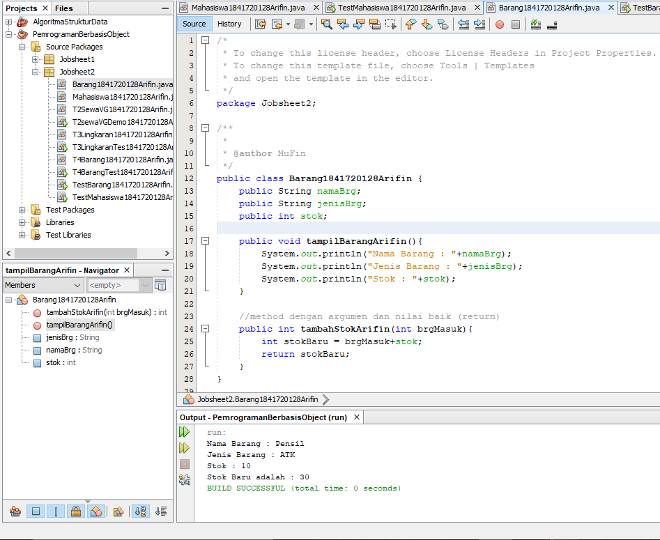
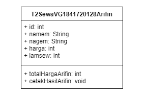
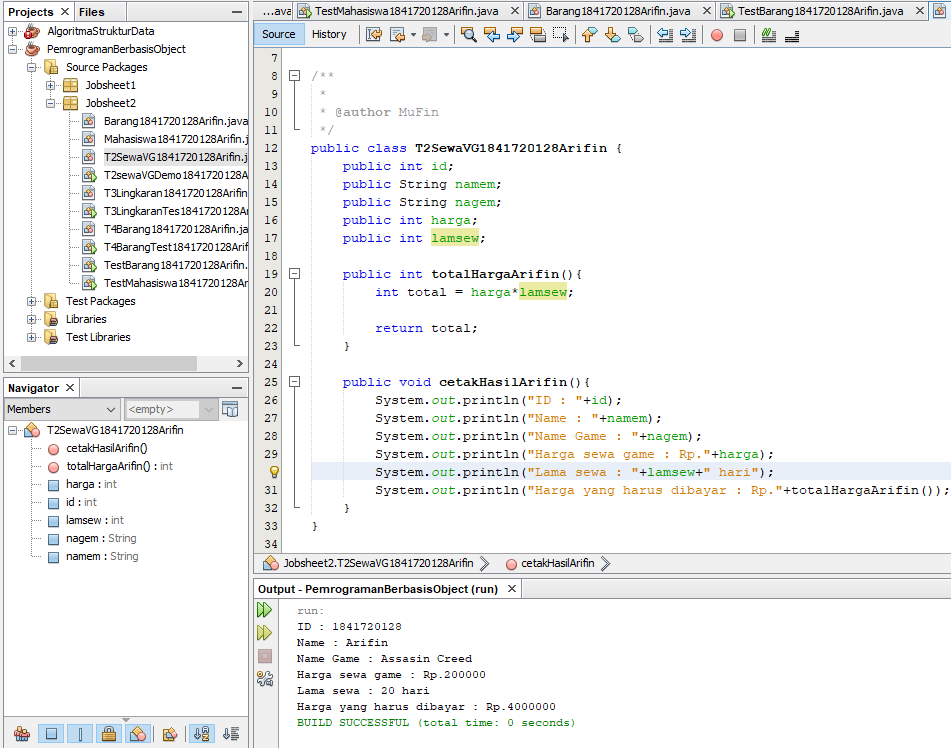
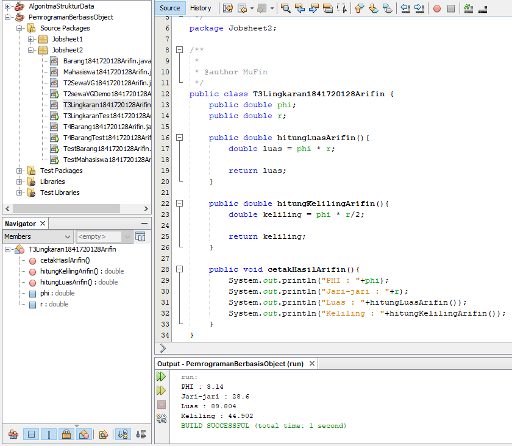
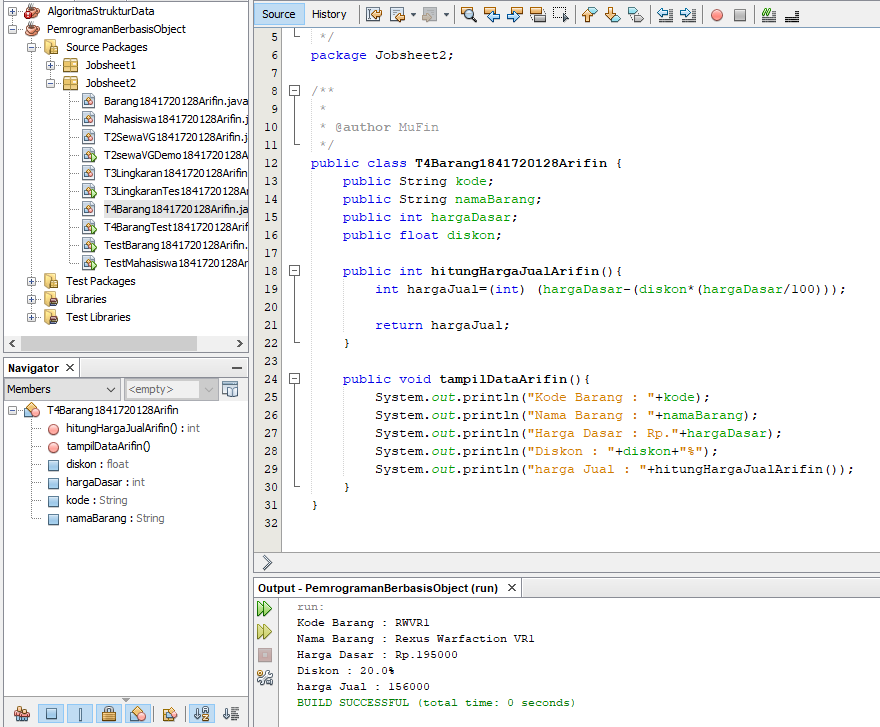

# Laporan Praktikum #2 - Class dan Object

## Kompetensi

 Kompetensi
 1. Mahasiswa dapat memahami deskripsi dari class dan object
 2. Mahasiswa memahami implementasi dari class
 3. Mahasiswa dapat memahami implementasi dari attribute
 4. Mahasiswa dapat memahami implementasi dari method
 5. Mahasiswa dapat memahami implementasi dari proses instansiasi
 6. Mahasiswa dapat memahami implementasi dari try-catch
 7. Mahasiswa dapat memahami proses pemodelan class diagram menggunakan UML 

## Ringkasan Materi

Pada praktikum ini saya menemukan kesulitan dan juga rasa penasaran pada kode program di tugas nomor 4 karena, pada pada kode program tersebut melakukan perhitungan dimana terdapat dua variable yang memiliki tipe data yang berbeda sehingga menyebabkan program menjadi error. Namun setelah saya melakukan perbaikan menggunakan fitur perbaikan program pada netBeans tiba-tiba program berjalan dengan lancar namun saya tidak paham dengan kode program yang diperbaiki dengan fitur yang ada pada netBeans.

## Percobaan

### Percobaan 1

Pada percobaan pertama adalah membuat class diagram dari suatu studi kasus dan juga beberapa pertanyaan sebagai berikut :

Dalam suatu perusahaan salah satu data yang diolah adalah data karyawan. Setiap karyawan memiliki id, nama, jenis kelamin, jabatan, jabatan, dan gaji. Setiap mahasiswa juga bisa menampilkan data diri pribadi dan melihat gajinya. 
 
1. Gambarkan desain class diagram dari studi kasus 1!
2. Sebutkan Class apa saja yang bisa dibuat dari studi kasus 1!
3. Sebutkan atribut beserta tipe datanya yang dapat diidentifikasi dari masing-masing class dari studi kasus 1!
4. Sebutkan method-method yang sudah anda buat dari masing-masing class pada studi kasus 1

Jawab :
1. Gambar desain class diagram Karyawan

    

2. Karyawan

3. Atribut yang ada pada class diagram Karyawan antara lain :
   
   a. Atribut id dengan tipe data integer

   b. Atribut nama dengan tipe data String

   c. Atribut jenisKelamin dengan tipe data String

   d. Atribut jabatan dengan tipe data String

   e. Atribut gaji dengan tipe data double

4. terdapat dua method yang sudah saya buat yaitu :
   
   a. tampilBiodata

   b. tampilGaji

### Percobaan 2

Pada percobaan kedua adalah membuat suatu program dengan class diagram yang sudah disediakan pada jobsheet, yaitu class diagram dari Mahasiswa yang berisi atribut nim dengan tipe data integer, nama dengan tipe data String, alamat dengan tipe data String dan juga kelas dengan tipe data String. Selain itu terdapat method pada class diagram Mahasiswa yaitu tampilBiodata.

Contoh link kode program pada class Mahasiswa1841720128Arifin.java : [ini contoh link ke kode program](../../src/2_Class_dan_Object/Percobaan_2/Mahasiswa1841720128Arifin.java)

Contoh link kode program pada class Main TestMahasiswa1841720128Arifin.java : [ini contoh link ke kode program](../../src/2_Class_dan_Object/Percobaan_2/TestMahasiswa1841720128Arifin.java)

### Percobaan 3

Pada percobaan ketiga ini saya membuat suatu class yang bernama Barang. Pada class Barang ini terdapat tiga atribut yaitu namaBarang, jenisBarang dan stok. selain atribut terdapat juga method pada class tersebut, yaitu tampilBarang dan juga tambahStok.

#### Kesimpulan : 

Kegunaan dari kata kunci return adalah untuk mengembalikan nilai dari suatu method yang didalamnya terdapat perhitungan.

Contoh link kode program pada class Barang1841720128Arifin.java : [ini contoh link ke kode program](../../src/2_Class_dan_Object/Percobaan_3/Barang1841720128Arifin.java)

Contoh link kode program pada class TestBarang1841720128Arifin.java : [ini contoh link ke kode program](../../src/2_Class_dan_Object/Percobaan_3/TestBarang1841720128Arifin.java)

## Tugas

1. Suatu toko persewaan video game salah satu yang diolah adalah peminjaman, dimana data yang dicatat ketika ada orang yang melakukan peminjaman adalah id, nama member, nama game, dan harga yang harus dibayar. Setiap peminjaman bisa menampilkan data hasil peminjaman dan harga yang harus dibayar. Buatlah class diagram pada studi kasus diatas! 
 
    Penjelasan:
  
    a. Harga yang harus dibayar diperoleh dari lama sewa x harga.
   
    b. Diasumsikan 1x transaksi peminjaman game yang dipinjam hanya 1 game saja.

    

2. Buatlah program dari class diagram yang sudah anda buat di no 1! 

    

    Contoh link kode program pada class TestBarang1841720128Arifin.java : [ini contoh link ke kode program](../../src/2_Class_dan_Object/Tugas_2/T2SewaVG1841720128Arifin.java)

    Contoh link kode program pada class TestBarang1841720128Arifin.java : [ini contoh link ke kode program](../../src/2_Class_dan_Object/Tugas_2/T2SewaVGDemo1841720128Arifin.java)

3. Program dari Class diagram Lingkaran

    

    Contoh link kode program pada class TestBarang1841720128Arifin.java : [ini contoh link ke kode program](../../src/2_Class_dan_Object/Tugas_3/T3Lingkaran1841720128Arifin.java)

    Contoh link kode program pada class TestBarang1841720128Arifin.java : [ini contoh link ke kode program](../../src/2_Class_dan_Object/Tugas_3/T3LingkaranTes1841720128Arifin.java)

4. Program Class diagram Barang

    Deskripsi / Penjelasan :
    
    a. Nilai atribut hargaDasar dalam Rupiah dan atribut diskon dalam %
    
    b. Method hitungHargaJual() digunakan untuk menghitung harga jual dengan perhitungan berikut ini: 
    
            harga jual = harga dasar – (diskon x harga dasar)

    

    Contoh link kode program pada class T4Barang1841720128Arifin.java : [ini contoh link ke kode program](../../src/2_Class_dan_Object/Tugas_4/T4Barang1841720128Arifin.java)

    Contoh link kode program pada class T4BarangTest1841720128Arifin.java : [ini contoh link ke kode program](../../src/2_Class_dan_Object/Tugas_4/T4BarangTest1841720128Arifin.java)
    

## Kesimpulan

Hal dapat disimpulkan dari praktikum dan juga tugas yang telah dilakukan, saya dapat menyimpulkan bahwa suatu class diagram pada java adalah rancangan dasar pada suatu pembuatan program. Selain pada praktikum dan juga tugas terdapat method yang dapat mengembalikan nilai yang gunanya sendiri adalah pada suatu studi kasus yang didalamnya tidak hanya menampilkan suatu inputan data saja namun, juga mengembalikan nilai perhitungan dari inputan data tersebut.

## Pernyataan Diri

Saya menyatakan isi tugas, kode program, dan laporan praktikum ini dibuat oleh saya sendiri. Saya tidak melakukan plagiasi, kecurangan, menyalin/menggandakan milik orang lain.

Jika saya melakukan plagiasi, kecurangan, atau melanggar hak kekayaan intelektual, saya siap untuk mendapat sanksi atau hukuman sesuai peraturan perundang-undangan yang berlaku.

Ttd,

***Mukhammad Arifin***
