# Laporan Praktikum #3 - Enkapsulasi

## Kompetensi

Setelah melakukan percobaan pada modul ini, mahasiswa memahami konsep: 
1. Konstruktor 
2. Akses Modifier 
3. Atribut/method pada class 
4. Intansiasi atribut/method  
5. Setter dan getter 
6. Memahami notasi pada UML Class Diagram 

## Ringkasan Materi

Pada praktikum ini saya menemukan kesulitan pada saat akan membuat sebuah inputan pada tugas nomor 6 dimana seperti yang diketahui saat ingin membuat suatu inputan pada method dimana method tersebut tidak bisa mengembalikan nilai sehingga saya merasa kebingungan dan juga tidak mengerti namun hal tersebut saya bisa saya selesaikan setelah saya bertanya pada kakak tingkat dan juga teman saya yang tahu tentang cara pengerjaan untuk tugas nomor 6 tersebut.

## Percobaan

### Percobaan 1 - Enkapsulasi

Pada percobaan Enkapsulasi saya membuat sebuah class bernama Motor1841720128Arifin yang memiliki atribut kecepatan dengan tipe data integer dan kontakOn dengan tipe data boolean, dan juga memiliki method printStatusArifin untuk menampilkan status pada motor. Selain itu saya juga membuat main class yang bernama MotorDemo1841720128Arifin untuk memanggil fungsi method yang ada pada class Motor1841720128Arifin

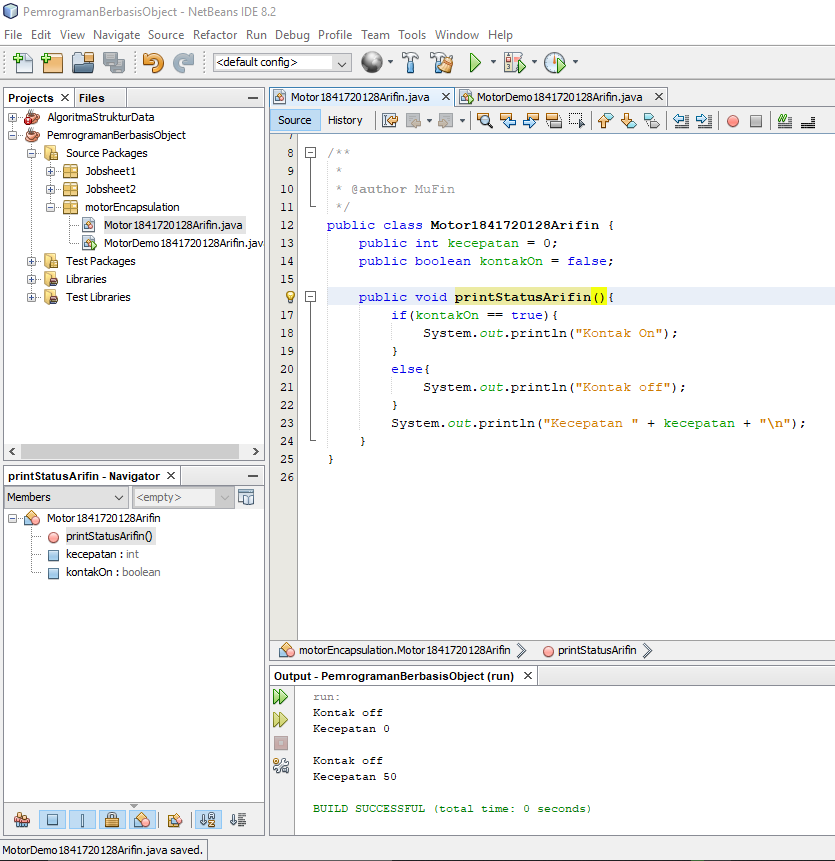

Contoh link kode program pada class Motor1841720128Arifin.java : [ini contoh link ke kode program](../../src/3_Enkapsulasi/Percobaan_1/Motor1841720128Arifin.java)

Contoh link kode program pada Main class MotorDemo1841720128Arifin.java : [ini contoh link ke kode program](../../src/3_Enkapsulasi/Percobaan_1/MotorDemo1841720128Arifin.java)

### Percobaan 2 - Access Modifier

Pada percobaan kedua yang akan saya lakukan adalah memperbaiki cara kerja class Motor1841720128Arifin yang ada pada percobaan ke-1 dengan cara menambahkan sebuah method baru yaitu nyalakanMesinArifin, matikanMesinArifin, tambahKecepatanArifin dan kurangiKecepatanArifin.

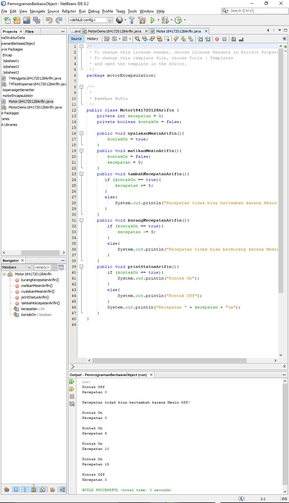

Contoh link kode program pada class Motor1841720128Arifin.java : [ini contoh link ke kode program](../../src/3_Enkapsulasi/Percobaan_2/Motor1841720128Arifin.java)

Contoh link kode program pada Main class MotorDemo1841720128Arifin.java : [ini contoh link ke kode program](../../src/3_Enkapsulasi/Percobaan_2/MotorDemo1841720128Arifin.java)

### Pertanyaan

1. Pada class MotorDemo, saat kita menambah kecepatan untuk pertama kalinya, mengapa muncul peringatan “Kecepatan tidak bisa bertambah karena Mesin Off!”?

    Jawab: 
    
    Karena pada method tambahKecepatanArifin sudah diberikan suatu keadaan dimana saat kontakOn bernilai true maka kecepatan akan ditambahkan sama dengan lima, namun apabila kontak on bernilai false atau dalam kondisi awal maka akan muncul peringatan “Kecepatan tidak bisa bertambah karena Mesin Off!”. Agar bisa menambahkan kecepatan pada Main class haruslah memanggil method nyalakanMesinArifin terlebih dahulu.

2. Mengapat atribut kecepatan dan kontakOn diset private?

    jawab:
    
    Untuk menghindari kesamaan nama pada atribut dan juga atribut tersebut hanya bisa digunakan pada class tersebut.

3. Ubah class Motor sehingga kecepatan maksimalnya adalah 100!

    Jawab:
    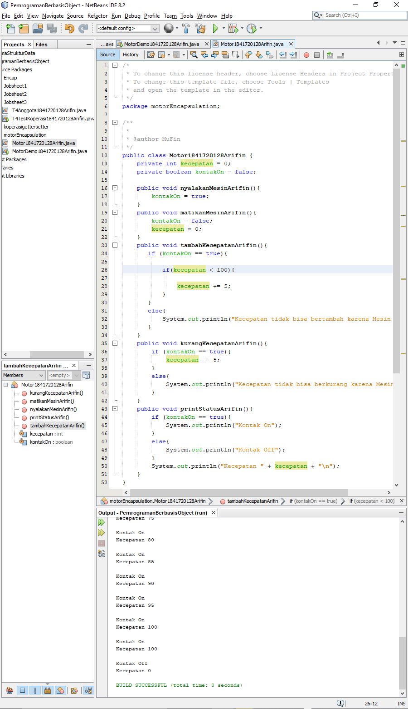

### Percobaan 3 - Getter dan Setter

Pada percobaan ketiga ini saya membuat suatu class yang bernama Anggota1841720128 yang memiliki atribut nama dengan tipe data String, alamat dengan tipe data String dan simpanan bertipe data float, selain itu terdapat juga method didalamnya antara lain, setNama, setAlamat, getNama, getAlamat, getSimpanan, setor dan juga pinjam. Selain itu saya juga membuat class bernama KoperasiDemo1841720128Arifin.

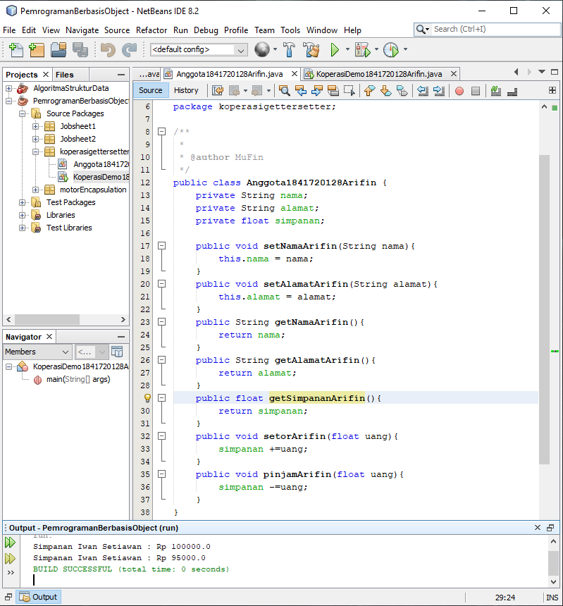

Contoh link kode program pada class Anggota1841720128Arifin.java : [ini contoh link ke kode program](../../src/3_Enkapsulasi/Percobaan_3/Anggota1841720128Arifin.java)

Contoh link kode program pada class Main KoperasiDemo1841720128Arifin.java : [ini contoh link ke kode program](../../src/3_Enkapsulasi/Percobaan_3/KoperasiDemo1841720128Arifin.java)

### Percobaan 4 - Konstruktor, Intansiasi

Pada percobaan keempat ini saya melakukan beberapa perubahan pada main class KoperasiDemo1841720128Arifin dan juga pada class Anggota1841720128Arifin

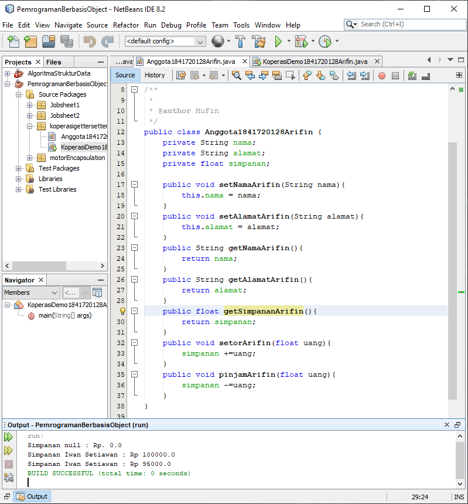

Contoh link kode program pada class Anggota1841720128Arifin.java : [ini contoh link ke kode program](../../src/3_Enkapsulasi/Percobaan_4_1/Anggota1841720128Arifin.java)

Contoh link kode program pada class Main KoperasiDemo1841720128Arifin.java : [ini contoh link ke kode program](../../src/3_Enkapsulasi/Percobaan_4_1/KoperasiDemo1841720128Arifin.java)

Contoh link kode program pada class Anggota1841720128Arifin.java : [ini contoh link ke kode program](../../src/3_Enkapsulasi/Percobaan_4_2/Anggota1841720128Arifin.java)

Contoh link kode program pada class Main KoperasiDemo1841720128Arifin.java : [ini contoh link ke kode program](../../src/3_Enkapsulasi/Percobaan_4_2/KoperasiDemo1841720128Arifin.java)

### Pertanyaan

1. Apa yang dimaksud getter dan setter?

    Jawab: 
    
    Yang dimaksud getter dan setter setelah saya melakukan percobaan 3 adalah getter ialah sebuah method untuk mengembalikan suatu nilai dari dalam method itu sendiri, sedangkan setter adalah sebuah method untuk mengambil nilai atau isi dari atribut tersebut.

2. Apa kegunaan dari method getSimpanan()?

    Jawab: 
    
    Untuk mengembalikan nilai pada atribut simpanan.

3. Method apa yang digunakan untk menambah saldo?

    Jawab: 
    
    Method yang menambahkan saldo adalah setorArifin().

4. Apa yand dimaksud konstruktor?

    Jawab: 
    
    Suatu method khusus yang akan langsung dieksekusi saat melakukan pembuatan suatu objek.

5. Sebutkan aturan dalam membuat konstruktor?

    Jawab: 
    
    Berikut merupakan contoh dari aturan membuat konstruktor:

    a. membuat konstruktur harus memiliki nama yang sama dengan class
    
    b. konstruktor tidak dapat diwariskan

    c. this adalah pernyataan pertama yang di panggil dalam constructor

6. Apakah boleh konstruktor bertipe private?

    Jawab: 
    
    Kemungkinan tidak bisa karena setelah saya mencoba sendiri yang terjadi adalah terdapat error pada Main class karena konstruktor dibuat menjadi private.

7. Kapan menggunakan parameter dengan passsing parameter?

    Jawab:

    Digunakan pada saat nilai default atribut pada pembuatan objek memiliki nilai tertentu.

8. Apa perbedaan atribut class dan instansiasi atribut?

    Jawab:

    Atribut class adalah suatu atribut yang terdapat pada suatu objek sedangkan instansiasi atribut yang memiliki nilai untuk objek dimana setiap objek yang satu dengan yang lain berbeda beda
    

9. Apa perbedaan class method dan instansiasi method?

    Jawab:

    Class method adalah method yang berada pada suatu class yang menyatakan suatu hal atau suatu fungsi yang bisa dilakukan seperti menghitung ataupun hal yang lainnya, sedangkan instansiasi method adalah method yang memberikan nilai awal pada suatu atribut.

## Tugas

1. Cobalah program dibawah ini dan tuliskan hasil outputnya

    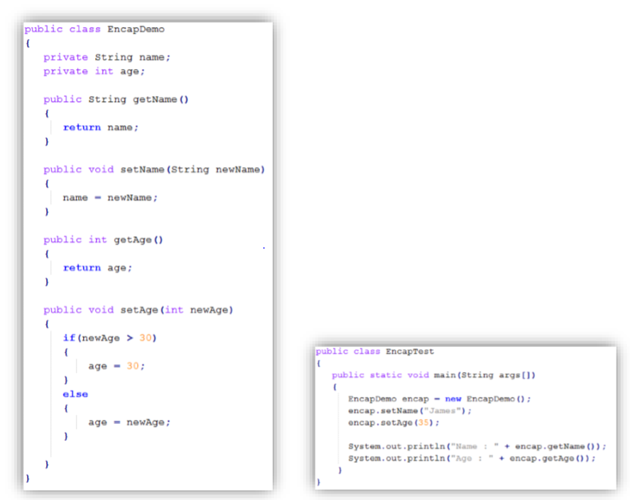

    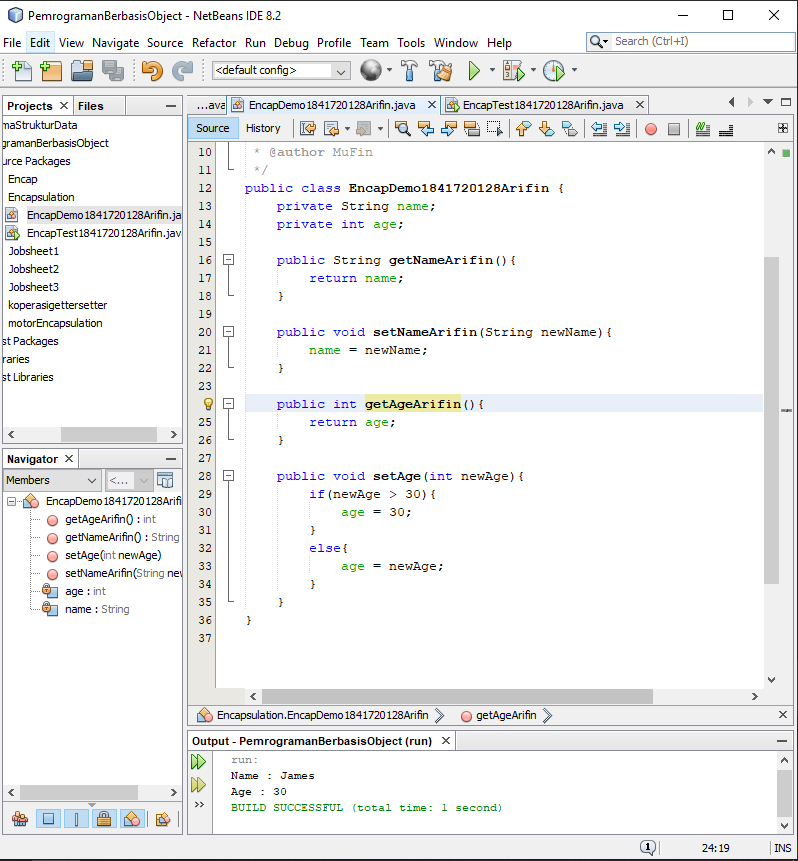

    Contoh link kode program pada class EncapDemo1841720128Arifin.java : [ini contoh link ke kode program](../../src/3_Enkapsulasi/Tugas_1/EncapDemo1841720128Arifin.java)

    Contoh link kode program pada Main class EncapTest1841720128Arifin.java : [ini contoh link ke kode program](../../src/3_Enkapsulasi/Tugas_1/EncapTest1841720128Arifin.java)

2. Pada program diatas, pada class EncapTest kita mengeset age dengan nilai 35, namun pada saat ditampilkan ke layar nilainya 30, jelaskan mengapa. 

    Jawab:

    Karena saat kita mengeset age dengan nilai 35 maka secara otomatis akan diproses oleh method setAgeArifin dengan kondisi jika newAge(atribut yang tadi telah di isi dengan nilai 35) bernilai diatas 30 maka age sama dengan 30, maka yang ditampilkan adalah nilai 30.

3. Ubah program diatas agar atribut age dapat diberi nilai maksimal 30 dan minimal 18. 

    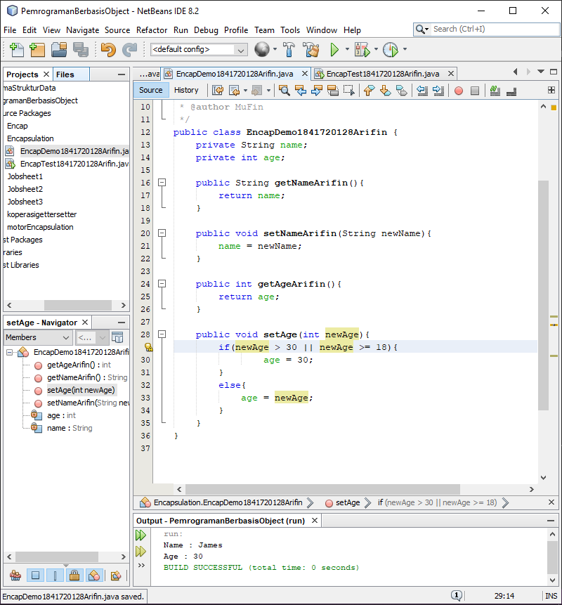

    Contoh link kode program pada class EncapDemo1841720128Arifin.java : [ini contoh link ke kode program](../../src/3_Enkapsulasi/Tugas_3/T2SewaVG1841720128Arifin.java)

    Contoh link kode program pada Main class EncapTest1841720128Arifin.java : [ini contoh link ke kode program](../../src/3_Enkapsulasi/Tugas_3/EncapTest1841720128Arifin.java)

4. Pada sebuah sistem informasi koperasi simpan pinjam, terdapat class Anggota yang memiliki atribut antara lain nomor KTP, nama, limit peminjaman, dan jumlah pinjaman. Anggota dapat meminjam uang dengan batas limit peminjaman yang ditentukan. Anggota juga dapat mengangsur pinjaman. Ketika Anggota tersebut mengangsur pinjaman, maka jumlah pinjaman akan berkurang sesuai dengan nominal yang diangsur. Buatlah class Anggota tersebut, berikan atribut, method dan konstruktor sesuai dengan kebutuhan. Uji dengan TestKoperasi berikut ini untuk memeriksa apakah class Anggota yang anda buat telah sesuai dengan yang diharapkan. 

    

    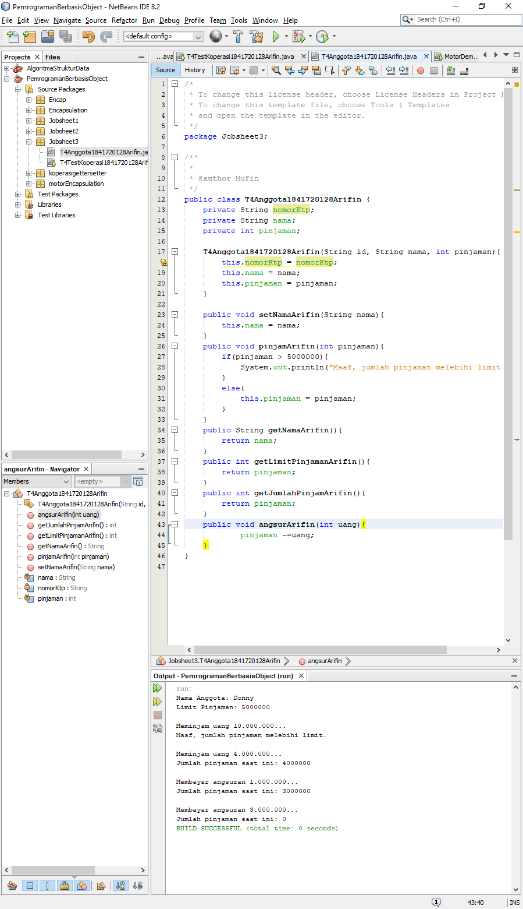

    Contoh link kode program pada class T4Anggota41841720128Arifin.java : [ini contoh link ke kode program](../../src/3_Enkapsulasi/Tugas_4/T4Anggota1841720128Arifin.java)

    Contoh link kode program pada Main class T4TestKoperasi1841720128Arifin.java : [ini contoh link ke kode program](../../src/3_Enkapsulasi/Tugas_4/T4TestKoperasi1841720128Arifin.java)

5. Modifikasi soal no. 4 agar nominal yang dapat diangsur minimal adalah 10% dari jumlah pinjaman saat ini. Jika mengangsur kurang dari itu, maka muncul peringatan “Maaf, angsuran harus 10% dari jumlah pinjaman”. 

    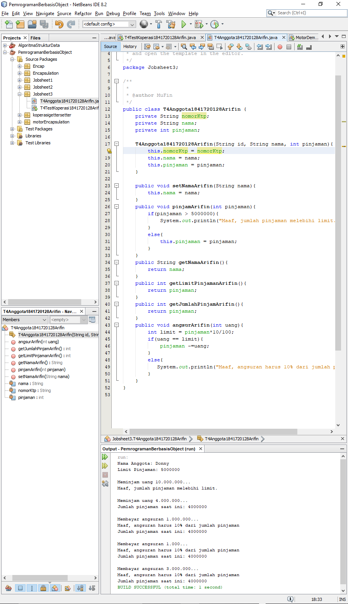

    Contoh link kode program pada class T4Anggota41841720128Arifin.java : [ini contoh link ke kode program](../../src/3_Enkapsulasi/Tugas_5/T4Anggota1841720128Arifin.java)

    Contoh link kode program pada Main class T4TestKoperasi1841720128Arifin.java : [ini contoh link ke kode program](../../src/3_Enkapsulasi/Tugas_5/T4TestKoperasi1841720128Arifin.java)
    

6. Modifikasi class TestKoperasi, agar jumlah pinjaman dan angsuran dapat menerima input dari console

    

    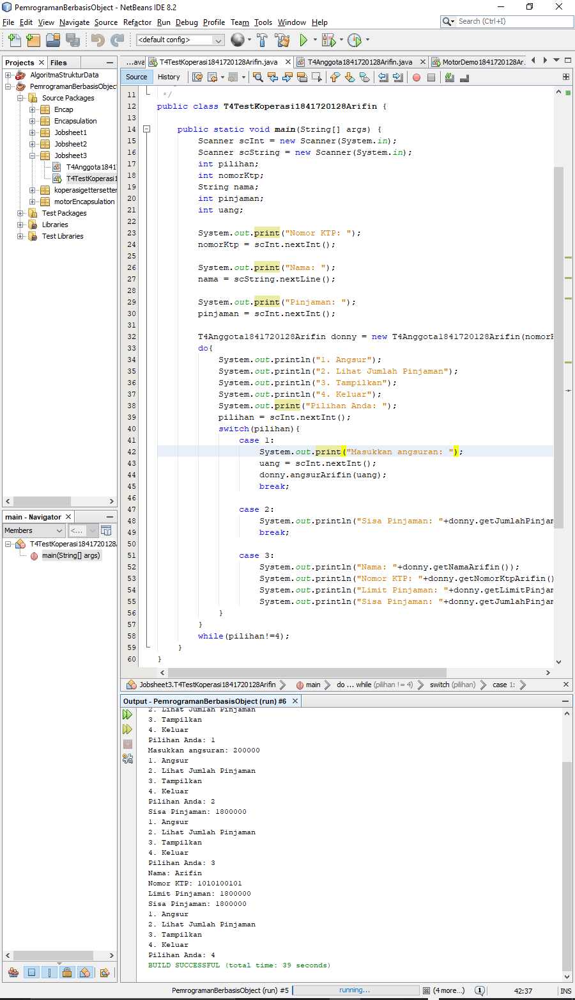

    Contoh link kode program pada class T4Anggota41841720128Arifin.java : [ini contoh link ke kode program](../../src/3_Enkapsulasi/Tugas_6/T4Anggota1841720128Arifin.java)

    Contoh link kode program pada Main class T4TestKoperasi1841720128Arifin.java : [ini contoh link ke kode program](../../src/3_Enkapsulasi/Tugas_6/T4TestKoperasi1841720128Arifin.java)

## Kesimpulan

Hal yang dapat saya simpulkan dari praktikum dan juga tugas yang telah dilakukan adalah enkapsulasi merupakan information-hiding, yang berarti sering kali dalam berinteraksi dengan objek kita tidak perlu mengetahui fungsi atau hal apa yang berjalan didalamnya. Selain enkapsulasi kita juga belajar konstruktor dan juga access modifier.

## Pernyataan Diri

Saya menyatakan isi tugas, kode program, dan laporan praktikum ini dibuat oleh saya sendiri. Saya tidak melakukan plagiasi, kecurangan, menyalin/menggandakan milik orang lain.

Jika saya melakukan plagiasi, kecurangan, atau melanggar hak kekayaan intelektual, saya siap untuk mendapat sanksi atau hukuman sesuai peraturan perundang-undangan yang berlaku.

Ttd,

***Mukhammad Arifin***
