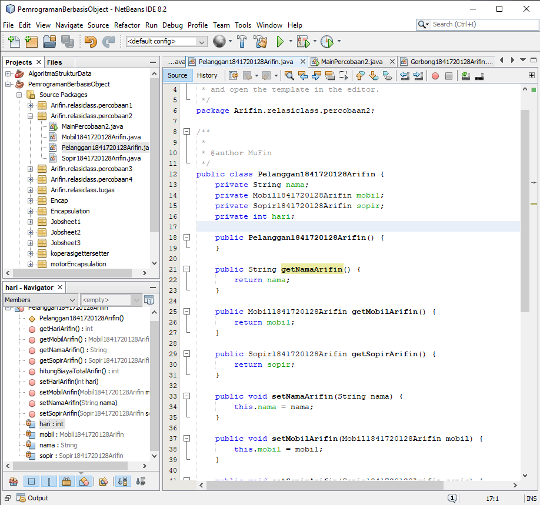

# Laporan Praktikum #4 - Relasi Kelas

## Kompetensi

Setelah menempuh pokok bahasan ini, mahasiswa mampu: 
1. Memahami konsep relasi kelas.
2. Mengimplementasikan relasi has‑a dalam program.

## Ringkasan Materi

Pada praktikum ini saya mengalami kesulitan pada pehaman saya terhadap suatu relasi class dan juga tipe data menggunakan nama class.

## Percobaan

### Percobaan 1

Pada percobaan pertama saya membuat dua buah class bernama Processor1841720128Arifin dan Laptop1841720128Arifin. Pada class Processor1841720128Arifin memiliki konstruktor default dan juga konstruktor berparameter yang memiliki nama sama dengan nama classnya selain itu terdapat juga atribut bernama merk dengan tipe data string dan cache dengan tipe data double, dan juga memiliki method getter dan setter dengan nama getMerkArifin(), getCacheArifin(), setMerkArifin(), setCacheArifin(), dan infoArifin() untuk menampilkan status pada class processor. Class Laptop1841720128Arifin memiliki konstruktor berparameter dengan nama yang juga sama dengan classnya dan atribut bernama merk dengan tipe data integer dan atribut proc dengan tipe data Processor1841720128Arifin yang merupakan class yang digunakan sebagai tipe data atribut tersebut, untuk method yang terdapat pada class ini terdapat method getter dan setter juga, nama method tersebut adalah getMerkArifin(), getProcArifin(), setMerkArifin(), setProcArifin(), dan infoArifin(). Selain itu saya juga membuat main class yang bernama MainPercobaan1 untuk memanggil fungsi method yang ada pada class Processor1841720128Arifin dan juga Laptop1841720128Arifin.

Contoh link kode program pada class Processor1841720128Arifin.java : [ini contoh link ke kode program](../../src/4_Relasi_Class/Percobaan_1/Processor1841720128Arifin.java)

Contoh link kode program pada class Laptop1841720128Arifin.java : [ini contoh link ke kode program](../../src/4_Relasi_Class/Percobaan_1/Laptop1841720128Arifin.java)

Contoh link kode program pada main class MainPercobaan1.java : [ini contoh link ke kode program](../../src/4_Relasi_Class/Percobaan_1/MainPercobaan1.java)

### Pertanyaan

Berdasarkan percobaan 1, jawablah pertanyaan‑pertanyaan yang terkait:

1. Di dalam class Processor dan class Laptop1841720128Arifin, terdapat method setter dan getter untuk masing‑masing atributnya. Apakah gunanya method setter dan getter tersebut ?

    Jawab:

    Kegunaan dari method setter adalah mengambil nilai dari atribut yang ada pada main class sedangkan kegunaan method getter adalah untuk mengembalikan atau menampilkan nilai dari class yang sebelumnya telah mengambil nilai dari atribut main class.

2. Di dalam class Processor dan class Laptop1841720128Arifin, masing‑masing terdapat konstruktor default dan konstruktor berparameter. Bagaimanakah beda penggunaan dari kedua jenis konstruktor tersebut ?

    Jawab:

    Kegunaan dari kedua konstruktor tersebut dari apa yang saya ketahui setelah mengerjakan percobaan pertama adalah konstruktor default digunakan saat melakukan inisialisasi objek apabila pada konstruktor default maka yang akan di inisialisasi adalah semua objek yang ada pada class, sedangkan konstruktor berparameter digunakan saat melakukan inisialisasi pada suatu objek dengan ketentuan tertentu dimana hanya beberapa objek saja yang akan di inisialisasikan.

3. Perhatikan class Laptop1841720128Arifin, di antara 2 atribut yang dimiliki (merk dan proc), atribut manakah yang bertipe object ?

    Jawab:

    Yang merupakan atribut bertipe objek adalah atribut bernama proc

4. Perhatikan class Laptop1841720128Arifin, pada baris manakah yang menunjukan bahwa class Laptop1841720128Arifin memiliki relasi dengan class Processor1841720128Arifin ?

    Jawab:

    Baris yang memiliki menunjukkan bahwa class Laptop1841720128Arifin memiliki relasi dengan class Processor1841720128Arifin adalah pada baris ke 14 yang bertuliskan
    
        private Processor1841720128Arifin proc;

    

5. Perhatikan pada class Laptop1841720128Arifin , Apakah guna dari sintaks proc.infoArifin() ?

    Jawab:

    Fungsi dari sintaks infoArifin.info() adalah digunakan untuk memanggil method infoArifin() yang ada pada class Processor1841720128Arifin. 

6. Pada class MainPercobaan1, terdapat baris kode: Laptop1841720128Arifin l = new Laptop1841720128Arifin("Thinkpad", p);. Apakah p tersebut ? Dan apakah yang terjadi jika baris kode tersebut diubah menjadi: 
Laptop1841720128Arifin l = new Laptop1841720128Arifin("Thinkpad", new Processor("Intel i5", 3)); Bagaimanakah hasil program saat dijalankan, apakah ada perubahan ?

    Jawab:

    Huruf p yang ada pada baris kode
    
        Laptop1841720128Arifin l = new Laptop1841720128Arifin("Thinkpad", p);

    memiliki fungsi yaitu untuk memasukkan inputan pada konstruktor Processor1841720128Arifin kedalam konstruktor Laptop1841720128Arifin dengan memasukkan inisialisasinya, jika baris diubah menjadi

        Laptop1841720128Arifin l = new Laptop1841720128Arifin("Thinkpad", new Processor("Intel i5", 3));

    yang terjadi adalah sama dengan yang dibuat pada awalnya.

### Percobaan 2

Pada percobaan kedua yang akan saya lakukan adalah membuat tiga buah class dan satu buah Main class yang pertama adalah class yang bernama Mobil1841720128Arifin yang memiliki atribut merk dengan tipe data String dan biaya dengan tipe data integer, terdapat pula onstruktor default, method getter setter, dan juga method hitungBiayaMobilArifin() untuk menghitung biaya mobil, kedua adalah class bernama Sopir1841720128Arifin yang memiliki atribut nama dengan tipe data String dan biaya dengan tipe data integer, selain atribut terdapat konstruktor default, method getter setter, dan juga method hitungBiayaSopirArifin() untuk menghitung biaya pada class Sopir1841720128Arifin, ketiga adalah class Pelanggan1841720128Arifin terdapat empat atribut yaitu antara lain nama dengan tipe data String, mobil dengan tipe data class Mobil1841720128Arifin, sopir dengan tipe data class Sopir1841720128Arifin, hari dengan tipe data integer, selain atribut terdapat juga method getter setter dan method hitungBiayaTotal() untuk menghitung biaya total dari penjumlahan antara method hitungBiayaMobilArifin() dan hitungBiayaSopirArifin(). Untuk Main class sendiri memiliki nama MainPercobaan2 yang berfungsi untuk menginputkan nilai pada atribut dan menampilkan hasil akhir yang telah dieksekusi oleh setiap method pada setiap class.

Contoh link kode program pada class Mobil1841720128Arifin.java : [ini contoh link ke kode program](../../src/4_Relasi_Class/Percobaan_2/Mobil1841720128Arifin.java)

Contoh link kode program pada class Sopir1841720128Arifin.java : [ini contoh link ke kode program](../../src/4_Relasi_Class/Percobaan_2/Sopir1841720128Arifin.java)

Contoh link kode program pada class Pelanggan1841720128Arifin.java : [ini contoh link ke kode program](../../src/4_Relasi_Class/Percobaan_2/Pelanggan1841720128Arifin.java)

Contoh link kode program pada main class MainPercobaan2.java : [ini contoh link ke kode program](../../src/4_Relasi_Class/Percobaan_2/MainPercobaan2.java)

### Pertanyaan

1. Perhatikan class Pelanggan. Pada baris program manakah yang menunjukan bahwa class Pelanggan1841720128Arifin memiliki relasi dengan class Mobil1841720128Arifin dan class Sopir1841720128Arifin ?

    Jawab:

    Yang menunjukkan bahwa class Pelanggan1841720128Arifin memiliki relasi dengan class Mobil1841720128Arifin dan class Sopir1841720128Arifin adalah pada baris ke 14 dan 15 dengan sintaks

        private Mobil1841720128Arifin mobil;
        private Sopir1841720128Arifin sopir;

    

2. Perhatikan method hitungBiayaSopirArifin pada class Sopir1841720128Arifin, serta method hitungBiayaMobilArifin pada class Mobil1841720128Arifin. Mengapa menurut Anda method tersebut harus memiliki argument hari ?

    Jawab:

    Alasan mengapa harus memiliki argumen hari adalah karena pada method karena biaya yang dibayar tergantung pada harinya sehingga inputan hari sebagai patokan atau inputan untuk menentukan berapa biaya total yang harus dibayarkan.

3. Perhatikan kode dari class Pelanggan1841720128Arifin. Untuk apakah perintah mobil.hitungBiayaMobilArifin(hari) dan sopir.hitungBiayaSopirArifin(hari) ?

    Jawab:

    Untuk menghitung berapa biaya yang harus dibayarkan dari kedua class, dengan cara nilai dari atribut biaya dikalikan dengan atribut hari.

4. Perhatikan class MainPercobaan2. Untuk apakah sintaks p.setMobilArifin(m) dan p.setSopirArifin(s) ?

    Jawab:

    Untuk menginputkan nilai dari atribut m dan juga s yang sebelumnya sudah diisikan pada konstruktor Mobil1841720128Arifin dan juga Sopir1841720128Arifin.

5. Perhatikan class MainPercobaan2. Untuk apakah proses p.hitungBiayaTotalArifin() tersebut ?

    Jawab:

    Untuk menghitung biaya total dari kedua method dari class Mobil1841720128Arifin dan juga Sopir1841720128Arifin yang sebelumya sudah dihitung dan tinggal menjumlahkan hasilnya dari kedua method yaitu hitungBiayaMobilArifin dan hitungBiayaSopirArifin.

6. Perhatikan class MainPercobaan2, coba tambahkan pada baris terakhir dari method main dan amati perubahan saat di‑run! 
 
        System.out.println(p.getMobilArifin().getMerkArifin()); 
 
    Jadi untuk apakah sintaks p.getMobilArifin().getMerkArifin() yang ada di dalam method main tersebut?

    Jawab:
    
    Perubahan yang terjadi setelah di run adalah akan muncul keluaran selain hasil dari biaya total yaitu memunculkan kata berupa "Avanza", fungsi dari sintaks itu sendiri adalah untuk memanggil nilai atribut pada merk.

### Percobaan 3

Pada percobaan ketiga ini saya membuat dua buah class yang bernama Pegawai1841720128Arifin dan KeretaApi1841720128Arifin dan juga saya membuat satu buah main class bernama MainPercobaan3. Pada Pegawai1841720128Arifin terdapat dua buah atribut yaitu atribut bernama nip dengan tipe data String dan nama dengan tipe data String. Selain atribut terdapat konstruktor berparameter, method getter setter dan juga method infoArifin() untuk menampilkan nilai pada kedua atribut. Class KeretaApi1841720128Arifin mempunya 4 atribut yaitu nama dengan tipe data String, kelas dengan tipe data String, masinis dengan tipe data class Pegawai1841720128Arifin dan yang terakhir asisten dengan tipe data class Pegawai1841720128Arifin, selain atribut juga terdapat konstruktor 2 konstruktor berparameter 3 dan berparameter 4, method getter setter, juga method infoArifin() untuk menampilkan informasi nilai pada setiap atribut.

Contoh link kode program pada class Pegawai1841720128Arifin.java : [ini contoh link ke kode program](../../src/4_Relasi_Class/Percobaan_3/Pegawai1841720128Arifin.java)

Contoh link kode program pada class KeretaApi1841720128Arifin.java : [ini contoh link ke kode program](../../src/4_Relasi_Class/Percobaan_3/KeretaApi1841720128Arifin.java)

Contoh link kode program pada main class MainPercobaan3.java : [ini contoh link ke kode program](../../src/4_Relasi_Class/Percobaan_3/MainPercobaan3.java)

### Pertanyaan

 
1. Di dalam method infoArifin() pada class KeretaApi, baris this.masinis.infoArifin() dan this.asisten.infoArifin() digunakan untuk apa ? 

    Jawab:

    Dalam method infoArifin() pada class KeretaApi1841720128Arifin, baris this.masinis.info() digunakan untuk memanggil infoArifin pada class Pegawai1841720128Arifin dan this.asisten.infoArifin() digunakan untuk memanggil info pada class Pegawai1841720128Arifin.

2. Buatlah main program baru dengan nama class MainPertanyaan pada package yang sama. Tambahkan kode berikut pada method main() ! 

        Pegawai masinis = new Pegawai("1234", "Spongebob Squarepants"); 
        KeretaApi keretaApi = new KeretaApi("Gaya Baru", "Bisnis", masinis);
        System.out.println(keretaApi.info());

    Jawab:

    

3. Apa hasil output dari main program tersebut ? Mengapa hal tersebut dapat terjadi ?

    Jawab:

    Output dari hasil program tersebut adalah terjadi error, hal tersebut terjadi adalah karena kesalahan dalam membuat konstruktor beserta nilai dari atributnya.

4. Perbaiki class KeretaApi sehingga program dapat berjalan !

    jawab:

    

### Percobaan 4

Pada percobaan keempat ini saya membuat tiga buah class dan satu buah main class. Class yang pertama bernama Penumpang1841720128Arifin yang memiliki dua buah atribut yaitu ktp dengan tipe data String, nama dengan tipe data String, selain atribut terdapat konstruktor berparameter, method getter setter dan juga method infoArifin() untuk menampilkan nilai dari kedua atribut. class yang kedua bernama Kursi1841720128Arifin memiliki dua atribut yaitu nomer dengan tipe data String dan penumpang dengan tipe data class Penumpang1841720128Arifin, ada satu konstruktor berparameter satu, method getter setter dan juga method infoArifin() untuk menampilkan isi atau nilai pada atribut. class yang ketiga bernama Gerbong1841720128Arifin memiliki dua atribut yaitu kode dengan tipe data String dan arrayKursi dengan tipe data Kursi1841720128Arifin, terdapat satu konstruktor berparameter dua, method getter setter, method untuk array dengan nama initKursiArifin(), method setPenumpangArifin() dan juga infoArifin() untuk menampilkan nilai dari atribut. Satu buah main class bernama MainPercobaan4 sebagai eksekusi untuk menginputkan dan menampilkan hasil dari pengolahan pada setiap class. 

Contoh link kode program pada class Penumpang1841720128Arifin.java : [ini contoh link ke kode program](../../src/4_Relasi_Class/Percobaan_4/Penumpang1841720128Arifin.java)

Contoh link kode program pada class Kursi1841720128Arifin.java : [ini contoh link ke kode program](../../src/4_Relasi_Class/Percobaan_4/Kursi1841720128Arifin.java)

Contoh link kode program pada class Gerbong1841720128Arifin.java : [ini contoh link ke kode program](../../src/4_Relasi_Class/Percobaan_4/Gerbong1841720128Arifin.java)

Contoh link kode program pada class main MainPercobaan4.java : [ini contoh link ke kode program](../../src/4_Relasi_Class/Percobaan_4/MainPercobaan4.java)

### Pertanyaan

1. Pada main program dalam class MainPercobaan4, berapakah jumlah kursi dalam Gerbong A ? 

    Jawab:

    Jumlah kursi dalam gerbong sebanyak 10 kursi

2. Perhatikan potongan kode pada method infoArifin() dalam class Kursi. Apa maksud kode tersebut ? 
 
        ... if (this.penumpang != null) { info += "Penumpang: " + penumpang.infoArifin() + "\n"; } ... 

    Jawab:

    Maksud dari sintaks tersebut adalah jika atribut penumpang tidak sama dengan null maka info ditambahkan sama dengan penumpang dengan method infoArifin().

3. Mengapa pada method setPenumpangArifin() dalam class Gerbong1841720128Arifin, nilai nomor dikurangi dengan angka 1 ? 

    Jawab:

    Karena index array sendiri dimulai dari angka nol

4. Instansiasi objek baru budi dengan tipe Penumpang, kemudian masukkan objek baru tersebut pada gerbong dengan gerbong.setPenumpang(budi, 1). Apakah yang terjadi ? 

    Jawab:

    Data budi tetap akan keluar namun menggunakan urutan kursi yang digunakan oleh data lain atau orang lain

5. Modifikasi program sehingga tidak diperkenankan untuk menduduki kursi yang sudah ada penumpang lain ! 

    Jawab:
    
    

## Tugas

Buatlah sebuah studi kasus, rancang dengan class diagram, kemudian implementasikan ke dalam program! Studi kasus harus mewakili relasi class dari percobaan‑percobaan yang telah dilakukan pada materi ini, setidaknya melibatkan minimal 4 class (class yang berisi main tidak dihitung). 
 

Contoh link kode program pada class Kursi1841720128Arifin.java : [ini contoh link ke kode program](../../src/4_Relasi_Class/Tugas/Kursi1841720128Arifin.java)

Contoh link kode program pada class Pegawai1841720128Arifin.java : [ini contoh link ke kode program](../../src/4_Relasi_Class/Tugas/Pegawai1841720128Arifin.java)

Contoh link kode program pada class Penumpang1841720128Arifin.java : [ini contoh link ke kode program](../../src/4_Relasi_Class/Tugas/Penumpang1841720128Arifin.java)

Contoh link kode program pada class Pesawat1841720128Arifin.java : [ini contoh link ke kode program](../../src/4_Relasi_Class/Tugas/Pesawat1841720128Arifin.java)

Contoh link kode program pada class main MainTugas.java : [ini contoh link ke kode program](../../src/4_Relasi_Class/Tugas/MainTugas.java)

## Kesimpulan

Hal yang dapat saya simpulkan dari praktikum dan juga tugas yang telah dilakukan adalah dalam melaukakan suatu relasi kelas adalah harus diperhatikan terlebih dahulu class diagram karena class diagram yang merupakan dasar dalam pembuatan suatu program.

## Pernyataan Diri

Saya menyatakan isi tugas, kode program, dan laporan praktikum ini dibuat oleh saya sendiri. Saya tidak melakukan plagiasi, kecurangan, menyalin/menggandakan milik orang lain.

Jika saya melakukan plagiasi, kecurangan, atau melanggar hak kekayaan intelektual, saya siap untuk mendapat sanksi atau hukuman sesuai peraturan perundang-undangan yang berlaku.

Ttd,

***Mukhammad Arifin***
