# Laporan Praktikum #6 - Inheritance (Pewarisan)

## Kompetensi

Setelah menempuh pokok bahasan ini, mahasiswa mampu: 
1. Memahami konsep dasar inheritance atau pewarisan.	
2. Mampu membuat suatu subclass dari suatu superclass tertentu	
3. Mampu mengimplementasikan konsep single dan multilevel inheritance.	
4. Mampu membuat objek dari suatu subclass dan melakukan pengaksesan terhadap atribut dan method baik yang dimiliki sendiri atau turunan dari superclassnya.	
  

## Ringkasan Materi

Pada praktikum ini saya mengalami kesulitan pada pemahaman tentang apakah memang atribut dengan modifier private tidak bisa diturunkan kepada sub classnya, untuk solusinya saya masih mempelajari hal tersebut.

## Percobaan

### Percobaan 1

Pada percobaan pertama saya membuat dua buah class, yang pertama bernama ClassA1841720128Arifin yang memiliki atribut x dengan tipe data integer dan y dengan tipe data integer selain itu terdapat method bertipe void bernama getNilaiArifin() yang digunakan untuk menampilkan value dari atribut x dan y. Kedua adalah class dengan nama ClassB1841720128Arifin yang memiliki atribut bernama z dengan tipe data integer, selain atribut terdapat methode getNilaiZArifin() untuk menampilkan value dari z dan method getJumlahArifin() untuk menampilkan hasil jumlah dari atribut x, y, dan z. Yang terakhir adalah saya membuat main class bernama Percobaantest1841720128Arifin.

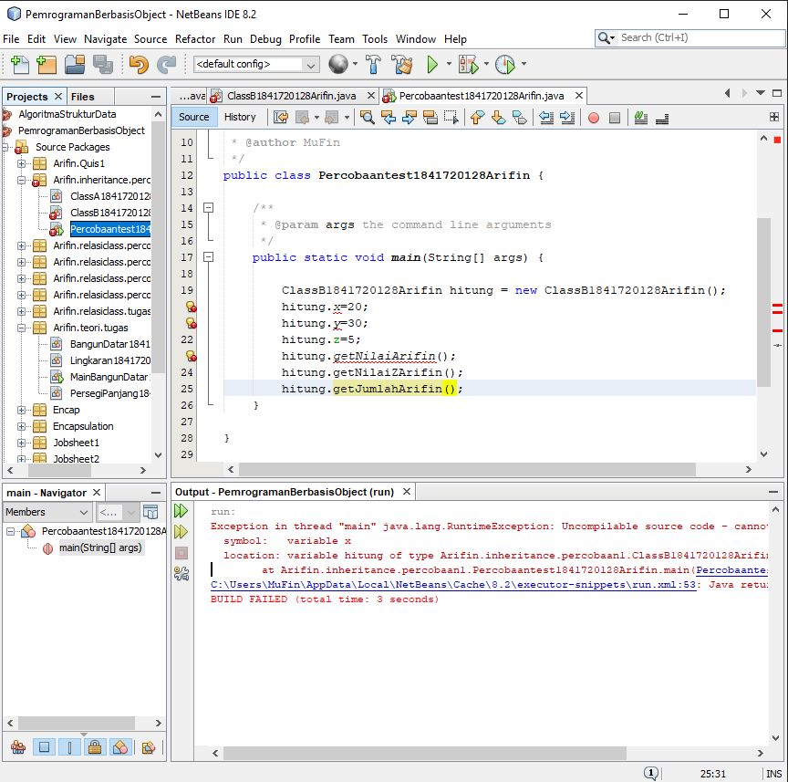

Contoh kode program pada class ClassA1841720128Arifin.java : [ini link ke kode program](../../src/6_Inheritance/Percobaan_1/ClassA1841720128Arifin.java)

Contoh kode program pada class ClassB1841720128Arifin.java : [ini link ke kode program](../../src/6_Inheritance/Percobaan_1/ClassB1841720128Arifin.java)

Contoh kode program pada main class Percobaantest1841720128Arifin.java : [ini link ke kode program](../../src/6_Inheritance/Percobaan_1/Percobaantest1841720128Arifin.java)

### Pertanyaan

1. Pada	percobaan 1 diatas program yang dijalankan terjadi error, kemudian perbaiki sehingga program tersebut bisa dijalankan dan tidak error!

    Jawab:

    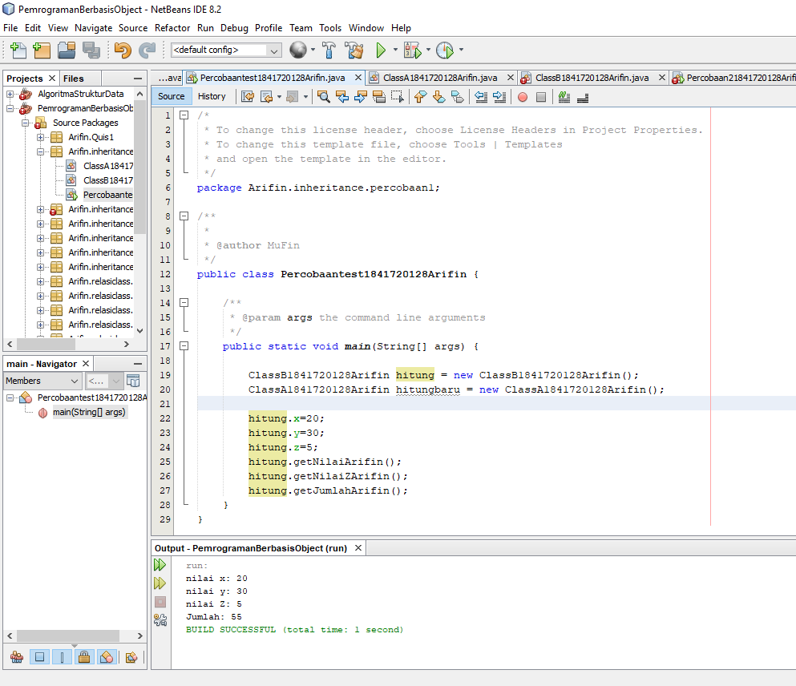

    Contoh kode program pada class ClassA1841720128Arifin.java : [ini link ke kode program](../../src/6_Inheritance/Pertanyaan_1/ClassA1841720128Arifin.java)

    Contoh kode program pada class ClassB1841720128Arifin.java : [ini link ke kode program](../../src/6_Inheritance/Pertanyaan_1/ClassB1841720128Arifin.java)

    Contoh kode program pada main class Percobaantest1841720128Arifin.java : [ini link ke kode program](../../src/6_Inheritance/Pertanyaan_1/Percobaantest1841720128Arifin.java)

2. Jelaskan apa penyebab program pada percobaan 1 ketika dijalankan terdapat error!

    Jawab:

    Penyebab kenapa bisa terjadi error adalah karena pada ClassB1841720128Arifin belum ditambahkan fungsi extends yang diarahkan ke ClasA1841720128Arifin dan juga belum ditambakannya konstruktor ClassA1841720128Arifin pada main class Percobaantest1841720128Arifin.

### Percobaan 2

Pada percobaan kedua yang akan saya lakukan adalah membuat dua buah class dan satu buah Main class yang pertama adalah class yang bernama ClassA1841720128Arifin yang memiliki atribut x bertipe data integer dengan modifier private dan atribut y bertipe data integer dengan modifier private, selain atribut terdapat 3 buah method yaitu setXArifin(), setYArifin() dan getNilaiArifin(). Class yang kedua bernama ClassB1841720128Arifin yang memiliki satu atribut yaitu z bertipe data integer dengan modifier private, selain atribut juga terdapat method dengan nama setZArifin(), getNilaiZArifin() dan getJumahArifin(). Selain kedua class tersebut saya juga membuat satu main class dengan nama Percobaan21841720128Arifin.

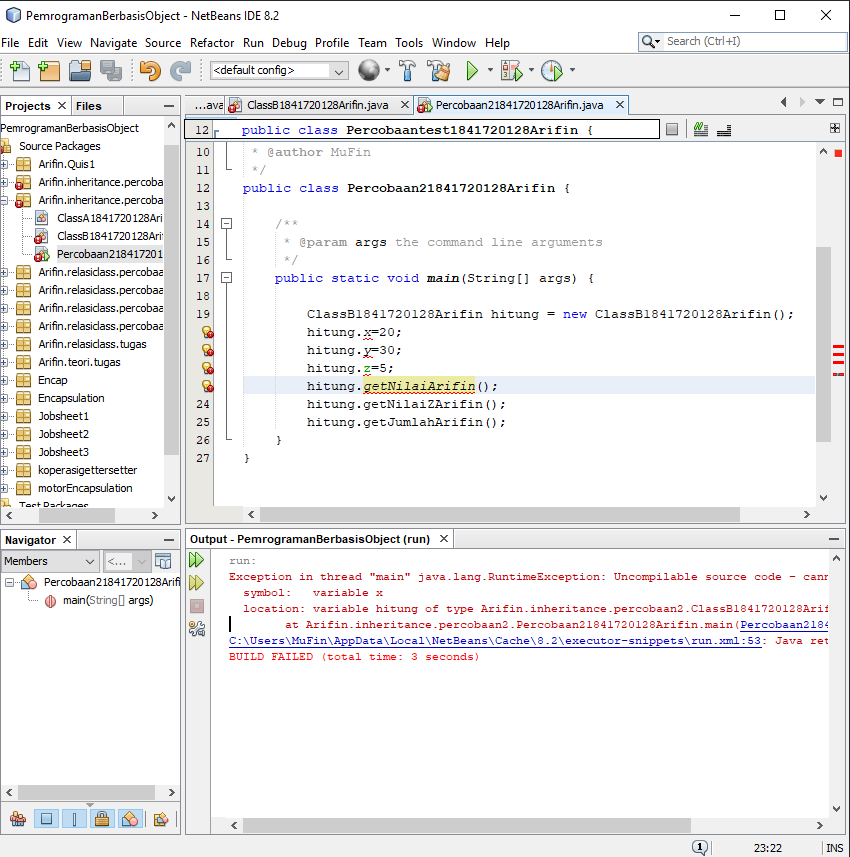

Contoh kode program pada class ClassA1841720128Arifin.java : [ini link ke kode program](../../src/6_Inheritance/Percobaan_2/ClassA1841720128Arifin.java)

Contoh kode program pada class ClassB1841720128Arifin.java : [ini link ke kode program](../../src/6_Inheritance/Percobaan_2/ClassB1841720128Arifin.java)

Contoh kode program pada main class Percobaantest1841720128Arifin.java : [ini link ke kode program](../../src/6_Inheritance/Percobaan_2/Percobaan21841720128Arifin.java)

### Pertanyaan

1. Pada percobaan 2 diatas program yang dijalankan terjadi error, kemudian perbaiki sehingga program tersebut bisa dijalankan dan tidak error!

    Jawab:

    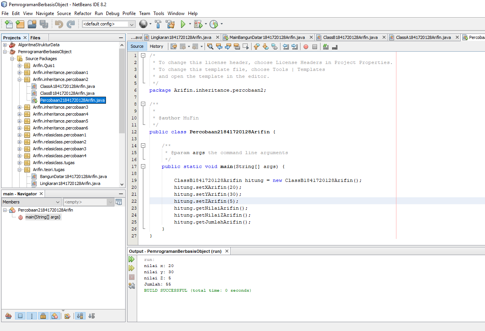

    Contoh kode program pada class ClassA1841720128Arifin.java : [ini link ke kode program](../../src/6_Iheritance/Pertanyaan_2/ClassA1841720128Arifin.java)

    Contoh kode program pada class ClassB1841720128Arifin.java : [ini link ke kode program](../../src/6_Iheritance/Pertanyaan_2/ClassB1841720128Arifin.java)

    Contoh kode program pada Main class Percobaan21841720128Arifin.java : [ini link ke kode program](../../src/6_Inheritance/Pertanyaan_2/Percobaan21841720128Arifin.java)

2. Jelaskan apa penyebab program pada percobaan 2 ketika dijalankan terdapat error!

    Jawab:

    Alasan kenapa terjadi error adalah karena pada ClassB1841720128Arifin belum ditambahkan extends yang diarahkan pada ClassA1841720128Arifin dan juga belum diubahnya modifier pada atribut di class ClassA1841720128Arifin dari private mejadi protected perubahan pada main class juga dipperlukan dengan mengisi value pada method setter yang telah disediakan.

### Percobaan 3

Pada percobaan ketiga ini saya membuat dua buah class yang bernama Bangun1841720128Arifin dan Tabung1841720128Arifin dan juga saya membuat satu buah main class bernama Percobaan31841720128Arifin. Pada Bangun1841720128Arifin terdapat dua buah atribut yaitu atribut bernama phi bertipe data double dengan modifier protected dan r bertipe data integer dengan modifier protected. Class Tabung1841720128Arifin mempunya satu atribut yaitu t bertipe data integer dengan modifier protected, terdapat juga setter dengan nama setSuperPhiArifin(), setSuperRArifin(), setTArifin() dan juga terdapat satu method dengan nama volumeArifin(). Selain class saya juga membuat satu main class dengan nama Percobaan31841720128Arifin.

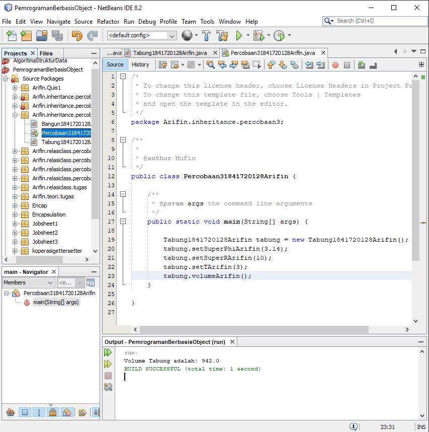

Contoh kode program pada class Bangun1841720128Arifin.java : [ini link ke kode program](../../src/6_Inheritance/Percobaan_3/Bangun1841720128Arifin.java)

Contoh kode program pada class Tabung1841720128Arifin.java : [ini link ke kode program](../../src/6_Inheritance/Percobaan_3/Tabung1841720128Arifin.java)

Contoh kode program pada main class Percobaan31841720128Arifin.java : [ini link ke kode program](../../src/6_Inheritance/Percobaan_3/Percobaan31841720128Arifin.java)

### Pertanyaan

1. Jelaskan fungsi “super” pada potongan program berikut di class Tabung!

    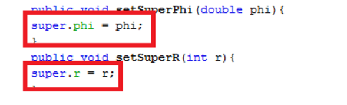  

    Jawab:

    Fungsi super pada potongan program tersebut adalah untuk memberikan penjelasan pada atribut phi terdapat pada class induk.

2. Jelaskan fungsi “super” dan “this” pada potongan program berikut di class Tabung!	

    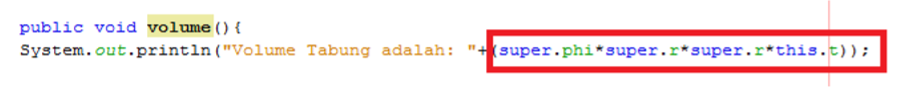  

    Jawab:

    Super sendiri menunjukkan bahwa atribut tersebut terletak pada class induk atau bisa dikatakan bahwa atribut ini merupakan atribut milik induk, sedangkan pada this menunjukkan bahwa atribut tersebut terletak pada class subclass tersebut.

3. Jelaskan mengapa pada class Tabung1841720128Arifin tidak dideklarasikan atribut “phi” dan “r” tetapi class tersebut dapat mengakses atribut tersebut! 

    Jawab:

    Karena class Tabung1841720128Arifin merupakan subclass dari class Bangun1841720128Arifin sehingga atribut yang ada pada tersebut walaupun bersifat protected akan diwariskan pada subclassnya.

### Percobaan 4

Pada percobaan keempat ini saya membuat tiga buah class dan satu buah main class. Class yang pertama bernama ClassA1841720128Arifin yang memiliki satu buah konstruktor default. Class yang kedua bernama ClassB1841720128Arifin memiliki satu buah konstruktor default. Class yang ketiga bernama ClassC1841720128Arifin memiliki satu buah konstruktor default. Satu buah main class bernama Percobaan41841720128Arifin sebagai eksekusi untuk menginputkan dan menampilkan hasil dari pengolahan pada setiap class. 

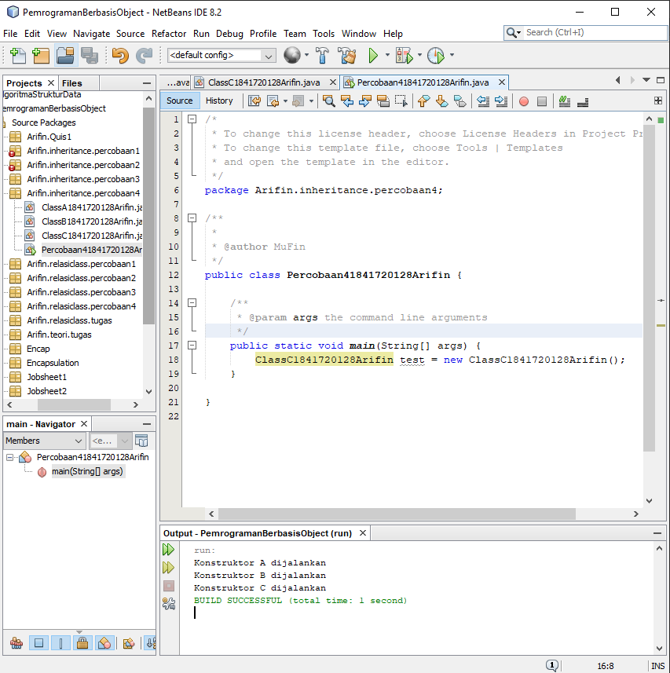

Contoh kode program pada class ClassA1841720128Arifin.java : [ini link ke kode program](../../src/6_Inheritance/Percobaan_4/ClassA1841720128Arifin.java)

Contoh kode program pada class ClassB1841720128Arifin.java : [ini link ke kode program](../../src/6_Inheritance/Percobaan_4/ClassB1841720128Arifin.java)

Contoh kode program pada class ClassC1841720128Arifin.java : [ini link ke kode program](../../src/6_Inheritance/Percobaan_4/ClassC1841720128Arifin.java)

Contoh kode program pada main class Percobaan41841720128Arifin.java : [ini link ke kode program](../../src/6_Inheritance/Percobaan_4/Percobaan41841720128Arifin.java)

### Pertanyaan

1. Pada percobaan 4 sebutkan mana class yang termasuk superclass dan subclass, kemudian jelaskan alasannya!

    Jawab:

    Yang merupakan Superclass adalah ClassA1841720128Arifin dan subclassnya adalah ClassB1841720128Arifin kenapa bisa begitu ?, karena ClassA1841720128Arifin merupakan class induk yang tidak diwarisi oleh class lain namun mewarikan pada class lain sedangkan pada ClassB1841720128Arifin merupakan subclass karena diwariskan dari ClassA1841720128Arifin namun bisa dikatakan sebagai superclass juga karena mewariskan pada ClassC1841720128Arifin.

2. Ubahlah isi konstruktor default ClassC seperti berikut:	

    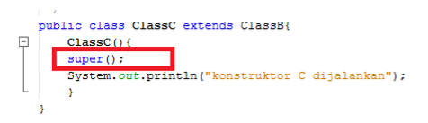  

    Tambahkan kata super() di baris	Pertaman dalam konstruktor defaultnya. Coba jalankan kembali class Percobaan4 dan terlihat tidak ada perbeda dari hasil outputnya!

    Jawab:

    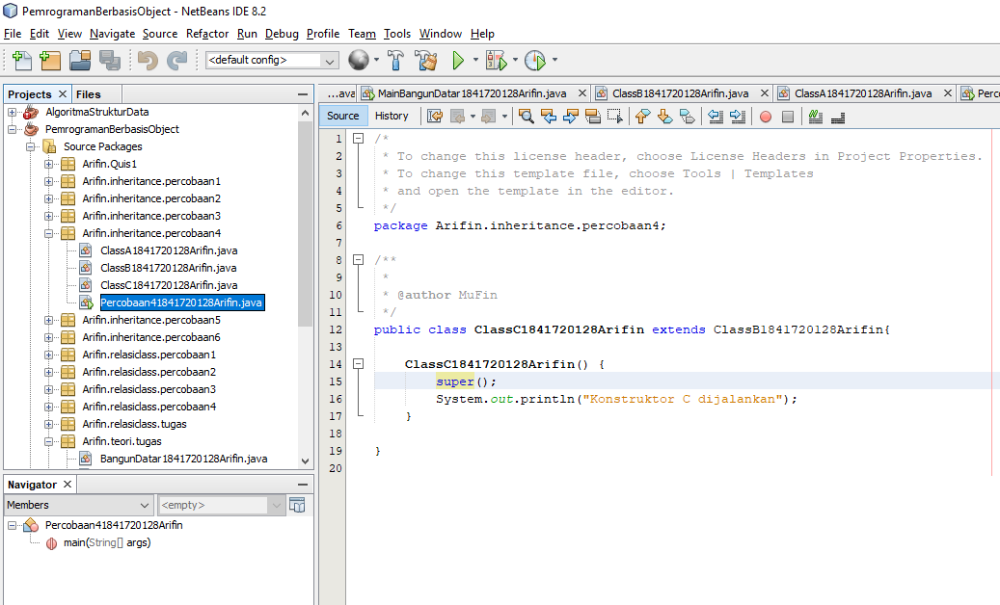

    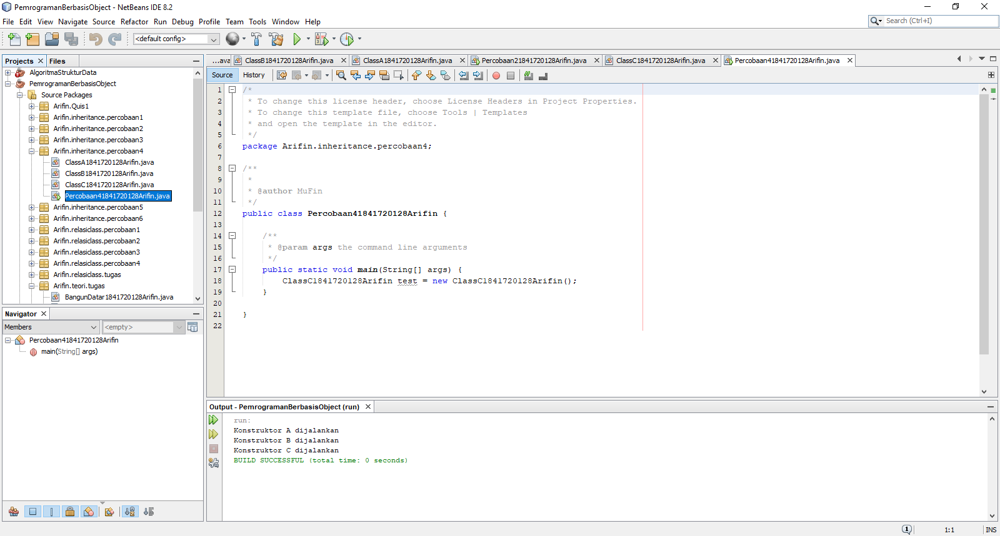

3. Ubahlah isi konstruktor default ClassC seperti berikut:	

    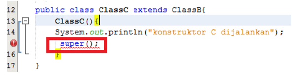  

    Ketika mengubah posisi super() dibaris kedua dalam kontruktor defaultnya dan terlihat ada error. Kemudian kembalikan super() kebaris pertama seperti sebelumnya, maka errornya akan hilang.

    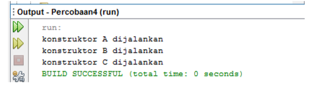  

    Jelaskan bagaimana urutan proses jalannya konstruktor saat objek test dibuat!	  

    Jawab:

    ClassC1841720128Arifin akan menambahkan super() untuk memanggil konstruktor superclass. penggunaan super() hanya bisa digunakan pada baris pertama dalam konstruktor.

4. Apakah fungsi super() pada potongan program dibawah ini di ClassC!
    
    
    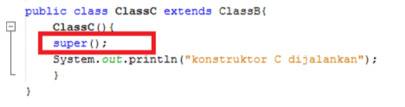  

    Jawab:

    Menunjukkan atau memanggil konstruktor superclass.

### Percobaan 5

Pada percobaan kelima ini saya membuat tiga buah class dan satu buah main class. Class yang pertama bernama Karyawan1841720128Arifin yang memiliki 5 atribut antara lain nama, alamat, jk dengan tipe data integer dan modifier public selain itu terdapat atribut dengan tipe data integer antara lain umur dan gaji, juga terdapat konstruktor default dan berparameter, selain konstruktor ada juga method dengan nama tampilDataKaryawanArifin() yang berguna untuk menampilkan semua nilai yang terdapat pada setiap atribut. Class yang kedua bernama Manager1841720128Arifin yang memiliki satu buah atribut tunjangan dengan tipe data integer dan method bernama tampilDataManagerArifin(). Class yang ketiga bernama Staff1841720128Arifin memiliki dua atribut yaitu lembur dan potongan dengan tipe data integer dan modifier public, selain itu terdapat dua buah konstruktor default dan berparameter, satu buah method dengan nama tampilDataStaffArifin(). Satu buah main class bernama Inheritance11841720128Arifin sebagai eksekusi untuk menginputkan dan menampilkan hasil dari pengolahan pada setiap class.

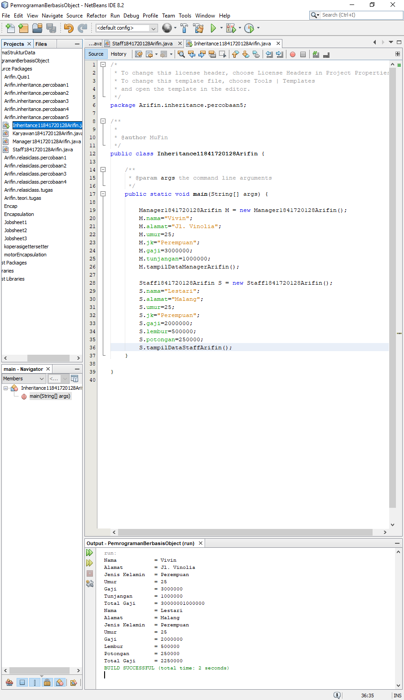

Contoh kode program pada class Karyawan1841720128Arifin.java : [ini link ke kode program](../../src/6_Inheritance/Percobaan_5/Karyawan1841720128Arifin.java)

Contoh kode program pada class Manager1841720128Arifin.java : [ini link ke kode program](../../src/6_Inheritance/Percobaan_5/Manager1841720128Arifin.java)

Contoh kode program pada class Staff1841720128Arifin.java : [ini link ke kode program](../../src/6_Inheritance/Percobaan_5/Staff1841720128Arifin.java)

Contoh kode program pada main class Inheritance11841720128Arifin.java : [ini link ke kode program](../../src/6_Inheritance/Percobaan_5/Inheritance11841720128Arifin.java)

### Pertanyaan

1. Sebutkan class mana yang termasuk super class dan sub class dari percobaan 1 diatas!	

    Jawab:

    Yang termasuk super class adalah class Karyawan1841720128Arifin dan yang merupakan sub class adalah class Manager1841720128Arifin dan class Staff1841720128Arifin.

2. Kata kunci apakah yang digunakan untuk menurunkan suatu class ke class yang lain?

    Jawab:

    Kata kunci untuk menurunkan suatu class ke class yang lain adalah 'extends'.

3. Perhatikan kode program pada class Manager1841720128Arifin, atribut apa saja yang dimiliki oleh class tersebut? Sebutkan atribut mana saja yang diwarisi dari class Karyawan!

    Jawab:

    Yang merupakan atribut yang dimiliki oleh Manager1841720128Arifin adalah tunjangan bertipe data integer, dan atribut yang diwariskan dari class Karyawan1841720128Arifin ke class Manager1841720128Arifin adalah nama, alamat dan jk yang memiliki tipe data String, selain itu juga ada umur dan gaji yang memiliki tipe data integer.

4. Jelaskan kata kunci super pada potongan program dibawah ini yang terdapat pada class Manager1841720128Arifin!

    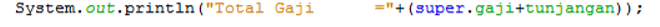

    Jawab:

    Untuk memanggil atribut gaji pada super class yaitu Karyawan1841720128Arifin.

5. Program pada percobaan 1 diatas termasuk dalam jenis inheritance apa? Jelaskan alasannya!

    Jawab:

    Termasuk dalam Single inheritance karna hanya memiliki satu parent class atau super class saja.

### Percobaan 6

Pada percobaan keenam ini masih berhubungan dengan percobaan kelima dimana saya membuat dua buah class, yaitu StaffTetap1841720128Arifin yang merupakan anak dari Staff1841720128Arifin dan memiliki dua atribut dengan nama golongan bertipe data String dengan modifier public dan asuransi bertipe data integer dengan modifier public, selain atribut terdapat konstruktor default dan berparameter, satu buah method tampilStaffTetapArifin() untuk menampilkan value pada setiap atribut. Yang kedua adalah class StaffHarian1841720128Arifin yang merupakan anak dari Staff1841720128Arifin dan memiliki satu atribut bernama jmlJamKerja, dan memiliki dua konstruktor default dan berparameter, satu buah method bernama tampilStaffHarianArifin(). Pada bagian main class akan ditambahkan beberapa perubahan seperti pada gambar dibawah ini.

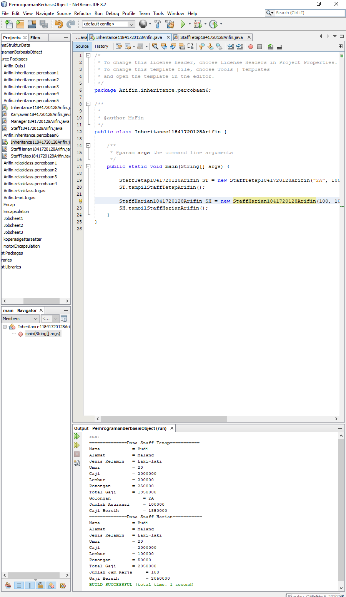

Contoh kode program pada class ClassA1841720128Arifin.java : [ini link ke kode program](../../src/6_Inheritance/Percobaan_6/ClassA1841720128Arifin.java)

Contoh kode program pada class ClassB1841720128Arifin.java : [ini link ke kode program](../../src/6_Inheritance/Percobaan_6/ClassB1841720128Arifin.java)

Contoh kode program pada class ClassC1841720128Arifin.java : [ini link ke kode program](../../src/6_Inheritance/Percobaan_6/ClassC1841720128Arifin.java)

Contoh kode program pada main class Percobaan41841720128Arifin.java : [ini link ke kode program](../../src/6_Inheritance/Percobaan_6/Percobaan41841720128Arifin.java)

### Pertanyaan

1. Berdasarkan class diatas manakah yang termasuk single inheritance dan mana yang termasuk multilevel inheritance?

    Jawab:

    Yang merupakan single inheritance adalah class Karyawan1841720128Arifin yang mewariskan kepada Manager1841720128Arifin dan juga Staff1841720128Arifin sedabgkan yang merupakan multilevel inheritance adalah keseluruhan mulai dari Karyawan1841720128Arifin menurunkan pada kedua sublcass dan subclass yang bernama Staff1841720128Arifin menurunkan kepada dua class yaitu StaffTetap1841720128Arifin dan StaffHarian1841720128Arifin.

2. Perhatikan kode program class StaffTetap1841720128Arifin dan StaffHarianArifin, atribut apa saja yang dimiliki oleh class tersebut? Sebutkan atribut mana saja yang diwarisi dari class Staff!	
  
    Jawab:

    Atribut yang terdapat pada StaffTetap1841720128Arifin adalah golongan dengan tipe data String dan asuransi dengan tipe data integer, sedangkan apa saja yang diwarisi dari class Staff1841720128Arifin adalah atribut bernama lembur dengan tipe data integer dan golongan dengan tipe data integer serta semua atribut yang ada pada class karyawan1841720128Arifin.

3. Apakah fungsi potongan program berikut pada class StaffHarian

    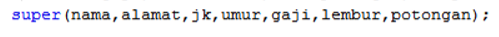   

    Jawab:

    Memanggil konstruktor class dari parent class, yaitu Staff1841720128Arifin.

4. Apakah fungsi potongan program berikut pada class StaffHarian

    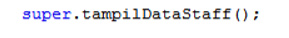

    Jawab:

    Memanggil method tampil pada class Staff1841720128Arifin

5. Perhatikan kode program dibawah ini yang terdapat pada class	StaffTetap

    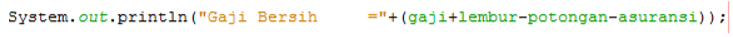

    Terlihat dipotongan program diatas atribut gaji, lembur dan potongan dapat diakses langsung. Kenapa hal ini bisa terjadi dan bagaimana class StaffTetap memiliki atribut gaji, lembur, dan potongan padahal dalam class tersebut tidak dideklarasikan atribut gaji, lembur, dan potongan?

    Jawab:

    Bisa, karena StaffTetap1841720128Arifin adalah sub class dari class Staff1841720128Arifin yang memiliki atribut tersebut.

## Tugas

Buatlah sebuah program dengan konsep pewarisan seperti pada class diagram berikut ini. Kemudian buatlah instansiasi objek untuk menampilkan data pada class Mac, Windows dan Pc!.
 
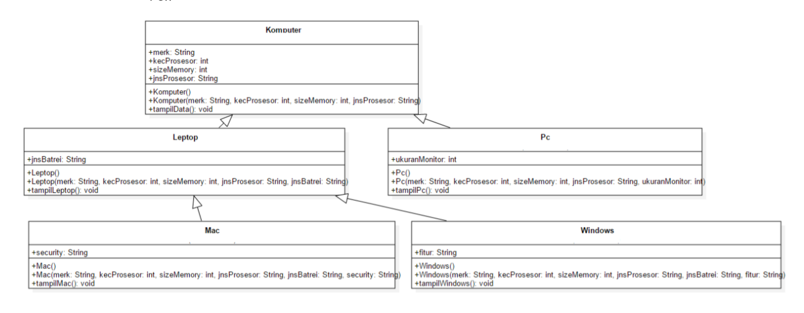

Jawab:

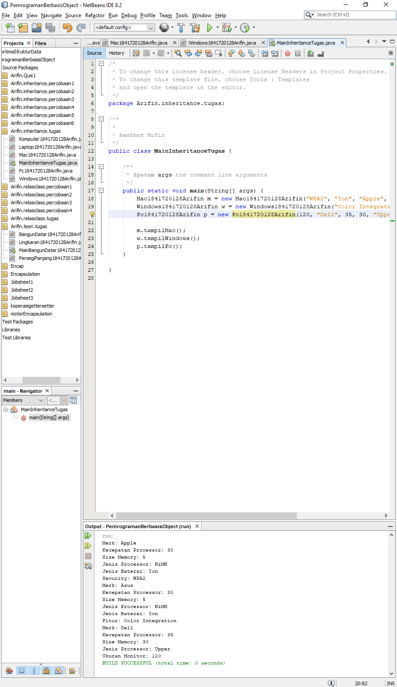

Contoh kode program pada class Komputer1841720128Arifin.java : [ini link ke kode program](../../src/6_Inheritance/Tugas/Komputer1841720128Arifin.java)

Contoh kode program pada class Laptop1841720128Arifin.java : [ini link ke kode program](../../src/6_Inheritance/Tugas/Laptop1841720128Arifin.java)

Contoh kode program pada class Pc1841720128Arifin.java : [ini link ke kode program](../../src/6_Inheritance/Tugas/Pc1841720128Arifin.java)

Contoh kode program pada class Mac1841720128Arifin.java : [ini link ke kode program](../../src/6_Inheritance/Tugas/Mac1841720128Arifin.java)

Contoh kode program pada class Windows1841720128Arifin.java : [ini link ke kode program](../../src/6_Inheritance/Tugas/Windows1841720128Arifin.java)

Contoh kode program pada class main MainInheritanceTugas.java : [ini link ke kode program](../../src/6_Inheritance/Tugas/MainInheritanceTugas.java)

## Kesimpulan

Hal yang dapat saya simpulkan dari praktikum dan juga tugas yang telah dilakukan adalah class bisa menjadi parent class atau super class dengan menurunkan atau mewariskan berupa atribut ataupun fungsi kepada class yang akan diturunkan dan class yang mewarisi dari parent class atau super class adalah sub class  child class. Atribut yang diturunkan sendiri bisa memiliki modifier dan juga tipe data yang berbeda - beda namun tidak untuk modifier private.

## Pernyataan Diri

Saya menyatakan isi tugas, kode program, dan laporan praktikum ini dibuat oleh saya sendiri. Saya tidak melakukan plagiasi, kecurangan, menyalin/menggandakan milik orang lain.

Jika saya melakukan plagiasi, kecurangan, atau melanggar hak kekayaan intelektual, saya siap untuk mendapat sanksi atau hukuman sesuai peraturan perundang-undangan yang berlaku.

Ttd,

***Mukhammad Arifin***
