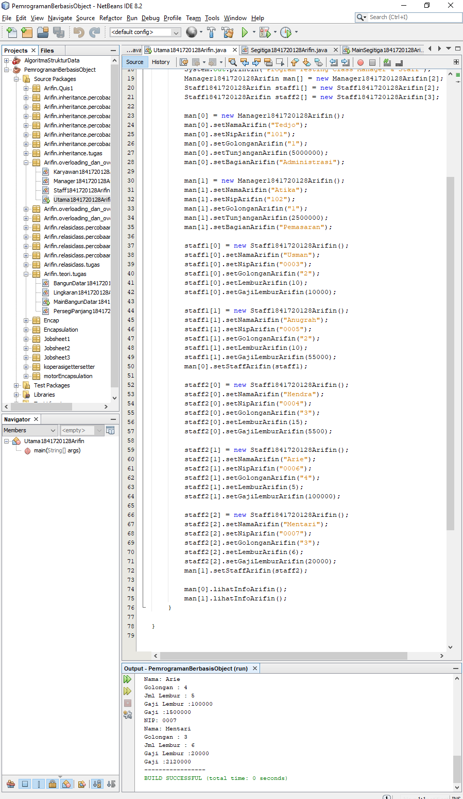

# Laporan Praktikum #7 - OVERLOADING DAN OVERRIDING

## Kompetensi

Setelah menempuh pokok bahasan ini, mahasiswa mampu: 
1. Memahami konsep overloading dan overriding, 
2. Memahami perbedaan overloading dan overriding, 
3. Ketepatan dalam mengidentifikasi method overriding dan overloading 
4. Ketepatan dalam mempraktekkan instruksi pada jobsheet 
5. Mengimplementasikan method overloading dan overriding.

## Ringkasan Materi

Pada praktikum ini saya mengalami kesulitan pada pemahaman terhadap materi yang ada pada jobsheet ini, solusi yang saya lakukan adalah mempelajari lebih lanjut dan juga bertanya pada teman yang lebih paham tentang materi ini.

## Percobaan

### Percobaan 1

Pada percobaan pertama saya membuat tiga buah class, yang pertama bernama Karyawan1841720128Arifin yang memiliki atribut nama dengan tipe data String, nip dengan tipe data String, golongan dengan tipe data String dan gaji dengan tipe data double selain itu terdapat method getter dan setter. Kedua adalah class dengan nama Staff1841720128Arifin yang memiliki atribut bernama lembur dengan tipe data integer dan gajiLembur dengan tipe data integer, selain atribut terdapat method lihatInfoArifin() untuk menampilkan value dari semua atribut dan method getter setter, overloading dan overriding. Yang ketiga adalah class dengan nama Manager1841720128Arifin yang memiliki atribut bernama tunjangan dengan tipe data double, bagian dengan tipe data String, st yang merupakan array dengan tipe data Staff1841720128Arifin, selain atribut terdapat method getter setter, dan juga viewStaffArifin() untuk menampilkan value pada setiap atribut. Yang terakhir adalah saya membuat main class bernama Percobaantest1841720128Arifin .

Contoh kode program pada class Karyawan1841720128Arifin.java : [ini link ke kode program](../../src/7_Overriding_dan_Overloading/Percobaan_1/Karyawan1841720128Arifin.java)

Contoh kode program pada class Staff1841720128Arifin.java : [ini link ke kode program](../../src/7_Overriding_dan_Overloading/Percobaan_1/Staff1841720128Arifin.java)

Contoh kode program pada class Manager1841720128Arifin.java : [ini link ke kode program](../../src/7_Overriding_dan_Overloading/Percobaan_1/Manager1841720128Arifin.java)

Contoh kode program pada main class Utama1841720128Arifin.java : [ini link ke kode program](../../src/7_Overriding_dan_Overloading/Percobaan_1/Utama1841720128Arifin.java)

### Pertanyaan

1. Dari source coding diatas terletak dimanakah overloading?

    Jawab:

    Overloading terletak pada method perkalian dengan parameter b dengan tipe data integer dan c dengan tipe data integer, selain itu terdapat method yang sama yaitu perkalian namun dengan tiga parameter yaitu a, b dan c semua memiliki tipe data yang sama yaitu integer.

2. Jika terdapat overloading ada berapa jumlah parameter yang berbeda? 

    Jawab:

    Terdapat 1 parameter yang berbeda yaitu parameter c.

3. Dari source coding diatas terletak dimanakah overloading?

    Jawab:

    Overloading terletak pada method perkalian yang memiliki parameter a dengan tipe data integer dan b dengan tipe data integer, selain method tersebut terdapat method dan parameter yang sama namanya namun memiliki tipe data yang berbeda yaitu double.

4. Jika terdapat overloading ada berapa tipe parameter yang berbeda? 

    Jawab:

    terdapat 2 tipe parameter yang berbeda.

5. Dari source coding diatas terletak dimanakah overriding?

    Jawab:

    Overriding terletak pada class Fish.

6. Jabarkanlah apabila sourcoding diatas jika terdapat overriding?

    Jawab:

    Overriding terpadat pada class Fish yaitu pada baris "Ikan b = new Piranha()", dimana class ikan ditindih oleh value lain dari class Piranha.

## Tugas

1. Implementasikan konsep overloading pada class diagram dibawah ini :
 

Jawab:

Contoh kode program pada class Segitiga1841720128Arifin.java : [ini link ke kode program](../../src/7_Overriding_dan_Overloading/Tugas_1/Segitiga1841720128Arifin.java)

Contoh kode program pada class main MainSegitiga1841720128Arifin.java : [ini link ke kode program](../../src/7_Overriding_dan_Overloading/Tugas_1/MainSegitiga1841720128Arifin.java)

2. Implementasikan class diagram dibawah ini dengan menggunakan teknik dynamic method dispatch :

Jawab:

Contoh kode program pada class Manusia1841720128Arifin.java : [ini link ke kode program](../../src/7_Overriding_dan_Overloading/Tugas_2/Manusia1841720128Arifin.java)

Contoh kode program pada class Dosen1841720128Arifin.java : [ini link ke kode program](../../src/7_Overriding_dan_Overloading/Tugas_2/Dosen1841720128Arifin.java)

Contoh kode program pada class Mahasiswa1841720128Arifin.java : [ini link ke kode program](../../src/7_Overriding_dan_Overloading/Tugas_2/Mahasiswa1841720128Arifin.java)

Contoh kode program pada class main MainManusia1841720128Arifin.java : [ini link ke kode program](../../src/7_Overriding_dan_Overloading/Tugas_2/MainManusia1841720128Arifin.java)

## Kesimpulan

Hal yang dapat saya simpulkan dari praktikum dan juga tugas yang telah dilakukan adalah suatu method dapat direcycle ulang hanya dengan membedakan pada parameter sehingga lebih menghemat memori saat melakukan run pada program tersebut sehingga program lebih efisien.

## Pernyataan Diri

Saya menyatakan isi tugas, kode program, dan laporan praktikum ini dibuat oleh saya sendiri. Saya tidak melakukan plagiasi, kecurangan, menyalin/menggandakan milik orang lain.

Jika saya melakukan plagiasi, kecurangan, atau melanggar hak kekayaan intelektual, saya siap untuk mendapat sanksi atau hukuman sesuai peraturan perundang-undangan yang berlaku.

Ttd,

***Mukhammad Arifin***
