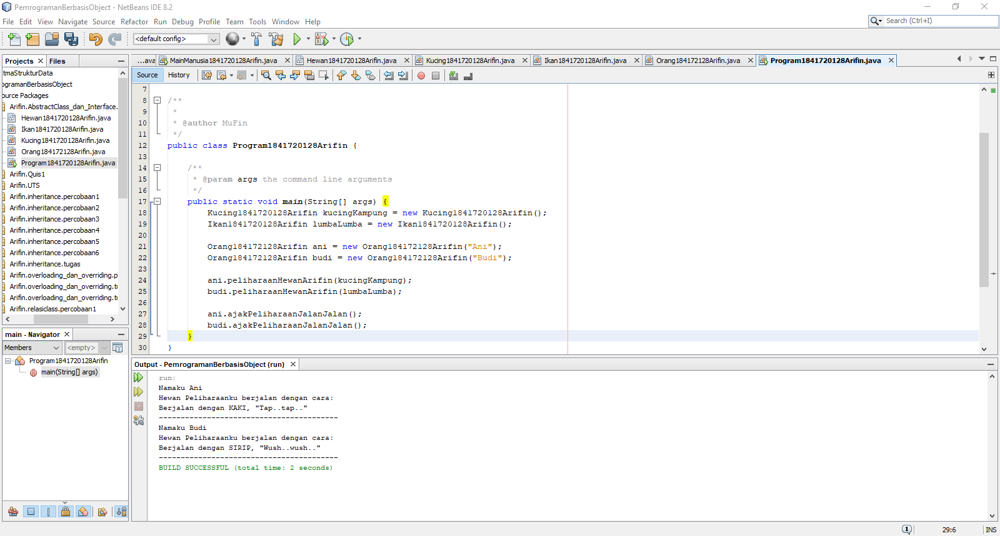
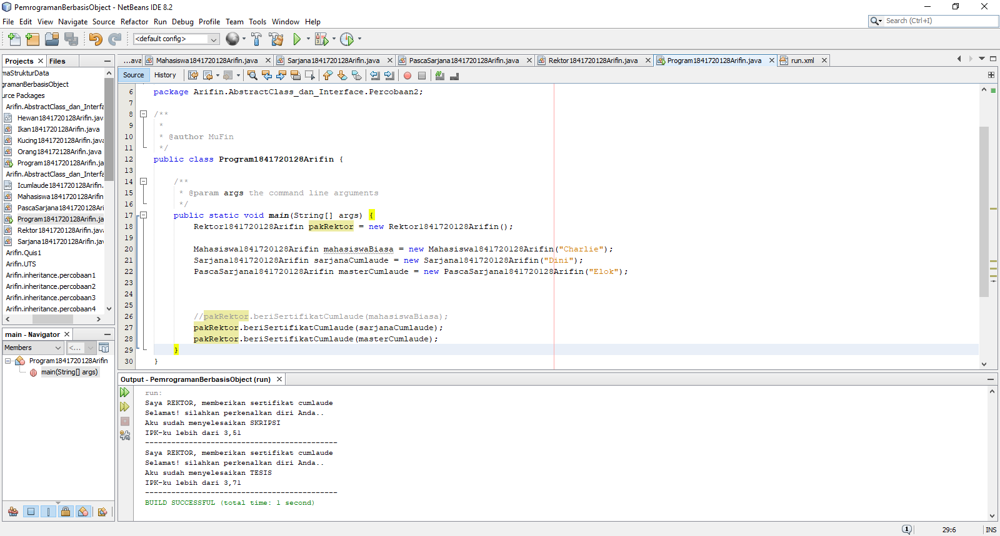
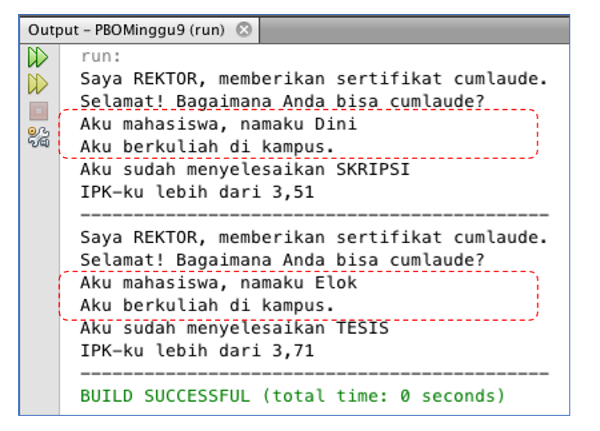
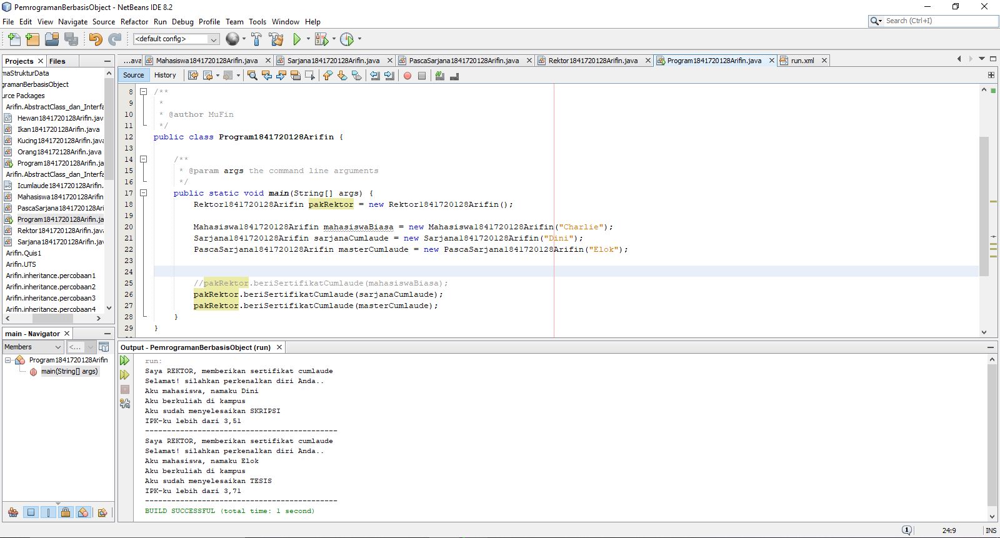
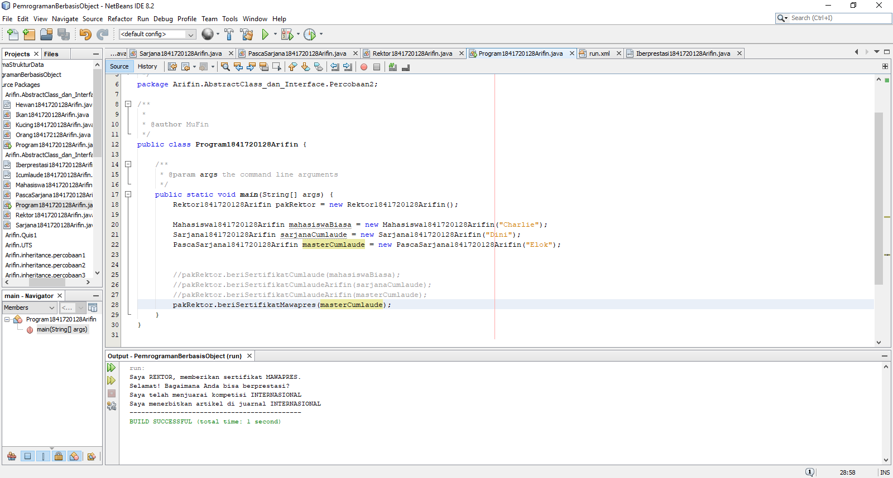
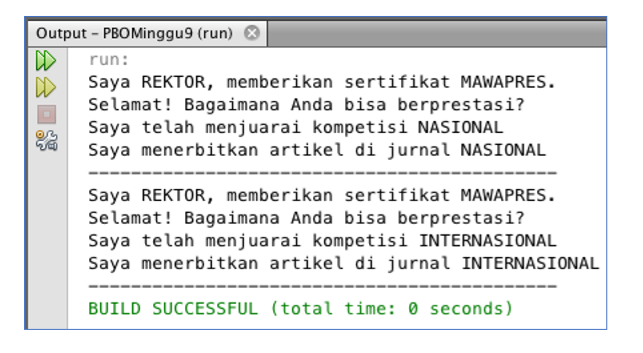
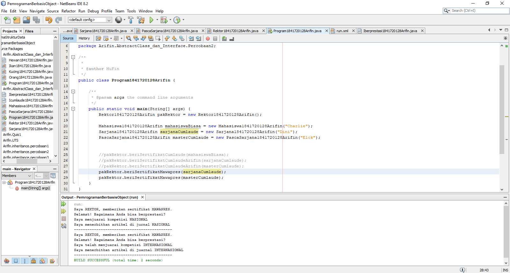

# Laporan Praktikum #9 - Abstract Class dan Interface

## Kompetensi

Setelah menyelesaikan lembar kerja ini mahasiswa diarapkan mampu: 
1. Menjelaskan maksud dan tujuan penggunaan Abstract Class 
2. Menjelaskan maksud dan tujuan penggunaan Interface 
3. Menggunakan Abstract Class dan Interface di dalam pembuatan program 

## Ringkasan Materi

Pada praktikum ini saya mengalami kesulitan konsep class abstract, untuk solusi dari permasalahan yang saya alami dapat diselesaikan dengan lebih belajar lagi.

## Percobaan

### Percobaan 1

Pada percobaan pertama saya membuat empat buah class, yang pertama bernama Hewan1841720128Arifin yang memiliki atribut nama dengan tipe data String selain itu terdapat konstruktor dan method bertambahUmurArifin() dan bergerakArifin. Kedua adalah class dengan nama Kucing1841720128Arifin yang merupakan turunan dari Hewan1841720128Arifin dan memiliki method bergerakArifin(). Yang ketiga adalah class dengan nama Ikan1841720128Arifin yang merupakan Hewan1841720128Arifin dan memiliki method bergerakArifin(). Yang terakhir adalah saya membuat class bernama Orang1841720128Arifin yang memiliki atribut nama dengan tipe data String dan hewanPeliharaan yang memiliki tipe data dari class Hewan1841720128Arifin, selain atribut terdapat konstruktor berparameter atribut nama dan juga terdapat method peliharaanHewanArifin() dan ajakPeliharaanJalanJalanArifin() untuk menampilkan value pada atribut nama dan juga untuk menampilkan value pada ethod bergerakArifin() yang tersambung pada atribut hewanPeliharaan.

Contoh kode program pada class Hewan1841720128Arifin.java : [ini link ke kode program](../../src/9_Abstract_Class_dan_Interface/Percobaan_1/Hewan1841720128Arifin.java)

Contoh kode program pada class Ikan1841720128Arifin.java : [ini link ke kode program](../../src/9_Abstract_Class_dan_Interface/Percobaan_1/Ikan1841720128Arifin.java)

Contoh kode program pada class Kucing1841720128Arifin.java : [ini link ke kode program](../../src/9_Abstract_Class_dan_Interface/Percobaan_1/Kucing1841720128Arifin.java)

Contoh kode program pada class Orang184172128Arifin.java : [ini link ke kode program](../../src/9_Abstract_Class_dan_Interface/Percobaan_1/Orang184172128Arifin.java)

Contoh kode program pada main class Program1841720128Arifin.java : [ini link ke kode program](../../src/9_Abstract_Class_dan_Interface/Percobaan_1/Program1841720128Arifin.java)

### Pertanyaan

1. Bolehkah apabila sebuah class yang meng-extend suatu abstract class tidak mengimplementasikan method abstract yang ada di class induknya? Buktikan!

    Jawab:

    Tidak boleh, karena kelas turunan harus mengoverride method yang ada dari kelas parent dan bila tidak maka akan muncul error, misalnya di kelas Kucing1841720128Arifin dihapus method bergerakArifin(), makan akan muncul error.

### Percobaan 2

Pada percobaan kedua saya membuat satu buah interface dan empat buah class, yang pertama bernama Icumlaude1841720128Arifin yang merupakan interface dan memiliki method lulusArifin() dan meraihIPKTinggiArifin(). Kedua adalah class dengan nama Mahasiswa1841720128Arifin yang memiliki atribut bernama nama dengan tipe data String, selain atribut terdapat konstruktor berparameter satu dan method kuliahDiKampusArifin() untuk menampilkan value dari atribut nama. Yang ketiga adalah class dengan nama Sarjana1841720128Arifin yang merupakan turunan dari Mahasiswa1841720128Arifin dan implemen dari Icumlaude1841720128Arifin, selain itu terdapat konstruktor Sarjana1841720128Arifin untuk memanggil atribut nama dari parent class dan terdapat dua method yaitu lulusArifin() dan meraihIPKTinggi(). Ketiga adalah class PascaSarjana1841720128Arifin yang merupakan child class dari Mahasiswa dan implement dari Icumlaude1841720128Arifin dan konstruktor PascaSarjana yang memanggil atribut nama dari parent classnya selain itu, terdapat method lulusArifin() dan juga method bernama meraihIPKTinggi(). Keempat adalah class dengan nama Rektor1841720128Arifin yang memiliki method beriSertifikatCumlaudeArifin yang menampilkan hasil pada method lulusArifin() dan meraihIPKTinggiArifin(). Yang terakhir adalah saya membuat main class bernama Programtest1841720128Arifin.

Contoh kode program pada class interface Icumlaude1841720128Arifin.java : [ini link ke kode program](../../src/9_Abstract_Class_dan_Interface/Percobaan_2/Icumlaude1841720128Arifin.java)

Contoh kode program pada class Mahasiswa1841720128Arifin.java : [ini link ke kode program](../../src/9_Abstract_Class_dan_Interface/Percobaan_2/Mahasiswa1841720128Arifin.java)

Contoh kode program pada class PascaSarjana1841720128Arifin.java : [ini link ke kode program](../../src/9_Abstract_Class_dan_Interface/Percobaan_2/PascaSarjana1841720128Arifin.java)

Contoh kode program pada class Rektor1841720128Arifin.java : [ini link ke kode program](../../src/9_Abstract_Class_dan_Interface/Percobaan_2/Rektor1841720128Arifin.java)

Contoh kode program pada class Sarjana1841720128Arifin.java : [ini link ke kode program](../../src/9_Abstract_Class_dan_Interface/Percobaan_2/Sarjana1841720128Arifin.java)

Contoh kode program pada main class Program1841720128Arifin.java : [ini link ke kode program](../../src/9_Abstract_Class_dan_Interface/Percobaan_2/Program1841720128Arifin.java)

### Pertanyaan

1. Mengapa pada langkah nomor 9 terjadi error? Jelaskan!

    Jawab:

    Karena pada class Mahasiswa1841720128Arifin tidak ter-implementasi interfaces dari Icumlaude1841720128Arifin sehingga error ketika akan dipanggil oleh object pakRektor.

2. Dapatkah method kuliahDiKampus() dipanggil dari objek sarjanaCumlaude di class Program? Mengapa demikian?

    Jawab:

    Bisa, karena object sarjanaCumlaude dari class Sarjana1841720128Arifin adalah kelas turunan dari Mahasiswa1841720128Arifin, sehingga method kuliahDiKampusArifin() bisa dipanggil ke class Sarjana1841720128Arifin.

3. Dapatkah method kuliahDiKampus() dipanggil dari parameter mahasiswa di method beriSertifikatCumlaude() pada class Rektor? Mengapa demikian?

    Jawab:

    Tidak bisa, karena class Rektor1841720128Arifin hanya menggunakan implementasi dari Icumlaude1841720128Arifin, dan method kuliahDiKampusArifin() dari class Mahasiswa1841720128Arifin tidak pernah di inisiasi di class Rektor1841720128Arifin.

4. Modifikasilah method beriSertifikatCumlaude() pada class Rektor agar hasil eksekusi class Program menjadi seperti berikut: 

    

    Jawab:

    

    Contoh kode program pada class interface Icumlaude1841720128Arifin.java : [ini link ke kode program](../../src/9_Abstract_Class_dan_Interface/Percobaan_2/Icumlaude1841720128Arifin.java)

    Contoh kode program pada class Mahasiswa1841720128Arifin.java : [ini link ke kode program](../../src/9_Abstract_Class_dan_Interface/Pertanyaan_2/Mahasiswa1841720128Arifin.java)

    Contoh kode program pada class PascaSarjana1841720128Arifin.java : [ini link ke kode program](../../src/9_Abstract_Class_dan_Interface/Pertanyaan_2/PascaSarjana1841720128Arifin.java)

    Contoh kode program pada class Rektor1841720128Arifin.java : [ini link ke kode program](../../src/9_Abstract_Class_dan_Interface/Pertanyaan_2/Rektor1841720128Arifin.java)

    Contoh kode program pada class Sarjana1841720128Arifin.java : [ini link ke kode program](../../src/9_Abstract_Class_dan_Interface/Pertanyaan_2/Sarjana1841720128Arifin.java)

    Contoh kode program pada main class Program1841720128Arifin.java : [ini link ke kode program](../../src/9_Abstract_Class_dan_Interface/Pertanyaan_2/Program1841720128Arifin.java)

### Percobaan 3

Pada percobaan ketiga saya membuat satu buah class interface bernama Iberprestasi1841720128Arifin karena pada percobaan 3 ini masih berhubungan dengan percobaan 3, yang berisi method menjuaraiKompetisiArifin() dan membuatPublkasiIlmiahArifin(). dan pada class PacsaSarjana1841720128Arifin menambahkan satu implement lagi yaitu Iberprestasi1841720128Arifin maka dan akan menambahkan dua method lagi yaitu menjuaraiKompetisiArifin() dan membuatPublkasiIlmiahArifin(). Selain itu pada class Rektor1841720128Arifin menambahkan method dengan nama beriSertifikatMawapresArifin() yang digunakan untuk menampilkan value pada method menjuaraiKompetisiArifin() dan membuatPublkasiIlmiahArifin().

Contoh kode program pada class interface Iberprestasi1841720128Arifin.java : [ini link ke kode program](../../src/9_Abstract_Class_dan_Interface/Percobaan_3/Iberprestasi1841720128Arifin.java)

Contoh kode program pada class interface Icumlaude1841720128Arifin.java : [ini link ke kode program](../../src/9_Abstract_Class_dan_Interface/Percobaan_3/Icumlaude1841720128Arifin.java)

Contoh kode program pada class Mahasiswa1841720128Arifin.java : [ini link ke kode program](../../src/9_Abstract_Class_dan_Interface/Percobaan_3/Mahasiswa1841720128Arifin.java)

Contoh kode program pada class PascaSarjana1841720128Arifin.java : [ini link ke kode program](../../src/9_Abstract_Class_dan_Interface/Percobaan_3/PascaSarjana1841720128Arifin.java)

Contoh kode program pada class Rektor1841720128Arifin.java : [ini link ke kode program](../../src/9_Abstract_Class_dan_Interface/Percobaan_3/Rektor1841720128Arifin.java)

Contoh kode program pada class Sarjana1841720128Arifin.java : [ini link ke kode program](../../src/9_Abstract_Class_dan_Interface/Percobaan_3/Sarjana1841720128Arifin.java)

Contoh kode program pada main class Program1841720128Arifin.java : [ini link ke kode program](../../src/9_Abstract_Class_dan_Interface/Percobaan_3/Program1841720128Arifin.java)

### Pertanyaan

1. Apabila Sarjana Berprestasi harus menjuarai kompetisi NASIONAL dan menerbitkan artikel di jurnal NASIONAL, maka modifikasilah class-class yang terkait pada aplikasi Anda agar di class Program objek pakRektor dapat memberikan sertifikat mawapres pada objek sarjanaCumlaude

    

    Jawab:

    

    Contoh kode program pada class interface Iberprestasi1841720128Arifin.java : [ini link ke kode program](../../src/9_Abstract_Class_dan_Interface/Pertanyaan_3/Iberprestasi1841720128Arifin.java)

    Contoh kode program pada class interface Icumlaude1841720128Arifin.java : [ini link ke kode program](../../src/9_Abstract_Class_dan_Interface/Pertanyaan_3/Icumlaude1841720128Arifin.java)

    Contoh kode program pada class Mahasiswa1841720128Arifin.java : [ini link ke kode program](../../src/9_Abstract_Class_dan_Interface/Pertanyaan_3/Mahasiswa1841720128Arifin.java)

    Contoh kode program pada class PascaSarjana1841720128Arifin.java : [ini link ke kode program](../../src/9_Abstract_Class_dan_Interface/Pertanyaan_3/PascaSarjana1841720128Arifin.java)

    Contoh kode program pada class Rektor1841720128Arifin.java : [ini link ke kode program](../../src/9_Abstract_Class_dan_Interface/Pertanyaan_3/Rektor1841720128Arifin.java)

    Contoh kode program pada class Sarjana1841720128Arifin.java : [ini link ke kode program](../../src/9_Abstract_Class_dan_Interface/Pertanyaan_3/Sarjana1841720128Arifin.java)

    Contoh kode program pada main class Program1841720128Arifin.java : [ini link ke kode program](../../src/9_Abstract_Class_dan_Interface/Pertanyaan_3/Program1841720128Arifin.java)

## Kesimpulan

Hal yang dapat saya simpulkan dari praktikum yang telah dilakukan adalah Abstract Class yang merupakan class yang tidak dapat diinstansiasi namun dapat di-extend selain hal tersebut interface juga berperan penting dalam pembuatan abstract class tersebut.

## Pernyataan Diri

Saya menyatakan isi tugas, kode program, dan laporan praktikum ini dibuat oleh saya sendiri. Saya tidak melakukan plagiasi, kecurangan, menyalin/menggandakan milik orang lain.

Jika saya melakukan plagiasi, kecurangan, atau melanggar hak kekayaan intelektual, saya siap untuk mendapat sanksi atau hukuman sesuai peraturan perundang-undangan yang berlaku.

Ttd,

***Mukhammad Arifin***
